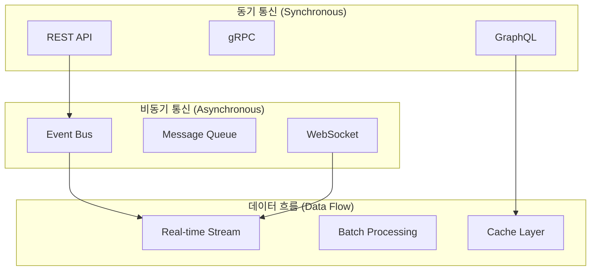
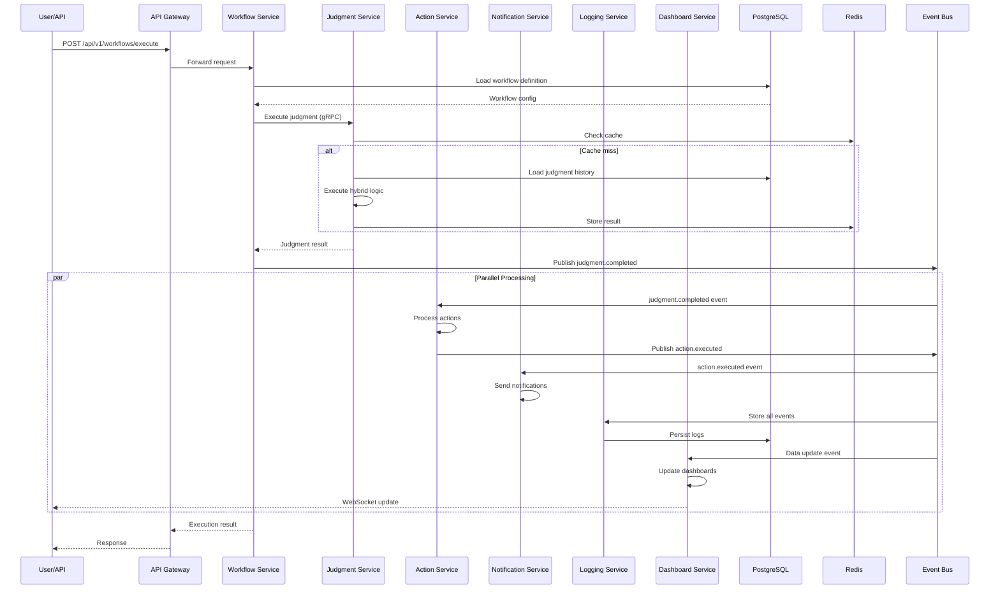
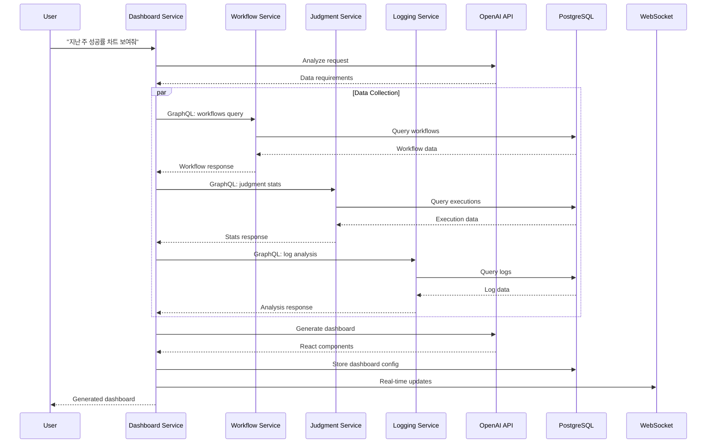
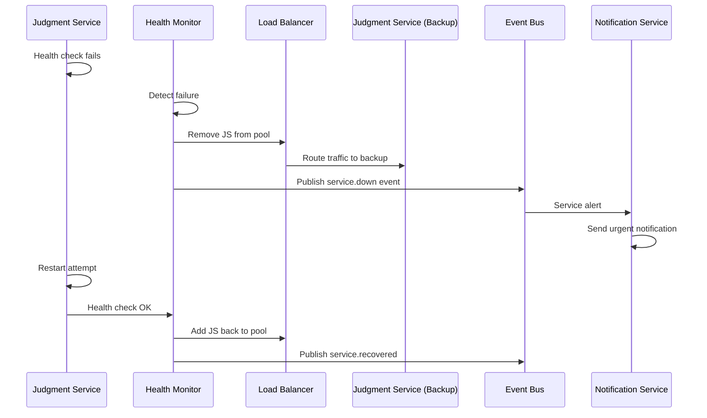

# 마이크로서비스 간 통신 아키텍처 설계서

**문서 버전**: v2.0  
**작성일**: 2024.08.10  
**대상**: 시스템 아키텍트, 백엔드 개발자, DevOps 엔지니어  
**목적**: 6개 마이크로서비스 간 통신 패턴, API 설계 및 데이터 흐름 최적화

## 📋 1. 통신 아키텍처 개요

### 1.1 서비스 간 통신 매트릭스

| 서비스 | Workflow | Judgment | Action | Notification | Logging | Dashboard |
|---------|----------|----------|--------|--------------|---------|-----------|
| **Workflow (8001)** | - | Sync/REST | Event | Event | Async/Log | Sync/GraphQL |
| **Judgment (8002)** | Sync/REST | - | Event | Event | Async/Log | WebSocket |
| **Action (8003)** | Event | Event | - | Sync/REST | Async/Log | Event |
| **Notification (8004)** | Event | Event | Event | - | Async/Log | Event |
| **Logging (8005)** | Async/Log | Async/Log | Async/Log | Async/Log | - | GraphQL |
| **Dashboard (8006)** | GraphQL | WebSocket | Event | Event | GraphQL | - |

### 1.2 통신 패턴 분류



## 🔧 2. API 설계 전략

### 2.1 서비스별 API 전략 매핑

#### 2.1.1 Workflow Service (8001) - REST API 중심
```yaml
API_Strategy: REST + GraphQL Federation
Reasoning: "CRUD 작업이 주요하며, 복잡한 쿼리 지원 필요"
Endpoints:
  - POST /api/v1/workflows (워크플로우 생성)
  - GET /api/v1/workflows/{id} (단일 조회)
  - PUT /api/v1/workflows/{id} (수정)
  - DELETE /api/v1/workflows/{id} (삭제)
  - POST /api/v1/workflows/{id}/simulate (시뮬레이션)
GraphQL_Federation: 
  - workflows 타입 제공
  - Dashboard Service에서 복잡한 쿼리 지원
```

#### 2.1.2 Judgment Service (8002) - gRPC + WebSocket
```yaml
API_Strategy: gRPC (내부) + REST (외부) + WebSocket (실시간)
Reasoning: "고성능 판단 처리 + 실시간 결과 스트리밍"
gRPC_Services:
  - JudgmentService.Execute (내부 호출용)
  - JudgmentService.ValidateInput
REST_Endpoints:
  - POST /api/v1/judgment/execute (외부 호출용)
  - GET /api/v1/judgment/status/{execution_id}
WebSocket:
  - /ws/judgment/realtime (실시간 판단 결과)
```

#### 2.1.3 Dashboard Service (8006) - GraphQL Federation
```yaml
API_Strategy: GraphQL Federation + WebSocket
Reasoning: "복잡한 데이터 조합 + 실시간 대시보드 업데이트"
GraphQL_Schema:
  - 모든 서비스 데이터 통합 조회
  - 자동 대시보드 생성 쿼리
WebSocket:
  - /ws/dashboard/updates (실시간 데이터 업데이트)
  - /ws/dashboard/generation (대시보드 생성 진행상황)
```

#### 2.1.4 Action/Notification/Logging - Event-Driven
```yaml
API_Strategy: Event-Driven + REST for Control
Event_Patterns:
  - judgment.completed → action.trigger
  - action.executed → notification.send
  - *.* → logging.store
REST_Control:
  - Action Service: POST /api/v1/actions/retry/{id}
  - Notification: GET /api/v1/notifications/templates
  - Logging: GET /api/v1/logs/search
```

### 2.2 API 게이트웨이 라우팅 전략

#### 2.2.1 Kong Gateway 설정
```yaml
# kong-routes.yaml
services:
  - name: workflow-service
    url: http://workflow-service:8001
    routes:
      - name: workflow-api
        paths: ["/api/v1/workflows"]
        methods: ["GET", "POST", "PUT", "DELETE"]
        
  - name: judgment-service  
    url: http://judgment-service:8002
    routes:
      - name: judgment-api
        paths: ["/api/v1/judgment"]
        methods: ["POST", "GET"]
        
  - name: dashboard-graphql
    url: http://dashboard-service:8006
    routes:
      - name: graphql-endpoint
        paths: ["/graphql"]
        methods: ["POST"]

plugins:
  - name: rate-limiting
    config:
      minute: 1000
      hour: 10000
      policy: redis
      
  - name: jwt
    config:
      secret_is_base64: false
      claims_to_verify: ["exp", "sub"]
      
  - name: cors
    config:
      origins: ["https://judgify.app", "http://localhost:3000"]
      methods: ["GET", "POST", "PUT", "DELETE", "OPTIONS"]
```

#### 2.2.2 라우팅 규칙
```python
# 라우팅 우선순위
ROUTING_RULES = {
    "high_priority": [
        "/api/v1/judgment/execute",  # 실시간 판단
        "/ws/judgment/realtime",     # WebSocket 판단
        "/api/v1/workflows/{id}/simulate"  # 시뮬레이션
    ],
    "medium_priority": [
        "/api/v1/workflows",         # 워크플로우 CRUD
        "/graphql",                  # GraphQL 쿼리
        "/ws/dashboard/updates"      # 대시보드 업데이트
    ],
    "low_priority": [
        "/api/v1/logs",              # 로그 조회
        "/api/v1/notifications"      # 알림 관리
    ]
}

# 로드밸런싱 전략
LOAD_BALANCING = {
    "judgment-service": "least_connections",  # CPU 집약적
    "dashboard-service": "round_robin",       # I/O 집약적
    "workflow-service": "consistent_hash",    # 세션 친화적
    "default": "weighted_round_robin"
}
```

## 🔄 3. 서비스 간 통신 패턴

### 3.1 동기 통신 (Synchronous Communication)

#### 3.1.1 REST API 통신
```python
# Workflow → Judgment 동기 호출 패턴
class WorkflowExecutor:
    def __init__(self, judgment_client: JudgmentServiceClient):
        self.judgment_client = judgment_client
    
    async def execute_workflow(self, workflow_id: str, input_data: dict):
        """워크플로우 실행 - 판단 서비스 동기 호출"""
        
        # 1. 워크플로우 정의 로드
        workflow = await self.load_workflow(workflow_id)
        
        # 2. 판단 서비스 호출 (동기)
        judgment_request = JudgmentRequest(
            workflow_id=workflow_id,
            input_data=input_data,
            method="hybrid"
        )
        
        # HTTP 클라이언트 사용
        async with httpx.AsyncClient() as client:
            response = await client.post(
                "http://judgment-service:8002/api/v1/judgment/execute",
                json=judgment_request.dict(),
                timeout=30.0
            )
            
            if response.status_code == 200:
                judgment_result = JudgmentResult(**response.json())
                return await self.process_judgment_result(judgment_result)
            else:
                raise JudgmentServiceError(f"Judgment failed: {response.text}")
```

#### 3.1.2 gRPC 통신 (고성능 내부 통신)
```python
# judgment_service.proto
syntax = "proto3";

package judgment;

service JudgmentService {
    rpc ExecuteJudgment(JudgmentRequest) returns (JudgmentResponse);
    rpc ValidateInput(ValidationRequest) returns (ValidationResponse);
    rpc GetExecutionStatus(StatusRequest) returns (StatusResponse);
}

message JudgmentRequest {
    string workflow_id = 1;
    map<string, string> input_data = 2;
    string method = 3;  // rule, llm, hybrid
}

message JudgmentResponse {
    bool success = 1;
    string result = 2;
    double confidence = 3;
    int32 execution_time_ms = 4;
    string explanation = 5;
    string error = 6;
}
```

```python
# gRPC 클라이언트 구현
import grpc
from generated import judgment_pb2, judgment_pb2_grpc

class JudgmentGRPCClient:
    def __init__(self, server_address: str):
        self.channel = grpc.aio.insecure_channel(server_address)
        self.stub = judgment_pb2_grpc.JudgmentServiceStub(self.channel)
    
    async def execute_judgment(self, workflow_id: str, input_data: dict) -> dict:
        """gRPC를 통한 고성능 판단 실행"""
        
        request = judgment_pb2.JudgmentRequest(
            workflow_id=workflow_id,
            input_data=input_data,
            method="hybrid"
        )
        
        try:
            response = await self.stub.ExecuteJudgment(
                request, 
                timeout=5.0
            )
            
            return {
                "success": response.success,
                "result": response.result,
                "confidence": response.confidence,
                "execution_time_ms": response.execution_time_ms,
                "explanation": response.explanation
            }
            
        except grpc.RpcError as e:
            raise JudgmentServiceError(f"gRPC error: {e.code()}: {e.details()}")
```

#### 3.1.3 GraphQL Federation
```graphql
# schema.graphql (Dashboard Service)
type Query {
  # 워크플로우 관련 (Workflow Service)
  workflows(filter: WorkflowFilter): [Workflow]
  workflow(id: ID!): Workflow
  
  # 판단 결과 관련 (Judgment Service)
  judgmentExecutions(filter: JudgmentFilter): [JudgmentExecution]
  judgmentStats(timeRange: TimeRange): JudgmentStats
  
  # 통합 대시보드 데이터
  dashboardData(request: DashboardRequest): DashboardData
}

type Workflow @key(fields: "id") {
  id: ID!
  name: String!
  definition: JSON!
  executions: [JudgmentExecution] @requires(fields: "id")
}

type JudgmentExecution @key(fields: "id") {
  id: ID!
  workflow: Workflow @provides(fields: "id")
  result: JSON!
  confidence: Float!
  executionTimeMs: Int!
}

type DashboardData {
  charts: [ChartComponent]
  metrics: [MetricCard]
  realTimeUpdates: Boolean
}
```

```python
# GraphQL Federation 클라이언트
import strawberry
from strawberry.federation import build_schema

@strawberry.type
class Query:
    async def dashboard_data(self, request: DashboardRequest) -> DashboardData:
        """다중 서비스 데이터 통합 조회"""
        
        # 병렬로 여러 서비스에서 데이터 수집
        workflow_data, judgment_data, action_data = await asyncio.gather(
            self.workflow_client.get_workflows(request.workflow_filter),
            self.judgment_client.get_executions(request.time_range),
            self.action_client.get_actions(request.action_filter)
        )
        
        # 대시보드 컴포넌트 생성
        dashboard = await self.dashboard_generator.create_dashboard(
            user_request=request.description,
            available_data={
                "workflows": workflow_data,
                "judgments": judgment_data, 
                "actions": action_data
            }
        )
        
        return dashboard
```

### 3.2 비동기 통신 (Asynchronous Communication)

#### 3.2.1 Event-Driven Architecture
```python
# 이벤트 정의
from pydantic import BaseModel
from typing import Any, Dict
from datetime import datetime

class BaseEvent(BaseModel):
    event_id: str
    event_type: str
    timestamp: datetime
    source_service: str
    correlation_id: str
    data: Dict[str, Any]

class JudgmentCompletedEvent(BaseEvent):
    event_type: str = "judgment.completed"
    data: Dict[str, Any]  # judgment_result, workflow_id, input_data

class ActionTriggerEvent(BaseEvent):
    event_type: str = "action.trigger"
    data: Dict[str, Any]  # action_type, target_system, command

class DashboardUpdateEvent(BaseEvent):
    event_type: str = "dashboard.update"
    data: Dict[str, Any]  # dashboard_id, update_type, data_changes
```

```python
# Redis Streams 기반 Event Bus
import aioredis
import json

class EventBus:
    def __init__(self, redis_url: str):
        self.redis = aioredis.from_url(redis_url)
    
    async def publish_event(self, event: BaseEvent):
        """이벤트 발행"""
        
        stream_name = f"events:{event.event_type}"
        
        await self.redis.xadd(
            stream_name,
            {
                "event_id": event.event_id,
                "data": json.dumps(event.dict(), default=str),
                "timestamp": event.timestamp.isoformat()
            }
        )
    
    async def subscribe_to_events(self, event_types: list, consumer_group: str):
        """이벤트 구독"""
        
        streams = {f"events:{event_type}": ">" for event_type in event_types}
        
        try:
            # Consumer Group 생성
            for stream in streams.keys():
                try:
                    await self.redis.xgroup_create(stream, consumer_group, id="0")
                except aioredis.ResponseError:
                    pass  # Group already exists
            
            while True:
                messages = await self.redis.xreadgroup(
                    consumer_group,
                    "consumer-1",
                    streams,
                    count=10,
                    block=1000
                )
                
                for stream, msgs in messages:
                    for msg_id, fields in msgs:
                        event_data = json.loads(fields[b'data'])
                        event = BaseEvent(**event_data)
                        
                        await self.handle_event(event)
                        
                        # 메시지 확인
                        await self.redis.xack(stream, consumer_group, msg_id)
                        
        except Exception as e:
            logger.error(f"Event subscription error: {e}")
    
    async def handle_event(self, event: BaseEvent):
        """이벤트 처리 (각 서비스에서 구현)"""
        pass
```

#### 3.2.2 WebSocket 실시간 통신
```python
# WebSocket Manager
from fastapi import WebSocket, WebSocketDisconnect
from typing import List, Dict
import json

class WebSocketManager:
    def __init__(self):
        self.active_connections: Dict[str, List[WebSocket]] = {}
    
    async def connect(self, websocket: WebSocket, client_type: str, client_id: str):
        """WebSocket 연결 관리"""
        await websocket.accept()
        
        if client_type not in self.active_connections:
            self.active_connections[client_type] = []
        
        self.active_connections[client_type].append(websocket)
        logger.info(f"Client {client_id} connected to {client_type}")
    
    def disconnect(self, websocket: WebSocket, client_type: str):
        """연결 해제"""
        if client_type in self.active_connections:
            self.active_connections[client_type].remove(websocket)
    
    async def broadcast_to_type(self, client_type: str, message: dict):
        """특정 타입 클라이언트에게 브로드캐스트"""
        if client_type in self.active_connections:
            disconnected = []
            
            for connection in self.active_connections[client_type]:
                try:
                    await connection.send_text(json.dumps(message))
                except WebSocketDisconnect:
                    disconnected.append(connection)
            
            # 끊어진 연결 정리
            for conn in disconnected:
                self.active_connections[client_type].remove(conn)

# Judgment Service WebSocket
from fastapi import FastAPI, WebSocket
websocket_manager = WebSocketManager()

@app.websocket("/ws/judgment/realtime/{client_id}")
async def judgment_websocket(websocket: WebSocket, client_id: str):
    await websocket_manager.connect(websocket, "judgment", client_id)
    
    try:
        while True:
            # 클라이언트로부터 메시지 대기
            data = await websocket.receive_text()
            request = json.loads(data)
            
            # 판단 실행 및 실시간 결과 전송
            result = await judgment_engine.execute(request)
            
            await websocket.send_text(json.dumps({
                "type": "judgment_result",
                "data": result.dict()
            }))
            
    except WebSocketDisconnect:
        websocket_manager.disconnect(websocket, "judgment")

# Dashboard Service WebSocket
@app.websocket("/ws/dashboard/updates/{dashboard_id}")
async def dashboard_websocket(websocket: WebSocket, dashboard_id: str):
    await websocket_manager.connect(websocket, "dashboard", dashboard_id)
    
    try:
        while True:
            # 실시간 데이터 업데이트 스트리밍
            updates = await dashboard_service.get_real_time_updates(dashboard_id)
            
            await websocket.send_text(json.dumps({
                "type": "data_update",
                "dashboard_id": dashboard_id,
                "data": updates
            }))
            
            await asyncio.sleep(5)  # 5초마다 업데이트
            
    except WebSocketDisconnect:
        websocket_manager.disconnect(websocket, "dashboard")
```

### 3.3 데이터 흐름 최적화

#### 3.3.1 CQRS 패턴 적용
```python
# Command와 Query 분리
from abc import ABC, abstractmethod

class Command(ABC):
    """변경 작업을 위한 Command 인터페이스"""
    pass

class Query(ABC):
    """조회 작업을 위한 Query 인터페이스"""
    pass

# Workflow Service의 CQRS 구현
class CreateWorkflowCommand(Command):
    def __init__(self, name: str, definition: dict, created_by: str):
        self.name = name
        self.definition = definition
        self.created_by = created_by

class GetWorkflowQuery(Query):
    def __init__(self, workflow_id: str):
        self.workflow_id = workflow_id

class WorkflowCommandHandler:
    """Command 처리 - 쓰기 작업"""
    
    def __init__(self, write_db: PostgreSQLConnection, event_bus: EventBus):
        self.write_db = write_db
        self.event_bus = event_bus
    
    async def handle_create_workflow(self, command: CreateWorkflowCommand):
        """워크플로우 생성 처리"""
        
        # 1. 데이터베이스에 저장
        workflow = await self.write_db.execute(
            """
            INSERT INTO workflows (name, definition, created_by, created_at)
            VALUES ($1, $2, $3, NOW())
            RETURNING id, name, created_at
            """,
            command.name, command.definition, command.created_by
        )
        
        # 2. 이벤트 발행
        event = BaseEvent(
            event_type="workflow.created",
            source_service="workflow-service",
            data={
                "workflow_id": workflow["id"],
                "name": workflow["name"],
                "created_by": command.created_by
            }
        )
        
        await self.event_bus.publish_event(event)
        
        return workflow

class WorkflowQueryHandler:
    """Query 처리 - 읽기 작업"""
    
    def __init__(self, read_db: PostgreSQLReadReplica, cache: Redis):
        self.read_db = read_db
        self.cache = cache
    
    async def handle_get_workflow(self, query: GetWorkflowQuery):
        """워크플로우 조회 처리"""
        
        # 1. 캐시 확인
        cache_key = f"workflow:{query.workflow_id}"
        cached_workflow = await self.cache.get(cache_key)
        
        if cached_workflow:
            return json.loads(cached_workflow)
        
        # 2. 읽기 전용 DB에서 조회
        workflow = await self.read_db.fetchrow(
            "SELECT * FROM workflows WHERE id = $1",
            query.workflow_id
        )
        
        if workflow:
            # 3. 캐시에 저장 (TTL: 10분)
            await self.cache.setex(
                cache_key, 
                600, 
                json.dumps(dict(workflow))
            )
        
        return workflow
```

#### 3.3.2 Event Sourcing 적용
```python
# Event Store 구현
class EventStore:
    def __init__(self, db: PostgreSQLConnection):
        self.db = db
    
    async def append_event(self, aggregate_id: str, event: BaseEvent, expected_version: int):
        """이벤트 저장"""
        
        try:
            await self.db.execute(
                """
                INSERT INTO event_store (
                    aggregate_id, event_type, event_data, 
                    event_version, created_at
                )
                VALUES ($1, $2, $3, $4, NOW())
                """,
                aggregate_id,
                event.event_type,
                json.dumps(event.data),
                expected_version + 1
            )
        except Exception as e:
            if "duplicate key" in str(e):
                raise ConcurrencyError("Event version conflict")
            raise
    
    async def get_events(self, aggregate_id: str, from_version: int = 0):
        """이벤트 조회"""
        
        events = await self.db.fetch(
            """
            SELECT event_type, event_data, event_version, created_at
            FROM event_store
            WHERE aggregate_id = $1 AND event_version > $2
            ORDER BY event_version
            """,
            aggregate_id, from_version
        )
        
        return [
            {
                "event_type": event["event_type"],
                "data": json.loads(event["event_data"]),
                "version": event["event_version"],
                "timestamp": event["created_at"]
            }
            for event in events
        ]

# Aggregate 재구성
class WorkflowAggregate:
    def __init__(self, workflow_id: str):
        self.workflow_id = workflow_id
        self.name = None
        self.definition = None
        self.version = 0
        self.is_active = True
    
    def apply_event(self, event: dict):
        """이벤트 적용하여 상태 재구성"""
        
        if event["event_type"] == "workflow.created":
            self.name = event["data"]["name"]
            self.definition = event["data"]["definition"]
            
        elif event["event_type"] == "workflow.updated":
            self.definition = event["data"]["definition"]
            
        elif event["event_type"] == "workflow.deactivated":
            self.is_active = False
        
        self.version = event["version"]
    
    @classmethod
    async def load_from_events(cls, workflow_id: str, event_store: EventStore):
        """이벤트로부터 Aggregate 재구성"""
        
        aggregate = cls(workflow_id)
        events = await event_store.get_events(workflow_id)
        
        for event in events:
            aggregate.apply_event(event)
        
        return aggregate
```

## 📊 4. 데이터 흐름 시나리오

### 4.1 하이브리드 판단 실행 플로우


### 4.2 실시간 대시보드 생성 플로우


### 4.3 장애 대응 및 복구 플로우


## 🔐 5. 보안 및 인증 전략

### 5.1 마이크로서비스 간 인증
```python
# JWT 기반 서비스 간 인증
import jwt
from datetime import datetime, timedelta

class ServiceAuthenticator:
    def __init__(self, secret_key: str, algorithm: str = "HS256"):
        self.secret_key = secret_key
        self.algorithm = algorithm
    
    def generate_service_token(self, service_name: str, permissions: list) -> str:
        """서비스 간 통신용 JWT 생성"""
        
        payload = {
            "sub": service_name,
            "iat": datetime.utcnow(),
            "exp": datetime.utcnow() + timedelta(hours=24),
            "type": "service",
            "permissions": permissions
        }
        
        return jwt.encode(payload, self.secret_key, algorithm=self.algorithm)
    
    def verify_service_token(self, token: str) -> dict:
        """서비스 토큰 검증"""
        
        try:
            payload = jwt.decode(token, self.secret_key, algorithms=[self.algorithm])
            
            if payload.get("type") != "service":
                raise jwt.InvalidTokenError("Invalid token type")
            
            return payload
            
        except jwt.ExpiredSignatureError:
            raise AuthenticationError("Service token expired")
        except jwt.InvalidTokenError:
            raise AuthenticationError("Invalid service token")

# FastAPI 미들웨어로 서비스 인증 적용
from fastapi import FastAPI, Request, HTTPException
from fastapi.security import HTTPBearer, HTTPAuthorizationCredentials

class ServiceAuthMiddleware:
    def __init__(self, auth: ServiceAuthenticator):
        self.auth = auth
        self.security = HTTPBearer()
    
    async def __call__(self, request: Request, call_next):
        # 내부 서비스 호출인지 확인
        if self.is_internal_call(request):
            try:
                auth_header = request.headers.get("Authorization")
                if not auth_header:
                    raise HTTPException(401, "Missing service authentication")
                
                token = auth_header.replace("Bearer ", "")
                payload = self.auth.verify_service_token(token)
                
                # Request context에 서비스 정보 추가
                request.state.service_name = payload["sub"]
                request.state.permissions = payload["permissions"]
                
            except AuthenticationError as e:
                raise HTTPException(401, str(e))
        
        response = await call_next(request)
        return response
    
    def is_internal_call(self, request: Request) -> bool:
        """내부 서비스 호출 여부 판단"""
        
        # X-Service-Call 헤더로 내부 호출 식별
        return request.headers.get("X-Service-Call") == "true"
```

### 5.2 API 보안 강화
```python
# Rate Limiting 구현
from collections import defaultdict, deque
import time
import asyncio

class AdvancedRateLimiter:
    def __init__(self, redis_client):
        self.redis = redis_client
        self.rate_limits = {
            "judgment.execute": {"requests": 100, "window": 60},    # 1분에 100회
            "dashboard.generate": {"requests": 10, "window": 60},   # 1분에 10회  
            "workflow.create": {"requests": 50, "window": 3600},    # 1시간에 50회
            "default": {"requests": 1000, "window": 3600}           # 기본 제한
        }
    
    async def check_rate_limit(self, client_id: str, endpoint: str) -> bool:
        """Rate limit 확인"""
        
        limit_config = self.rate_limits.get(endpoint, self.rate_limits["default"])
        
        # Redis를 사용한 sliding window 구현
        now = int(time.time())
        window_start = now - limit_config["window"]
        
        pipe = self.redis.pipeline()
        
        # 윈도우 범위 밖의 요청 제거
        pipe.zremrangebyscore(
            f"rate_limit:{client_id}:{endpoint}",
            0, window_start
        )
        
        # 현재 요청 수 확인
        pipe.zcard(f"rate_limit:{client_id}:{endpoint}")
        
        # 현재 요청 추가
        pipe.zadd(
            f"rate_limit:{client_id}:{endpoint}",
            {str(now): now}
        )
        
        # TTL 설정
        pipe.expire(f"rate_limit:{client_id}:{endpoint}", limit_config["window"])
        
        results = await pipe.execute()
        current_requests = results[1]
        
        return current_requests < limit_config["requests"]

# Input Validation 강화
from pydantic import BaseModel, validator
import re

class WorkflowCreateRequest(BaseModel):
    name: str
    definition: dict
    description: str = None
    
    @validator('name')
    def validate_name(cls, v):
        if not re.match(r'^[a-zA-Z0-9_-]{3,50}$', v):
            raise ValueError('Name must be alphanumeric, 3-50 characters')
        return v
    
    @validator('definition')
    def validate_definition(cls, v):
        required_fields = ['nodes', 'edges', 'startNode']
        
        if not all(field in v for field in required_fields):
            raise ValueError(f'Definition must contain: {required_fields}')
        
        # 노드 수 제한
        if len(v.get('nodes', [])) > 100:
            raise ValueError('Too many nodes (max: 100)')
        
        return v
    
    @validator('description')
    def validate_description(cls, v):
        if v and len(v) > 500:
            raise ValueError('Description too long (max: 500 characters)')
        return v

class JudgmentExecuteRequest(BaseModel):
    workflow_id: str
    input_data: dict
    method: str = "hybrid"
    
    @validator('workflow_id')
    def validate_workflow_id(cls, v):
        # UUID 형식 검증
        import uuid
        try:
            uuid.UUID(v)
        except ValueError:
            raise ValueError('Invalid workflow ID format')
        return v
    
    @validator('input_data')
    def validate_input_data(cls, v):
        # JSON 크기 제한 (1MB)
        import json
        if len(json.dumps(v)) > 1024 * 1024:
            raise ValueError('Input data too large (max: 1MB)')
        
        # 중첩 깊이 제한
        def check_depth(obj, depth=0):
            if depth > 10:
                raise ValueError('Input data too nested (max depth: 10)')
            
            if isinstance(obj, dict):
                for value in obj.values():
                    check_depth(value, depth + 1)
            elif isinstance(obj, list):
                for item in obj:
                    check_depth(item, depth + 1)
        
        check_depth(v)
        return v
    
    @validator('method')
    def validate_method(cls, v):
        if v not in ['rule', 'llm', 'hybrid']:
            raise ValueError('Method must be: rule, llm, or hybrid')
        return v
```

## 📈 6. 성능 최적화 전략

### 6.1 캐싱 전략
```python
# 계층화된 캐싱 시스템
class MultiLevelCache:
    def __init__(self, l1_cache, l2_cache, l3_cache):
        self.l1 = l1_cache  # Redis (빠름)
        self.l2 = l2_cache  # PostgreSQL (중간)
        self.l3 = l3_cache  # 파일 시스템 (느림)
    
    async def get(self, key: str):
        """다단계 캐시 조회"""
        
        # L1 캐시 확인 (Redis)
        value = await self.l1.get(key)
        if value:
            return json.loads(value)
        
        # L2 캐시 확인 (DB)
        value = await self.l2.get(key)
        if value:
            # L1에 업데이트
            await self.l1.setex(key, 300, json.dumps(value))
            return value
        
        # L3 캐시 확인 (파일)
        value = await self.l3.get(key)
        if value:
            # L1, L2에 업데이트
            await self.l1.setex(key, 300, json.dumps(value))
            await self.l2.set(key, value, ttl=3600)
            return value
        
        return None
    
    async def set(self, key: str, value: any, ttl: int = 3600):
        """다단계 캐시 저장"""
        
        # 모든 레벨에 저장
        await asyncio.gather(
            self.l1.setex(key, min(ttl, 300), json.dumps(value)),
            self.l2.set(key, value, ttl=ttl),
            self.l3.set(key, value, ttl=ttl*2)
        )

# 서비스별 캐싱 전략
CACHE_STRATEGIES = {
    "workflow_definitions": {
        "ttl": 3600,  # 1시간
        "invalidate_on": ["workflow.updated", "workflow.deleted"]
    },
    "judgment_results": {
        "ttl": 300,   # 5분
        "key_pattern": "judgment:{workflow_id}:{input_hash}",
        "invalidate_on": ["workflow.updated"]
    },
    "dashboard_data": {
        "ttl": 60,    # 1분
        "refresh_async": True,  # 백그라운드 갱신
        "invalidate_on": ["judgment.completed", "action.executed"]
    },
    "user_preferences": {
        "ttl": 7200,  # 2시간
        "invalidate_on": ["user.updated"]
    }
}
```

### 6.2 데이터베이스 최적화
```sql
-- 인덱스 전략
-- 1. 판단 실행 이력 (시계열 데이터)
CREATE INDEX CONCURRENTLY idx_judgment_executions_created_at 
    ON judgment_executions USING BRIN (created_at);

CREATE INDEX CONCURRENTLY idx_judgment_executions_workflow_created 
    ON judgment_executions (workflow_id, created_at DESC);

-- 2. 워크플로우 조회 최적화  
CREATE INDEX CONCURRENTLY idx_workflows_active_name 
    ON workflows (is_active, name) WHERE is_active = true;

-- 3. 액션 실행 상태별 조회
CREATE INDEX CONCURRENTLY idx_action_executions_status_created
    ON action_executions (status, created_at) 
    WHERE status IN ('pending', 'running');

-- 4. 로그 데이터 파티셔닝
CREATE TABLE logs_y2024m08 PARTITION OF logs
    FOR VALUES FROM ('2024-08-01') TO ('2024-09-01');

-- 5. pgvector 최적화 (RAG)
CREATE INDEX ON judgment_explanations 
    USING ivfflat (embedding vector_cosine_ops) 
    WITH (lists = 100);

-- 쿼리 최적화 예시
-- Before (비효율적)
SELECT j.*, w.name as workflow_name
FROM judgment_executions j
JOIN workflows w ON j.workflow_id = w.id
WHERE j.created_at >= NOW() - INTERVAL '7 days'
ORDER BY j.created_at DESC;

-- After (최적화)
WITH recent_judgments AS (
    SELECT workflow_id, final_result, confidence_score, created_at
    FROM judgment_executions
    WHERE created_at >= NOW() - INTERVAL '7 days'
      AND created_at >= (
          SELECT created_at 
          FROM judgment_executions 
          ORDER BY created_at DESC 
          LIMIT 1 OFFSET 10000
      ) -- 최대 10k 레코드만 조회
)
SELECT rj.*, w.name as workflow_name
FROM recent_judgments rj
JOIN workflows w ON rj.workflow_id = w.id
ORDER BY rj.created_at DESC
LIMIT 100;
```

### 6.3 모니터링 및 알림
```python
# 성능 메트릭 수집
from prometheus_client import Counter, Histogram, Gauge
import time

# 비즈니스 메트릭
judgment_executions_total = Counter(
    'judgment_executions_total',
    'Total number of judgment executions',
    ['method', 'status', 'workflow_id']
)

judgment_execution_duration = Histogram(
    'judgment_execution_duration_seconds',
    'Duration of judgment execution',
    ['method']
)

active_websocket_connections = Gauge(
    'websocket_connections_active',
    'Number of active WebSocket connections',
    ['service', 'connection_type']
)

# 시스템 메트릭
service_health_status = Gauge(
    'service_health_status',
    'Health status of each service (1=healthy, 0=unhealthy)',
    ['service_name']
)

database_connections_active = Gauge(
    'database_connections_active',
    'Number of active database connections',
    ['service', 'database']
)

# 자동 알림 시스템
class AlertManager:
    def __init__(self, slack_webhook: str):
        self.slack_webhook = slack_webhook
        self.alert_thresholds = {
            "judgment_latency_high": 5.0,      # 5초 이상
            "error_rate_high": 0.05,           # 5% 이상
            "memory_usage_high": 0.85,         # 85% 이상
            "disk_usage_high": 0.90,           # 90% 이상
        }
    
    async def check_and_alert(self, metrics: dict):
        """메트릭 기반 자동 알림"""
        
        alerts = []
        
        # 지연시간 체크
        if metrics.get("avg_judgment_latency", 0) > self.alert_thresholds["judgment_latency_high"]:
            alerts.append({
                "severity": "warning",
                "message": f"Judgment latency high: {metrics['avg_judgment_latency']:.2f}s"
            })
        
        # 에러율 체크
        error_rate = metrics.get("error_rate", 0)
        if error_rate > self.alert_thresholds["error_rate_high"]:
            alerts.append({
                "severity": "critical",
                "message": f"Error rate high: {error_rate:.2%}"
            })
        
        # 메모리 사용률 체크
        memory_usage = metrics.get("memory_usage", 0)
        if memory_usage > self.alert_thresholds["memory_usage_high"]:
            alerts.append({
                "severity": "warning",
                "message": f"Memory usage high: {memory_usage:.2%}"
            })
        
        # 알림 발송
        for alert in alerts:
            await self.send_alert(alert)
    
    async def send_alert(self, alert: dict):
        """Slack 알림 발송"""
        
        color_map = {
            "critical": "#FF0000",
            "warning": "#FFA500", 
            "info": "#0099CC"
        }
        
        payload = {
            "attachments": [{
                "color": color_map.get(alert["severity"], "#808080"),
                "title": f"🚨 {alert['severity'].upper()} Alert",
                "text": alert["message"],
                "ts": int(time.time())
            }]
        }
        
        async with httpx.AsyncClient() as client:
            await client.post(self.slack_webhook, json=payload)
```

## 🚀 7. 스키마 버전 관리 및 호환성

### 7.1 API 버전 관리 전략
```python
# API 버전 관리
from enum import Enum

class APIVersion(Enum):
    V1 = "v1"
    V2 = "v2"  # 향후 확장

# 버전별 라우터 분리
from fastapi import APIRouter

v1_router = APIRouter(prefix="/api/v1")
v2_router = APIRouter(prefix="/api/v2")  # 향후

# 하위 호환성 유지
@v1_router.post("/judgment/execute")
async def execute_judgment_v1(request: JudgmentExecuteRequestV1):
    """V1 API - 하위 호환성 유지"""
    
    # V2 형식으로 변환
    v2_request = convert_v1_to_v2(request)
    
    # V2 로직 실행
    result = await judgment_service.execute(v2_request)
    
    # V1 형식으로 응답 변환
    return convert_v2_to_v1_response(result)

# 스키마 진화 전략
class SchemaEvolution:
    def __init__(self):
        self.migration_strategies = {
            "workflow_definition_v1_to_v2": self.migrate_workflow_v1_to_v2,
            "judgment_result_v1_to_v2": self.migrate_judgment_v1_to_v2
        }
    
    def migrate_workflow_v1_to_v2(self, old_data: dict) -> dict:
        """워크플로우 스키마 마이그레이션"""
        
        new_data = old_data.copy()
        
        # V2에서 추가된 필드들의 기본값 설정
        if "hybrid_strategy" not in new_data:
            new_data["hybrid_strategy"] = "rule_first"
        
        if "required_context" not in new_data:
            new_data["required_context"] = []
        
        # V1에서 제거된 필드들 정리
        deprecated_fields = ["legacy_field1", "legacy_field2"]
        for field in deprecated_fields:
            new_data.pop(field, None)
        
        return new_data
```

### 7.2 GraphQL 스키마 Federation
```graphql
# Gateway Schema (통합)
type Query {
  # Workflow Service
  workflow(id: ID!): Workflow
  workflows(filter: WorkflowFilter): [Workflow!]!
  
  # Judgment Service  
  judgmentExecution(id: ID!): JudgmentExecution
  judgmentStats(filter: StatsFilter): JudgmentStats
  
  # Dashboard Service
  dashboard(id: ID!): Dashboard
  generateDashboard(request: String!): DashboardGenerationResult
  
  # 연결된 데이터 조회
  workflowWithStats(id: ID!): WorkflowWithStats
}

# Workflow Service Schema
extend type Query {
  workflow(id: ID!): Workflow @provides(fields: "id name definition")
}

type Workflow @key(fields: "id") {
  id: ID!
  name: String!
  definition: JSON!
  version: Int!
  executions: [JudgmentExecution!]! @requires(fields: "id")
}

# Judgment Service Schema  
extend type Query {
  judgmentExecution(id: ID!): JudgmentExecution
}

type JudgmentExecution @key(fields: "id") {
  id: ID!
  workflow: Workflow! @provides(fields: "id")
  result: JSON!
  confidence: Float!
  method: JudgmentMethod!
}

extend type Workflow @key(fields: "id") {
  executions: [JudgmentExecution!]!
  successRate: Float!
  avgExecutionTime: Int!
}
```

## 📊 8. 운영 및 모니터링

### 8.1 Health Check 구현
```python
# 종합적인 Health Check
from datetime import datetime, timedelta
import asyncio

class HealthChecker:
    def __init__(self, services: dict):
        self.services = services
        self.health_cache = {}
        self.cache_ttl = 30  # 30초 캐시
    
    async def check_all_services(self) -> dict:
        """모든 서비스 상태 확인"""
        
        results = {}
        
        # 병렬로 모든 서비스 체크
        tasks = [
            self.check_service(name, config)
            for name, config in self.services.items()
        ]
        
        service_results = await asyncio.gather(*tasks, return_exceptions=True)
        
        for i, (name, _) in enumerate(self.services.items()):
            results[name] = service_results[i] if not isinstance(service_results[i], Exception) else {
                "status": "unhealthy",
                "error": str(service_results[i])
            }
        
        # 전체 시스템 상태 계산
        healthy_count = sum(1 for r in results.values() if r.get("status") == "healthy")
        total_count = len(results)
        
        overall_status = {
            "status": "healthy" if healthy_count == total_count else "degraded" if healthy_count > 0 else "unhealthy",
            "healthy_services": healthy_count,
            "total_services": total_count,
            "timestamp": datetime.utcnow().isoformat(),
            "services": results
        }
        
        return overall_status
    
    async def check_service(self, name: str, config: dict) -> dict:
        """개별 서비스 상태 확인"""
        
        # 캐시 확인
        cache_key = f"health:{name}"
        if cache_key in self.health_cache:
            cached_time, cached_result = self.health_cache[cache_key]
            if datetime.utcnow() - cached_time < timedelta(seconds=self.cache_ttl):
                return cached_result
        
        try:
            start_time = time.time()
            
            # 서비스별 체크 로직
            if name == "database":
                result = await self.check_database(config)
            elif name == "redis":
                result = await self.check_redis(config)
            elif name.endswith("-service"):
                result = await self.check_microservice(config)
            else:
                result = await self.check_generic(config)
            
            response_time = int((time.time() - start_time) * 1000)
            result["response_time_ms"] = response_time
            
            # 캐시에 저장
            self.health_cache[cache_key] = (datetime.utcnow(), result)
            
            return result
            
        except Exception as e:
            return {
                "status": "unhealthy",
                "error": str(e),
                "timestamp": datetime.utcnow().isoformat()
            }
    
    async def check_database(self, config: dict) -> dict:
        """데이터베이스 상태 확인"""
        
        async with asyncpg.connect(config["url"]) as conn:
            # 기본 연결 확인
            await conn.fetchval("SELECT 1")
            
            # 성능 메트릭
            active_connections = await conn.fetchval("""
                SELECT count(*) FROM pg_stat_activity 
                WHERE state = 'active'
            """)
            
            # 디스크 사용량 확인
            db_size = await conn.fetchval("""
                SELECT pg_size_pretty(pg_database_size(current_database()))
            """)
            
            return {
                "status": "healthy",
                "metrics": {
                    "active_connections": active_connections,
                    "database_size": db_size
                }
            }
    
    async def check_microservice(self, config: dict) -> dict:
        """마이크로서비스 상태 확인"""
        
        async with httpx.AsyncClient(timeout=5.0) as client:
            response = await client.get(f"{config['url']}/health")
            
            if response.status_code == 200:
                health_data = response.json()
                
                return {
                    "status": "healthy",
                    "version": health_data.get("version"),
                    "uptime": health_data.get("uptime"),
                    "metrics": health_data.get("metrics", {})
                }
            else:
                return {
                    "status": "unhealthy",
                    "http_status": response.status_code
                }

# FastAPI Health Endpoint
@app.get("/health")
async def health_check():
    """종합 헬스체크 엔드포인트"""
    
    health_checker = HealthChecker({
        "database": {"url": DATABASE_URL},
        "redis": {"url": REDIS_URL},
        "judgment-service": {"url": "http://judgment-service:8002"},
        "workflow-service": {"url": "http://workflow-service:8001"},
        "action-service": {"url": "http://action-service:8003"},
        "dashboard-service": {"url": "http://dashboard-service:8006"}
    })
    
    return await health_checker.check_all_services()
```

이 아키텍처 설계는 Judgify-core Ver2.0의 마이크로서비스 간 효율적인 통신과 확장 가능한 데이터 흐름을 보장합니다. 각 서비스의 독립성을 유지하면서도 전체 시스템의 일관성과 성능을 최적화했습니다.