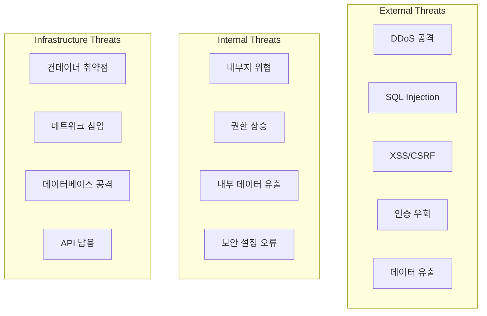

# Judgify-core Ver2.0 보안 아키텍처 및 인증/권한 시스템 설계서

**문서 버전**: v2.0  
**작성일**: 2024.08.10  
**대상**: 보안 엔지니어, 백엔드 개발자, DevOps 엔지니어  
**목적**: 제조업 AI 판단 플랫폼의 종합적 보안 아키텍처 및 구현 가이드

---

## 🎯 1. 보안 아키텍처 개요

### 1.1 핵심 보안 원칙
- **Zero Trust 아키텍처**: 모든 요청을 검증, 신뢰하지 않음
- **Defense in Depth**: 다층 보안 방어 체계
- **Principle of Least Privilege**: 최소 권한 원칙
- **Secure by Design**: 설계 단계부터 보안 고려
- **Audit Trail**: 모든 보안 이벤트 추적 및 기록

### 1.2 위협 모델링


### 1.3 제조업 특화 보안 요구사항
- **OT-IT 연계 보안**: 제조 시스템과 IT 시스템 간 보안 경계
- **실시간 판단 무결성**: AI 판단 결과의 변조 방지
- **멀티테넌트 격리**: 제조업체별 완전한 데이터 격리
- **산업 표준 준수**: ISO 27001, NIST CSF, IEC 62443 준수
- **GDPR/개인정보보호법**: 유럽 및 국내 개인정보보호 규정 준수

---

## 🔐 2. 인증 시스템 설계

### 2.1 하이브리드 인증 전략

#### 2.1.1 JWT + OAuth2 + OIDC 통합 아키텍처
```python
# 인증 전략 선택 매트릭스
AUTHENTICATION_STRATEGY = {
    "internal_users": "JWT + MFA",           # 내부 사용자
    "external_api": "OAuth2 + API Key",     # 외부 API 연동
    "sso_integration": "OIDC + SAML",       # SSO 통합
    "service_to_service": "mTLS + JWT",     # 마이크로서비스 간
    "iot_devices": "Certificate + JWT"      # IoT/센서 디바이스
}
```

#### 2.1.2 JWT 토큰 구조 설계
```python
# Access Token (15분 TTL)
ACCESS_TOKEN_PAYLOAD = {
    "sub": "user-uuid",                    # 사용자 ID
    "tenant_id": "tenant-uuid",            # 테넌트 ID (필수)
    "session_id": "session-uuid",          # 세션 추적용
    "roles": ["manufacturing_admin"],       # 역할 목록
    "permissions": [                       # 세밀한 권한
        "judgment:execute:tenant123",
        "workflow:create:tenant123",
        "dashboard:view:tenant123"
    ],
    "device_fingerprint": "fp_hash",       # 디바이스 지문
    "ip_whitelist": ["192.168.1.0/24"],   # IP 제한
    "mfa_verified": True,                  # MFA 인증 여부
    "security_level": "high",              # 보안 레벨
    "iat": 1700000000,                     # 발행 시간
    "exp": 1700000900,                     # 만료 시간 (15분)
    "iss": "judgify-auth-service",         # 발행자
    "aud": ["judgment-service", "workflow-service"]  # 대상 서비스
}

# Refresh Token (30일 TTL, Secure + HttpOnly)
REFRESH_TOKEN_PAYLOAD = {
    "sub": "user-uuid",
    "tenant_id": "tenant-uuid",
    "session_id": "session-uuid",
    "token_family": "rf_family_uuid",      # 토큰 패밀리 (탈취 감지)
    "security_level": "high",
    "iat": 1700000000,
    "exp": 1702592000,                     # 30일 후
    "iss": "judgify-auth-service"
}
```

### 2.2 Multi-Factor Authentication (MFA) 구현

#### 2.2.1 MFA 제공자 및 전략
```python
from enum import Enum
from typing import Dict, List
from dataclasses import dataclass

class MFAProvider(Enum):
    TOTP = "totp"                          # Google Authenticator, Authy
    SMS = "sms"                            # SMS OTP
    EMAIL = "email"                        # 이메일 OTP  
    HARDWARE_KEY = "hardware_key"          # YubiKey, FIDO2
    BIOMETRIC = "biometric"                # 지문, 얼굴인식
    PUSH_NOTIFICATION = "push"             # 앱 푸시 인증

@dataclass
class MFAPolicy:
    tenant_id: str
    required_factors: List[MFAProvider]
    grace_period_hours: int = 24           # MFA 유예 기간
    backup_codes_count: int = 10           # 백업 코드 개수
    max_failed_attempts: int = 5           # 최대 실패 횟수
    lockout_duration_minutes: int = 30     # 계정 잠금 시간

# 보안 레벨별 MFA 정책
MFA_POLICIES = {
    "manufacturing_admin": MFAPolicy(
        tenant_id="*",
        required_factors=[MFAProvider.TOTP, MFAProvider.HARDWARE_KEY],
        grace_period_hours=8,
        max_failed_attempts=3
    ),
    "quality_manager": MFAPolicy(
        tenant_id="*", 
        required_factors=[MFAProvider.TOTP],
        grace_period_hours=24,
        max_failed_attempts=5
    ),
    "operator": MFAPolicy(
        tenant_id="*",
        required_factors=[MFAProvider.SMS],
        grace_period_hours=72,
        max_failed_attempts=5
    )
}
```

#### 2.2.2 MFA 인증 플로우 구현
```python
from sqlalchemy import Column, String, DateTime, Boolean, Integer
from sqlalchemy.dialects.postgresql import UUID
import uuid
from datetime import datetime, timedelta

class MFASession(Base):
    __tablename__ = "mfa_sessions"
    
    id = Column(UUID(as_uuid=True), primary_key=True, default=uuid.uuid4)
    user_id = Column(UUID(as_uuid=True), nullable=False)
    tenant_id = Column(UUID(as_uuid=True), nullable=False)
    challenge_token = Column(String(255), nullable=False, unique=True)
    mfa_provider = Column(String(50), nullable=False)
    challenge_data = Column(String(500))  # 암호화된 챌린지 데이터
    attempt_count = Column(Integer, default=0)
    is_verified = Column(Boolean, default=False)
    expires_at = Column(DateTime, nullable=False)
    created_at = Column(DateTime, default=datetime.utcnow)

class AuthService:
    async def initiate_mfa_challenge(
        self, 
        user_id: str, 
        tenant_id: str, 
        provider: MFAProvider
    ) -> MFAChallenge:
        """MFA 챌린지 시작"""
        
        # 1. 사용자 MFA 설정 확인
        user_mfa = await self.get_user_mfa_config(user_id, tenant_id)
        if not user_mfa.is_enabled:
            raise MFANotConfiguredError()
        
        # 2. 챌린지 토큰 생성
        challenge_token = self.generate_secure_token(32)
        
        # 3. 제공자별 챌린지 생성
        if provider == MFAProvider.TOTP:
            # TOTP는 별도 데이터 불필요
            challenge_data = None
        elif provider == MFAProvider.SMS:
            # SMS OTP 생성 및 발송
            otp = self.generate_otp(6)
            await self.sms_service.send_otp(user_mfa.phone_number, otp)
            challenge_data = self.encrypt_data(otp)  # 암호화 저장
        elif provider == MFAProvider.HARDWARE_KEY:
            # WebAuthn 챌린지 생성
            challenge_data = self.webauthn.generate_challenge()
        
        # 4. MFA 세션 저장
        mfa_session = MFASession(
            user_id=user_id,
            tenant_id=tenant_id,
            challenge_token=challenge_token,
            mfa_provider=provider.value,
            challenge_data=challenge_data,
            expires_at=datetime.utcnow() + timedelta(minutes=10)
        )
        await self.db.save(mfa_session)
        
        return MFAChallenge(
            challenge_token=challenge_token,
            provider=provider,
            expires_in=600  # 10분
        )
    
    async def verify_mfa_response(
        self, 
        challenge_token: str, 
        response: str
    ) -> MFAVerificationResult:
        """MFA 응답 검증"""
        
        # 1. 챌린지 세션 조회
        session = await self.get_mfa_session(challenge_token)
        if not session or session.expires_at < datetime.utcnow():
            raise MFASessionExpiredError()
        
        # 2. 시도 횟수 확인
        if session.attempt_count >= 5:
            await self.lock_user_account(session.user_id, minutes=30)
            raise MFAMaxAttemptsExceededError()
        
        # 3. 제공자별 검증
        is_valid = False
        if session.mfa_provider == MFAProvider.TOTP.value:
            is_valid = self.totp_service.verify(session.user_id, response)
        elif session.mfa_provider == MFAProvider.SMS.value:
            stored_otp = self.decrypt_data(session.challenge_data)
            is_valid = (response == stored_otp)
        elif session.mfa_provider == MFAProvider.HARDWARE_KEY.value:
            is_valid = self.webauthn.verify_response(
                session.challenge_data, response
            )
        
        # 4. 결과 처리
        session.attempt_count += 1
        if is_valid:
            session.is_verified = True
            await self.log_security_event(
                "mfa_success", 
                user_id=session.user_id,
                provider=session.mfa_provider
            )
        else:
            await self.log_security_event(
                "mfa_failure",
                user_id=session.user_id, 
                provider=session.mfa_provider,
                attempt_count=session.attempt_count
            )
        
        await self.db.save(session)
        
        return MFAVerificationResult(
            is_valid=is_valid,
            verified_at=datetime.utcnow() if is_valid else None,
            attempts_remaining=5 - session.attempt_count
        )
```

### 2.3 Single Sign-On (SSO) 통합

#### 2.3.1 SAML 2.0 + OIDC 지원
```python
from saml2 import BINDING_HTTP_POST, BINDING_HTTP_REDIRECT
from saml2.config import Config as SAML2Config
from authlib.integrations.flask_oauth2 import ResourceProtector

class SSOProvider(Enum):
    SAML_ADFS = "saml_adfs"               # Microsoft ADFS
    OIDC_AZURE_AD = "oidc_azure_ad"       # Azure Active Directory
    OIDC_GOOGLE = "oidc_google"           # Google Workspace
    OIDC_OKTA = "oidc_okta"               # Okta
    SAML_GENERIC = "saml_generic"         # Generic SAML 2.0

class SSOService:
    def __init__(self):
        self.saml_config = self._setup_saml_config()
        self.oidc_clients = self._setup_oidc_clients()
    
    def _setup_saml_config(self) -> SAML2Config:
        """SAML 2.0 설정"""
        return SAML2Config({
            'entityid': 'https://judgify.company.com/saml/metadata',
            'service': {
                'sp': {
                    'name': 'Judgify SAML SP',
                    'endpoints': {
                        'assertion_consumer_service': [
                            ('https://judgify.company.com/saml/acs', 
                             BINDING_HTTP_POST),
                        ],
                        'single_logout_service': [
                            ('https://judgify.company.com/saml/sls',
                             BINDING_HTTP_REDIRECT),
                        ],
                    },
                    'allow_unsolicited': True,
                    'authn_requests_signed': True,
                    'logout_requests_signed': True,
                    'want_assertions_signed': True,
                    'want_response_signed': True,
                }
            },
            'key_file': '/etc/ssl/private/saml.key',
            'cert_file': '/etc/ssl/certs/saml.crt',
        })
    
    async def process_saml_response(
        self, 
        saml_response: str,
        tenant_id: str
    ) -> SSOLoginResult:
        """SAML 응답 처리 및 사용자 매핑"""
        
        # 1. SAML 응답 검증
        saml_client = Saml2Client(self.saml_config)
        authn_response = saml_client.parse_authn_request_response(
            saml_response, 
            BINDING_HTTP_POST
        )
        
        if not authn_response.came_from:
            raise InvalidSAMLResponseError()
        
        # 2. 사용자 속성 추출
        attributes = authn_response.get_identity()
        user_info = {
            'email': attributes.get('email', [None])[0],
            'name': attributes.get('displayName', [None])[0],
            'employee_id': attributes.get('employeeID', [None])[0],
            'department': attributes.get('department', [None])[0],
            'groups': attributes.get('groups', [])
        }
        
        # 3. 사용자 매핑 및 생성/업데이트
        user = await self.provision_sso_user(user_info, tenant_id)
        
        # 4. JWT 토큰 생성
        tokens = await self.generate_jwt_tokens(
            user.id, 
            tenant_id,
            auth_method="sso_saml"
        )
        
        return SSOLoginResult(
            user=user,
            access_token=tokens.access_token,
            refresh_token=tokens.refresh_token,
            provider="saml"
        )
```

---

## 🔑 3. 권한 관리 시스템 (RBAC)

### 3.1 역할 기반 접근 제어 모델

#### 3.1.1 권한 계층 구조
```python
from enum import Enum
from typing import List, Dict, Set
from dataclasses import dataclass

class Permission(Enum):
    # 워크플로우 권한
    WORKFLOW_VIEW = "workflow:view"
    WORKFLOW_CREATE = "workflow:create"
    WORKFLOW_EDIT = "workflow:edit" 
    WORKFLOW_DELETE = "workflow:delete"
    WORKFLOW_EXECUTE = "workflow:execute"
    WORKFLOW_PUBLISH = "workflow:publish"
    
    # 판단 권한
    JUDGMENT_VIEW = "judgment:view"
    JUDGMENT_EXECUTE = "judgment:execute"
    JUDGMENT_APPROVE = "judgment:approve"
    JUDGMENT_OVERRIDE = "judgment:override"
    
    # 대시보드 권한
    DASHBOARD_VIEW = "dashboard:view"
    DASHBOARD_CREATE = "dashboard:create"
    DASHBOARD_EDIT = "dashboard:edit"
    DASHBOARD_SHARE = "dashboard:share"
    
    # 시스템 관리 권한
    USER_MANAGE = "user:manage"
    TENANT_MANAGE = "tenant:manage"
    SYSTEM_CONFIG = "system:config"
    AUDIT_VIEW = "audit:view"
    
    # 데이터 권한
    DATA_EXPORT = "data:export"
    DATA_IMPORT = "data:import"
    DATA_DELETE = "data:delete"

class Role(Enum):
    # 시스템 관리자
    SUPER_ADMIN = "super_admin"
    TENANT_ADMIN = "tenant_admin"
    
    # 제조 관리자
    MANUFACTURING_ADMIN = "manufacturing_admin"
    QUALITY_MANAGER = "quality_manager"
    
    # 운영자
    SENIOR_OPERATOR = "senior_operator"
    OPERATOR = "operator"
    
    # 분석가
    DATA_ANALYST = "data_analyst"
    
    # 조회 전용
    VIEWER = "viewer"

# 역할별 권한 매트릭스
ROLE_PERMISSIONS = {
    Role.SUPER_ADMIN: [perm for perm in Permission],  # 모든 권한
    
    Role.TENANT_ADMIN: [
        Permission.WORKFLOW_VIEW, Permission.WORKFLOW_CREATE,
        Permission.WORKFLOW_EDIT, Permission.WORKFLOW_DELETE,
        Permission.JUDGMENT_VIEW, Permission.JUDGMENT_EXECUTE,
        Permission.JUDGMENT_APPROVE, Permission.DASHBOARD_VIEW,
        Permission.DASHBOARD_CREATE, Permission.DASHBOARD_EDIT,
        Permission.USER_MANAGE, Permission.AUDIT_VIEW,
        Permission.DATA_EXPORT, Permission.DATA_IMPORT
    ],
    
    Role.MANUFACTURING_ADMIN: [
        Permission.WORKFLOW_VIEW, Permission.WORKFLOW_CREATE,
        Permission.WORKFLOW_EDIT, Permission.WORKFLOW_PUBLISH,
        Permission.JUDGMENT_VIEW, Permission.JUDGMENT_EXECUTE,
        Permission.JUDGMENT_APPROVE, Permission.JUDGMENT_OVERRIDE,
        Permission.DASHBOARD_VIEW, Permission.DASHBOARD_CREATE,
        Permission.DASHBOARD_EDIT, Permission.DATA_EXPORT
    ],
    
    Role.QUALITY_MANAGER: [
        Permission.WORKFLOW_VIEW, Permission.WORKFLOW_EXECUTE,
        Permission.JUDGMENT_VIEW, Permission.JUDGMENT_EXECUTE,
        Permission.JUDGMENT_APPROVE, Permission.DASHBOARD_VIEW,
        Permission.DASHBOARD_CREATE, Permission.DATA_EXPORT
    ],
    
    Role.SENIOR_OPERATOR: [
        Permission.WORKFLOW_VIEW, Permission.WORKFLOW_EXECUTE,
        Permission.JUDGMENT_VIEW, Permission.JUDGMENT_EXECUTE,
        Permission.DASHBOARD_VIEW
    ],
    
    Role.OPERATOR: [
        Permission.WORKFLOW_VIEW, Permission.WORKFLOW_EXECUTE,
        Permission.JUDGMENT_VIEW, Permission.DASHBOARD_VIEW
    ],
    
    Role.DATA_ANALYST: [
        Permission.WORKFLOW_VIEW, Permission.JUDGMENT_VIEW,
        Permission.DASHBOARD_VIEW, Permission.DASHBOARD_CREATE,
        Permission.DATA_EXPORT, Permission.AUDIT_VIEW
    ],
    
    Role.VIEWER: [
        Permission.WORKFLOW_VIEW, Permission.JUDGMENT_VIEW,
        Permission.DASHBOARD_VIEW
    ]
}
```

#### 3.1.2 동적 권한 할당 시스템
```python
from sqlalchemy import Column, String, DateTime, Boolean, Text, ForeignKey
from sqlalchemy.dialects.postgresql import UUID, JSON
from sqlalchemy.orm import relationship
import uuid

class User(Base):
    __tablename__ = "users"
    
    id = Column(UUID(as_uuid=True), primary_key=True, default=uuid.uuid4)
    email = Column(String(255), nullable=False, unique=True)
    tenant_id = Column(UUID(as_uuid=True), ForeignKey("tenants.id"), nullable=False)
    is_active = Column(Boolean, default=True)
    created_at = Column(DateTime, default=datetime.utcnow)
    
    # 관계
    tenant = relationship("Tenant", back_populates="users")
    user_roles = relationship("UserRole", back_populates="user")
    user_permissions = relationship("UserPermission", back_populates="user")

class UserRole(Base):
    __tablename__ = "user_roles"
    
    id = Column(UUID(as_uuid=True), primary_key=True, default=uuid.uuid4)
    user_id = Column(UUID(as_uuid=True), ForeignKey("users.id"), nullable=False)
    role = Column(String(50), nullable=False)  # Role enum value
    granted_by = Column(UUID(as_uuid=True), ForeignKey("users.id"))
    granted_at = Column(DateTime, default=datetime.utcnow)
    expires_at = Column(DateTime, nullable=True)  # 임시 역할 지원
    is_active = Column(Boolean, default=True)
    
    # 관계
    user = relationship("User", back_populates="user_roles")

class UserPermission(Base):
    """사용자별 개별 권한 (역할 권한에 추가)"""
    __tablename__ = "user_permissions"
    
    id = Column(UUID(as_uuid=True), primary_key=True, default=uuid.uuid4)
    user_id = Column(UUID(as_uuid=True), ForeignKey("users.id"), nullable=False)
    permission = Column(String(100), nullable=False)
    resource_type = Column(String(50))  # workflow, judgment, dashboard
    resource_id = Column(String(255))   # 특정 리소스 ID
    granted_by = Column(UUID(as_uuid=True), ForeignKey("users.id"))
    granted_at = Column(DateTime, default=datetime.utcnow)
    expires_at = Column(DateTime, nullable=True)
    is_active = Column(Boolean, default=True)
    
    # 관계
    user = relationship("User", back_populates="user_permissions")

class AuthorizationService:
    """권한 검증 및 관리 서비스"""
    
    async def check_permission(
        self, 
        user_id: str,
        tenant_id: str,
        permission: Permission,
        resource_id: str = None
    ) -> bool:
        """권한 검증 (역할 + 개별 권한 통합)"""
        
        # 1. 사용자 활성화 상태 확인
        user = await self.get_user(user_id, tenant_id)
        if not user or not user.is_active:
            return False
        
        # 2. 역할 기반 권한 확인
        user_roles = await self.get_user_active_roles(user_id)
        role_permissions = set()
        for role in user_roles:
            role_permissions.update(ROLE_PERMISSIONS.get(Role(role), []))
        
        if permission in role_permissions:
            return True
        
        # 3. 개별 권한 확인
        individual_permissions = await self.get_user_permissions(
            user_id, permission.value, resource_id
        )
        
        return len(individual_permissions) > 0
    
    async def grant_temporary_permission(
        self, 
        user_id: str,
        permission: Permission,
        duration_hours: int,
        granted_by: str,
        reason: str,
        resource_id: str = None
    ):
        """임시 권한 부여"""
        
        # 1. 부여자 권한 확인
        can_grant = await self.check_permission(
            granted_by, user_id, Permission.USER_MANAGE
        )
        if not can_grant:
            raise InsufficientPermissionsError()
        
        # 2. 임시 권한 생성
        temp_permission = UserPermission(
            user_id=user_id,
            permission=permission.value,
            resource_id=resource_id,
            granted_by=granted_by,
            expires_at=datetime.utcnow() + timedelta(hours=duration_hours)
        )
        
        await self.db.save(temp_permission)
        
        # 3. 감사 로그 기록
        await self.log_security_event(
            "temp_permission_granted",
            user_id=user_id,
            granted_by=granted_by,
            permission=permission.value,
            duration_hours=duration_hours,
            reason=reason
        )
```

### 3.2 멀티테넌트 권한 격리

#### 3.2.1 테넌트별 데이터 격리
```python
class Tenant(Base):
    __tablename__ = "tenants"
    
    id = Column(UUID(as_uuid=True), primary_key=True, default=uuid.uuid4)
    name = Column(String(255), nullable=False)
    domain = Column(String(255), nullable=False, unique=True)  # company.com
    
    # 보안 정책
    security_policy = Column(JSON, nullable=False, default=dict)
    
    # 암호화 키 (테넌트별 격리)
    encryption_key_id = Column(String(255), nullable=False)
    
    # 네트워크 정책
    allowed_ip_ranges = Column(JSON, default=list)  # ["192.168.1.0/24"]
    
    # 관계
    users = relationship("User", back_populates="tenant")
    workflows = relationship("Workflow", back_populates="tenant")
    
    created_at = Column(DateTime, default=datetime.utcnow)
    is_active = Column(Boolean, default=True)

class TenantSecurityPolicy:
    """테넌트별 보안 정책"""
    
    def __init__(self, tenant_id: str, policy_config: dict):
        self.tenant_id = tenant_id
        self.password_policy = policy_config.get("password_policy", {})
        self.session_policy = policy_config.get("session_policy", {})
        self.mfa_policy = policy_config.get("mfa_policy", {})
        self.ip_policy = policy_config.get("ip_policy", {})
    
    def validate_password(self, password: str) -> bool:
        """테넌트별 패스워드 정책 검증"""
        min_length = self.password_policy.get("min_length", 12)
        require_uppercase = self.password_policy.get("require_uppercase", True)
        require_lowercase = self.password_policy.get("require_lowercase", True) 
        require_numbers = self.password_policy.get("require_numbers", True)
        require_symbols = self.password_policy.get("require_symbols", True)
        
        if len(password) < min_length:
            return False
        if require_uppercase and not any(c.isupper() for c in password):
            return False
        if require_lowercase and not any(c.islower() for c in password):
            return False
        if require_numbers and not any(c.isdigit() for c in password):
            return False
        if require_symbols and not any(c in "!@#$%^&*" for c in password):
            return False
            
        return True
    
    def get_session_timeout(self) -> int:
        """테넌트별 세션 타임아웃"""
        return self.session_policy.get("timeout_minutes", 480)  # 8시간 기본

class TenantIsolationMiddleware:
    """테넌트 격리 미들웨어"""
    
    async def __call__(self, request: Request, call_next):
        # 1. 테넌트 식별
        tenant_id = await self.extract_tenant_id(request)
        if not tenant_id:
            raise TenantNotFoundError()
        
        # 2. 테넌트별 데이터베이스 컨텍스트 설정
        request.state.tenant_id = tenant_id
        request.state.db_context = self.get_tenant_db_context(tenant_id)
        
        # 3. 테넌트별 보안 정책 적용
        security_policy = await self.get_tenant_security_policy(tenant_id)
        request.state.security_policy = security_policy
        
        # 4. IP 제한 확인
        client_ip = request.client.host
        if not self.is_ip_allowed(client_ip, security_policy.ip_policy):
            await self.log_security_event(
                "ip_access_denied",
                tenant_id=tenant_id,
                client_ip=client_ip
            )
            raise IPAccessDeniedError()
        
        response = await call_next(request)
        return response
    
    async def extract_tenant_id(self, request: Request) -> str:
        """요청에서 테넌트 ID 추출"""
        
        # 1. JWT 토큰에서 추출
        auth_header = request.headers.get("Authorization")
        if auth_header and auth_header.startswith("Bearer "):
            token = auth_header.split(" ")[1]
            try:
                payload = jwt.decode(token, verify=False)
                return payload.get("tenant_id")
            except:
                pass
        
        # 2. 서브도메인에서 추출 (company.judgify.com)
        host = request.headers.get("Host", "")
        if "." in host:
            subdomain = host.split(".")[0]
            tenant = await self.get_tenant_by_domain(subdomain)
            if tenant:
                return tenant.id
        
        # 3. API Key에서 추출
        api_key = request.headers.get("X-API-Key")
        if api_key:
            tenant_id = await self.get_tenant_from_api_key(api_key)
            if tenant_id:
                return tenant_id
        
        return None
```

---

## 🛡️ 4. API 보안 강화

### 4.1 Rate Limiting 및 DDoS 방어

#### 4.1.1 계층별 Rate Limiting
```python
from redis import Redis
from typing import Dict, Tuple
from datetime import datetime, timedelta
import hashlib

class RateLimitConfig:
    def __init__(
        self,
        requests_per_minute: int = 60,
        requests_per_hour: int = 1000,
        requests_per_day: int = 10000,
        burst_allowance: int = 10
    ):
        self.requests_per_minute = requests_per_minute
        self.requests_per_hour = requests_per_hour  
        self.requests_per_day = requests_per_day
        self.burst_allowance = burst_allowance

# 엔드포인트별 Rate Limit 설정
ENDPOINT_RATE_LIMITS = {
    "/api/v1/auth/login": RateLimitConfig(
        requests_per_minute=10,
        requests_per_hour=100,
        burst_allowance=3
    ),
    "/api/v1/judgment/execute": RateLimitConfig(
        requests_per_minute=120,
        requests_per_hour=2000,
        burst_allowance=20
    ),
    "/api/v1/workflow/create": RateLimitConfig(
        requests_per_minute=30,
        requests_per_hour=200,
        burst_allowance=5
    ),
    "default": RateLimitConfig()
}

class AdvancedRateLimiter:
    def __init__(self, redis_client: Redis):
        self.redis = redis_client
        self.default_config = ENDPOINT_RATE_LIMITS["default"]
    
    async def check_rate_limit(
        self, 
        identifier: str,
        endpoint: str,
        user_tier: str = "standard"
    ) -> Tuple[bool, Dict]:
        """고급 Rate Limiting 검사"""
        
        # 1. 설정 가져오기
        config = ENDPOINT_RATE_LIMITS.get(endpoint, self.default_config)
        
        # 2. 사용자 티어별 배율 적용
        multiplier = self.get_tier_multiplier(user_tier)
        adjusted_config = self.apply_tier_multiplier(config, multiplier)
        
        # 3. 여러 시간 윈도우 검사
        windows = {
            "minute": (60, adjusted_config.requests_per_minute),
            "hour": (3600, adjusted_config.requests_per_hour),
            "day": (86400, adjusted_config.requests_per_day)
        }
        
        current_time = datetime.utcnow()
        
        for window_name, (duration, limit) in windows.items():
            key = f"rate_limit:{identifier}:{endpoint}:{window_name}:{int(current_time.timestamp() // duration)}"
            
            # Redis에서 현재 카운트 가져오기
            current_count = await self.redis.get(key)
            current_count = int(current_count) if current_count else 0
            
            # 한도 초과 검사
            if current_count >= limit:
                # Burst allowance 확인 (분 단위만)
                if window_name == "minute":
                    burst_key = f"burst:{identifier}:{endpoint}"
                    burst_used = await self.redis.get(burst_key)
                    burst_used = int(burst_used) if burst_used else 0
                    
                    if burst_used < adjusted_config.burst_allowance:
                        # Burst allowance 사용
                        await self.redis.incr(burst_key)
                        await self.redis.expire(burst_key, 3600)  # 1시간 후 리셋
                        continue
                
                # Rate limit 초과
                retry_after = duration - (int(current_time.timestamp()) % duration)
                return False, {
                    "error": "rate_limit_exceeded",
                    "window": window_name,
                    "limit": limit,
                    "current": current_count,
                    "retry_after": retry_after
                }
        
        # 4. 카운터 증가
        for window_name, (duration, _) in windows.items():
            key = f"rate_limit:{identifier}:{endpoint}:{window_name}:{int(current_time.timestamp() // duration)}"
            await self.redis.incr(key)
            await self.redis.expire(key, duration)
        
        return True, {"status": "allowed"}
    
    def get_tier_multiplier(self, user_tier: str) -> float:
        """사용자 티어별 배율"""
        multipliers = {
            "enterprise": 5.0,
            "professional": 3.0,
            "standard": 1.0,
            "basic": 0.5
        }
        return multipliers.get(user_tier, 1.0)

class SecurityMiddleware:
    def __init__(self, rate_limiter: AdvancedRateLimiter):
        self.rate_limiter = rate_limiter
    
    async def __call__(self, request: Request, call_next):
        # 1. 클라이언트 식별
        client_id = await self.get_client_identifier(request)
        endpoint = request.url.path
        
        # 2. Rate Limiting 검사
        allowed, result = await self.rate_limiter.check_rate_limit(
            client_id, endpoint
        )
        
        if not allowed:
            # 보안 이벤트 로깅
            await self.log_security_event(
                "rate_limit_exceeded",
                client_id=client_id,
                endpoint=endpoint,
                details=result
            )
            
            return JSONResponse(
                status_code=429,
                content=result,
                headers={"Retry-After": str(result.get("retry_after", 60))}
            )
        
        # 3. 기타 보안 헤더 추가
        response = await call_next(request)
        
        # 보안 헤더 추가
        response.headers["X-Content-Type-Options"] = "nosniff"
        response.headers["X-Frame-Options"] = "DENY" 
        response.headers["X-XSS-Protection"] = "1; mode=block"
        response.headers["Strict-Transport-Security"] = "max-age=31536000; includeSubDomains"
        response.headers["Referrer-Policy"] = "strict-origin-when-cross-origin"
        
        return response
    
    async def get_client_identifier(self, request: Request) -> str:
        """클라이언트 식별자 생성"""
        
        # 1. 인증된 사용자의 경우 사용자 ID 사용
        if hasattr(request.state, "user_id"):
            return f"user:{request.state.user_id}"
        
        # 2. API Key 사용자
        api_key = request.headers.get("X-API-Key")
        if api_key:
            # API Key 해시 사용 (보안)
            key_hash = hashlib.sha256(api_key.encode()).hexdigest()[:16]
            return f"api:{key_hash}"
        
        # 3. IP 주소 기반 (마지막 수단)
        forwarded_for = request.headers.get("X-Forwarded-For")
        if forwarded_for:
            client_ip = forwarded_for.split(",")[0].strip()
        else:
            client_ip = request.client.host
        
        return f"ip:{client_ip}"
```

### 4.2 입력 검증 및 SQL Injection 방지

#### 4.2.1 Pydantic 기반 입력 검증
```python
from pydantic import BaseModel, Field, validator, root_validator
from typing import Optional, List, Dict, Any, Union
import re
from datetime import datetime
from enum import Enum

class WorkflowNodeType(str, Enum):
    CONDITION = "condition"
    ACTION = "action"
    JUDGMENT = "judgment"
    NOTIFICATION = "notification"

class SecureBaseModel(BaseModel):
    """보안 강화된 기본 모델"""
    
    class Config:
        # XSS 방지: HTML 태그 제거
        str_strip_whitespace = True
        # 추가 필드 허용 안 함
        extra = "forbid"
        # 타입 검증 강화
        validate_all = True
        
    @validator("*", pre=True, always=True)
    def sanitize_strings(cls, v):
        """문자열 필드 XSS 방지 처리"""
        if isinstance(v, str):
            # HTML 태그 제거
            v = re.sub(r'<[^>]+>', '', v)
            # 스크립트 태그 완전 제거
            v = re.sub(r'javascript:', '', v, flags=re.IGNORECASE)
            # SQL 인젝션 의심 패턴 제거
            suspicious_patterns = [
                r'union\s+select', r'drop\s+table', r'delete\s+from',
                r'insert\s+into', r'update\s+set', r'alter\s+table'
            ]
            for pattern in suspicious_patterns:
                v = re.sub(pattern, '', v, flags=re.IGNORECASE)
        return v

class WorkflowCreateRequest(SecureBaseModel):
    """워크플로우 생성 요청"""
    name: str = Field(
        ...,
        min_length=3,
        max_length=100,
        regex=r'^[a-zA-Z0-9가-힣\s\-_]+$',  # 안전한 문자만 허용
        description="워크플로우 이름"
    )
    description: Optional[str] = Field(
        None,
        max_length=500,
        description="워크플로우 설명"
    )
    definition: Dict[str, Any] = Field(
        ...,
        description="워크플로우 정의 (JSON)"
    )
    
    @validator("definition")
    def validate_workflow_definition(cls, v):
        """워크플로우 정의 구조 검증"""
        required_fields = {"nodes", "edges", "startNode"}
        if not all(field in v for field in required_fields):
            raise ValueError("워크플로우 정의에 필수 필드가 없습니다")
        
        # 노드 개수 제한 (DoS 방지)
        if len(v.get("nodes", [])) > 100:
            raise ValueError("노드 개수가 너무 많습니다 (최대 100개)")
        
        # 각 노드 타입 검증
        for node in v.get("nodes", []):
            node_type = node.get("type")
            if node_type not in [e.value for e in WorkflowNodeType]:
                raise ValueError(f"지원하지 않는 노드 타입: {node_type}")
        
        return v

class JudgmentExecuteRequest(SecureBaseModel):
    """판단 실행 요청"""
    workflow_id: str = Field(
        ...,
        regex=r'^[0-9a-f]{8}-[0-9a-f]{4}-[0-9a-f]{4}-[0-9a-f]{4}-[0-9a-f]{12}$',
        description="워크플로우 UUID"
    )
    input_data: Dict[str, Union[str, int, float, bool]] = Field(
        ...,
        description="입력 데이터"
    )
    priority: Optional[int] = Field(
        1,
        ge=1,
        le=5,
        description="우선순위 (1-5)"
    )
    
    @validator("input_data")
    def validate_input_data(cls, v):
        """입력 데이터 검증"""
        # 데이터 크기 제한 (DoS 방지)
        if len(str(v)) > 10000:  # 10KB 제한
            raise ValueError("입력 데이터가 너무 큽니다")
        
        # 중첩 레벨 제한
        def check_nesting_level(obj, level=0):
            if level > 5:  # 최대 5단계 중첩
                raise ValueError("중첩 레벨이 너무 깊습니다")
            if isinstance(obj, dict):
                for value in obj.values():
                    check_nesting_level(value, level + 1)
            elif isinstance(obj, list):
                for item in obj:
                    check_nesting_level(item, level + 1)
        
        check_nesting_level(v)
        return v

class DashboardCreateRequest(SecureBaseModel):
    """대시보드 생성 요청"""
    natural_language_query: str = Field(
        ...,
        min_length=10,
        max_length=500,
        description="자연어 요청"
    )
    data_sources: Optional[List[str]] = Field(
        None,
        max_items=10,
        description="데이터 소스 목록"
    )
    
    @validator("natural_language_query")
    def validate_query(cls, v):
        """자연어 쿼리 보안 검증"""
        # 의심스러운 키워드 차단
        dangerous_keywords = [
            "execute", "eval", "function", "script", "import",
            "require", "process", "global", "__"
        ]
        
        v_lower = v.lower()
        for keyword in dangerous_keywords:
            if keyword in v_lower:
                raise ValueError(f"허용되지 않는 키워드: {keyword}")
        
        return v

# SQL 쿼리 빌더 (인젝션 방지)
class SecureQueryBuilder:
    """SQL 인젝션 방지 쿼리 빌더"""
    
    def __init__(self, table_name: str):
        self.table_name = self._sanitize_identifier(table_name)
        self.conditions = []
        self.parameters = {}
        self.joins = []
        self.order_by = []
        
    def _sanitize_identifier(self, identifier: str) -> str:
        """식별자 이름 검증 (테이블명, 컬럼명)"""
        if not re.match(r'^[a-zA-Z_][a-zA-Z0-9_]*$', identifier):
            raise ValueError(f"올바르지 않은 식별자: {identifier}")
        return identifier
    
    def where(self, column: str, operator: str, value: Any) -> 'SecureQueryBuilder':
        """WHERE 조건 추가"""
        # 허용된 연산자만 사용
        allowed_operators = ['=', '!=', '>', '<', '>=', '<=', 'LIKE', 'IN', 'IS NULL', 'IS NOT NULL']
        if operator.upper() not in allowed_operators:
            raise ValueError(f"허용되지 않는 연산자: {operator}")
        
        column = self._sanitize_identifier(column)
        param_name = f"param_{len(self.parameters)}"
        
        if operator.upper() == 'IN':
            if not isinstance(value, (list, tuple)):
                raise ValueError("IN 연산자는 리스트 값이 필요합니다")
            placeholders = ', '.join([f':{param_name}_{i}' for i in range(len(value))])
            self.conditions.append(f"{column} IN ({placeholders})")
            for i, v in enumerate(value):
                self.parameters[f"{param_name}_{i}"] = v
        else:
            self.conditions.append(f"{column} {operator} :{param_name}")
            self.parameters[param_name] = value
        
        return self
    
    def build_select(self, columns: List[str] = None) -> Tuple[str, Dict]:
        """SELECT 쿼리 생성"""
        if columns:
            columns = [self._sanitize_identifier(col) for col in columns]
            select_clause = ', '.join(columns)
        else:
            select_clause = '*'
        
        query = f"SELECT {select_clause} FROM {self.table_name}"
        
        if self.conditions:
            query += " WHERE " + " AND ".join(self.conditions)
        
        if self.order_by:
            query += " ORDER BY " + ", ".join(self.order_by)
        
        return query, self.parameters

# 사용 예제
async def get_workflows_secure(
    tenant_id: str,
    status: Optional[str] = None,
    limit: int = 50
) -> List[Dict]:
    """보안이 강화된 워크플로우 조회"""
    
    # 1. 입력 검증
    if limit > 1000:  # DoS 방지
        limit = 1000
    
    # 2. 안전한 쿼리 빌더 사용
    builder = SecureQueryBuilder("workflows") \
        .where("tenant_id", "=", tenant_id) \
        .where("is_active", "=", True)
    
    if status:
        builder.where("status", "=", status)
    
    query, params = builder.build_select(
        ["id", "name", "description", "status", "created_at"]
    )
    
    # LIMIT은 별도로 추가 (안전함)
    query += f" LIMIT :limit"
    params["limit"] = limit
    
    # 3. 파라미터화된 쿼리 실행
    result = await database.fetch_all(query, params)
    return [dict(row) for row in result]
```

---

## 🔒 5. 데이터 보안 및 암호화

### 5.1 End-to-End 암호화 전략

#### 5.1.1 계층별 암호화 구현
```python
from cryptography.fernet import Fernet
from cryptography.hazmat.primitives import hashes
from cryptography.hazmat.primitives.kdf.pbkdf2 import PBKDF2HMAC
from cryptography.hazmat.primitives.ciphers import Cipher, algorithms, modes
import os
import base64
from typing import Dict, Any
import json

class EncryptionService:
    """다층 암호화 서비스"""
    
    def __init__(self):
        self.tenant_keys: Dict[str, bytes] = {}
        self.master_key = self._load_master_key()
    
    def _load_master_key(self) -> bytes:
        """마스터 키 로드 (HSM 또는 Key Vault에서)"""
        # 실제 구현에서는 AWS KMS, Azure Key Vault 등 사용
        master_key_b64 = os.environ.get("MASTER_ENCRYPTION_KEY")
        if not master_key_b64:
            raise ValueError("마스터 암호화 키가 설정되지 않았습니다")
        return base64.b64decode(master_key_b64)
    
    def get_tenant_key(self, tenant_id: str) -> bytes:
        """테넌트별 암호화 키 생성/조회"""
        if tenant_id not in self.tenant_keys:
            # 테넌트별 고유 키 생성
            salt = tenant_id.encode()
            kdf = PBKDF2HMAC(
                algorithm=hashes.SHA256(),
                length=32,
                salt=salt,
                iterations=100000,
            )
            tenant_key = kdf.derive(self.master_key)
            self.tenant_keys[tenant_id] = tenant_key
        
        return self.tenant_keys[tenant_id]
    
    def encrypt_sensitive_data(
        self, 
        data: Any, 
        tenant_id: str,
        data_classification: str = "sensitive"
    ) -> str:
        """민감한 데이터 암호화"""
        
        # 1. JSON 직렬화
        json_data = json.dumps(data, ensure_ascii=False)
        
        # 2. 테넌트별 키로 암호화
        tenant_key = self.get_tenant_key(tenant_id)
        fernet = Fernet(base64.urlsafe_b64encode(tenant_key))
        
        # 3. 메타데이터 포함 암호화
        metadata = {
            "tenant_id": tenant_id,
            "classification": data_classification,
            "encrypted_at": datetime.utcnow().isoformat(),
            "data": json_data
        }
        
        metadata_json = json.dumps(metadata)
        encrypted_data = fernet.encrypt(metadata_json.encode())
        
        return base64.b64encode(encrypted_data).decode()
    
    def decrypt_sensitive_data(
        self, 
        encrypted_data: str, 
        tenant_id: str
    ) -> Any:
        """민감한 데이터 복호화"""
        
        try:
            # 1. Base64 디코딩
            encrypted_bytes = base64.b64decode(encrypted_data)
            
            # 2. 테넌트별 키로 복호화
            tenant_key = self.get_tenant_key(tenant_id)
            fernet = Fernet(base64.urlsafe_b64encode(tenant_key))
            
            decrypted_bytes = fernet.decrypt(encrypted_bytes)
            metadata = json.loads(decrypted_bytes.decode())
            
            # 3. 테넌트 검증
            if metadata["tenant_id"] != tenant_id:
                raise ValueError("테넌트 불일치")
            
            # 4. 원본 데이터 반환
            return json.loads(metadata["data"])
            
        except Exception as e:
            # 복호화 실패 로깅
            await self.log_security_event(
                "decryption_failed",
                tenant_id=tenant_id,
                error=str(e)
            )
            raise DecryptionError("데이터 복호화 실패")

class FieldLevelEncryption:
    """필드 레벨 암호화 (데이터베이스)"""
    
    def __init__(self, encryption_service: EncryptionService):
        self.encryption_service = encryption_service
        
        # 암호화 대상 필드 정의
        self.encrypted_fields = {
            "users": ["email", "phone_number", "personal_data"],
            "judgment_executions": ["input_data", "llm_result"],
            "workflows": ["definition"],  # 민감한 비즈니스 로직
            "audit_logs": ["details"]
        }
    
    async def before_save(
        self, 
        table_name: str, 
        data: Dict[str, Any],
        tenant_id: str
    ) -> Dict[str, Any]:
        """저장 전 필드 암호화"""
        
        if table_name not in self.encrypted_fields:
            return data
        
        encrypted_data = data.copy()
        
        for field in self.encrypted_fields[table_name]:
            if field in encrypted_data and encrypted_data[field] is not None:
                # 필드 값 암호화
                encrypted_value = self.encryption_service.encrypt_sensitive_data(
                    encrypted_data[field],
                    tenant_id,
                    f"{table_name}_{field}"
                )
                encrypted_data[field] = encrypted_value
                
                # 암호화 메타데이터 추가
                encrypted_data[f"{field}_encrypted"] = True
                encrypted_data[f"{field}_encrypted_at"] = datetime.utcnow()
        
        return encrypted_data
    
    async def after_load(
        self, 
        table_name: str, 
        data: Dict[str, Any],
        tenant_id: str
    ) -> Dict[str, Any]:
        """로드 후 필드 복호화"""
        
        if table_name not in self.encrypted_fields:
            return data
        
        decrypted_data = data.copy()
        
        for field in self.encrypted_fields[table_name]:
            if (field in decrypted_data and 
                decrypted_data.get(f"{field}_encrypted") is True):
                
                try:
                    # 필드 값 복호화
                    decrypted_value = self.encryption_service.decrypt_sensitive_data(
                        decrypted_data[field],
                        tenant_id
                    )
                    decrypted_data[field] = decrypted_value
                    
                    # 메타데이터 제거
                    decrypted_data.pop(f"{field}_encrypted", None)
                    decrypted_data.pop(f"{field}_encrypted_at", None)
                    
                except Exception:
                    # 복호화 실패시 필드 제거
                    decrypted_data.pop(field, None)
        
        return decrypted_data

# 데이터베이스 모델에 암호화 적용
class EncryptedWorkflow(Base):
    __tablename__ = "workflows"
    
    id = Column(UUID(as_uuid=True), primary_key=True, default=uuid.uuid4)
    tenant_id = Column(UUID(as_uuid=True), nullable=False)
    name = Column(String(255), nullable=False)
    
    # 암호화된 필드
    definition = Column(Text)  # JSON이지만 암호화됨
    definition_encrypted = Column(Boolean, default=False)
    definition_encrypted_at = Column(DateTime)
    
    # 검색용 해시 (암호화된 데이터 검색용)
    definition_hash = Column(String(64))  # SHA-256 해시
    
    created_at = Column(DateTime, default=datetime.utcnow)
    
    @hybrid_property
    def decrypted_definition(self):
        """복호화된 정의 접근"""
        if hasattr(self, '_decrypted_definition'):
            return self._decrypted_definition
        return None
    
    @decrypted_definition.setter
    def decrypted_definition(self, value):
        self._decrypted_definition = value
```

### 5.2 개인정보 보호 및 GDPR 준수

#### 5.2.1 개인정보 식별 및 관리
```python
from enum import Enum
from typing import Set, Dict, Any, List
import re

class PIIClassification(Enum):
    """개인정보 분류"""
    DIRECT_IDENTIFIER = "direct"      # 직접 식별자 (이름, 주민번호)
    QUASI_IDENTIFIER = "quasi"        # 준식별자 (나이, 직업, 지역)
    SENSITIVE = "sensitive"           # 민감정보 (건강, 생체정보)
    CONTACT = "contact"              # 연락처 정보 (이메일, 전화)

class PIIDetector:
    """개인정보 자동 탐지"""
    
    def __init__(self):
        self.patterns = {
            PIIClassification.DIRECT_IDENTIFIER: [
                r'\b\d{6}-[1-4]\d{6}\b',          # 주민등록번호
                r'\b\d{3}-\d{2}-\d{4}\b',         # 외국인등록번호
            ],
            PIIClassification.CONTACT: [
                r'\b[A-Za-z0-9._%+-]+@[A-Za-z0-9.-]+\.[A-Z|a-z]{2,}\b',  # 이메일
                r'\b01[0-9]-\d{4}-\d{4}\b',       # 휴대전화
                r'\b\d{2,3}-\d{3,4}-\d{4}\b',    # 일반전화
            ]
        }
    
    def detect_pii(self, text: str) -> Dict[PIIClassification, List[str]]:
        """텍스트에서 개인정보 탐지"""
        findings = {}
        
        for classification, patterns in self.patterns.items():
            matches = []
            for pattern in patterns:
                matches.extend(re.findall(pattern, text))
            
            if matches:
                findings[classification] = matches
        
        return findings
    
    def mask_pii(self, text: str) -> str:
        """개인정보 마스킹"""
        masked_text = text
        
        # 이메일 마스킹
        masked_text = re.sub(
            r'\b([A-Za-z0-9._%+-]+)@([A-Za-z0-9.-]+\.[A-Z|a-z]{2,})\b',
            r'\1***@\2',
            masked_text
        )
        
        # 전화번호 마스킹
        masked_text = re.sub(
            r'\b(\d{2,3})-(\d{3,4})-(\d{4})\b',
            r'\1-***-\3',
            masked_text
        )
        
        # 주민등록번호 마스킹
        masked_text = re.sub(
            r'\b(\d{6})-([1-4]\d{6})\b',
            r'\1-*******',
            masked_text
        )
        
        return masked_text

class GDPRComplianceManager:
    """GDPR 준수 관리"""
    
    def __init__(self, encryption_service: EncryptionService):
        self.encryption_service = encryption_service
        self.pii_detector = PIIDetector()
    
    async def record_consent(
        self,
        user_id: str,
        tenant_id: str,
        purpose: str,
        data_types: List[str],
        consent_given: bool,
        consent_source: str = "web"
    ):
        """사용자 동의 기록"""
        
        consent_record = {
            "user_id": user_id,
            "tenant_id": tenant_id,
            "purpose": purpose,
            "data_types": data_types,
            "consent_given": consent_given,
            "consent_source": consent_source,
            "consent_timestamp": datetime.utcnow(),
            "ip_address": self.get_current_ip(),
            "user_agent": self.get_current_user_agent()
        }
        
        # 동의 기록 암호화 저장
        encrypted_consent = self.encryption_service.encrypt_sensitive_data(
            consent_record, tenant_id, "consent_record"
        )
        
        await self.db.execute(
            "INSERT INTO consent_records (user_id, tenant_id, encrypted_data, created_at) VALUES (?, ?, ?, ?)",
            (user_id, tenant_id, encrypted_consent, datetime.utcnow())
        )
    
    async def process_data_subject_request(
        self,
        request_type: str,
        user_id: str,
        tenant_id: str
    ) -> Dict[str, Any]:
        """데이터 주체 권리 요청 처리"""
        
        if request_type == "access":
            return await self._process_access_request(user_id, tenant_id)
        elif request_type == "portability":
            return await self._process_portability_request(user_id, tenant_id)
        elif request_type == "erasure":
            return await self._process_erasure_request(user_id, tenant_id)
        elif request_type == "rectification":
            return await self._process_rectification_request(user_id, tenant_id)
        else:
            raise ValueError(f"지원하지 않는 요청 유형: {request_type}")
    
    async def _process_access_request(
        self, 
        user_id: str, 
        tenant_id: str
    ) -> Dict[str, Any]:
        """접근권(열람권) 요청 처리"""
        
        # 1. 사용자 관련 모든 데이터 수집
        tables_to_check = [
            "users", "user_roles", "workflows", "judgment_executions",
            "audit_logs", "consent_records"
        ]
        
        collected_data = {}
        
        for table in tables_to_check:
            query = f"SELECT * FROM {table} WHERE user_id = ? AND tenant_id = ?"
            rows = await self.db.fetch_all(query, (user_id, tenant_id))
            
            # 복호화 처리
            decrypted_rows = []
            for row in rows:
                decrypted_row = await self.field_encryption.after_load(
                    table, dict(row), tenant_id
                )
                decrypted_rows.append(decrypted_row)
            
            collected_data[table] = decrypted_rows
        
        # 2. 개인정보 탐지 및 분류
        pii_summary = {}
        for table, rows in collected_data.items():
            for row in rows:
                for field, value in row.items():
                    if isinstance(value, str):
                        pii_findings = self.pii_detector.detect_pii(value)
                        if pii_findings:
                            pii_summary[f"{table}.{field}"] = pii_findings
        
        # 3. 데이터 처리 활동 기록
        processing_activities = await self.get_processing_activities(user_id, tenant_id)
        
        return {
            "user_data": collected_data,
            "pii_summary": pii_summary,
            "processing_activities": processing_activities,
            "generated_at": datetime.utcnow().isoformat(),
            "retention_periods": self.get_retention_periods()
        }
    
    async def _process_erasure_request(
        self, 
        user_id: str, 
        tenant_id: str
    ) -> Dict[str, Any]:
        """삭제권(잊혀질 권리) 요청 처리"""
        
        # 1. 삭제 가능성 검토
        legal_basis_check = await self.check_legal_basis_for_retention(user_id, tenant_id)
        if legal_basis_check["must_retain"]:
            return {
                "success": False,
                "reason": "legal_obligation",
                "details": legal_basis_check["reasons"],
                "retention_period": legal_basis_check["retention_period"]
            }
        
        # 2. 단계적 삭제 실행
        deletion_results = {}
        
        # 2.1 개인정보 익명화
        anonymization_results = await self.anonymize_personal_data(user_id, tenant_id)
        deletion_results["anonymized"] = anonymization_results
        
        # 2.2 직접 식별자 삭제
        direct_deletion_results = await self.delete_direct_identifiers(user_id, tenant_id)
        deletion_results["direct_deleted"] = direct_deletion_results
        
        # 2.3 계정 비활성화
        await self.deactivate_user_account(user_id, tenant_id)
        
        # 3. 삭제 증명서 생성
        deletion_certificate = {
            "user_id": user_id,
            "tenant_id": tenant_id,
            "deletion_timestamp": datetime.utcnow(),
            "deletion_method": "gdpr_erasure",
            "deleted_data_types": list(deletion_results.keys()),
            "certificate_hash": self.generate_deletion_hash(user_id, tenant_id)
        }
        
        # 4. 감사 기록
        await self.log_gdpr_action(
            "data_erasure_completed",
            user_id=user_id,
            tenant_id=tenant_id,
            details=deletion_certificate
        )
        
        return {
            "success": True,
            "deletion_results": deletion_results,
            "certificate": deletion_certificate
        }
    
    async def anonymize_personal_data(
        self, 
        user_id: str, 
        tenant_id: str
    ) -> Dict[str, int]:
        """개인정보 익명화"""
        
        anonymization_counts = {}
        
        # 판단 실행 기록에서 개인정보 제거
        judgment_count = await self.db.execute(
            """
            UPDATE judgment_executions 
            SET input_data = jsonb_set(input_data, '{user_id}', '"[ANONYMIZED]"'::jsonb),
                llm_result = jsonb_set(COALESCE(llm_result, '{}'), '{user_context}', '"[ANONYMIZED]"'::jsonb)
            WHERE input_data->>'user_id' = ? AND tenant_id = ?
            """,
            (user_id, tenant_id)
        )
        anonymization_counts["judgment_executions"] = judgment_count
        
        # 워크플로우에서 생성자 정보 익명화
        workflow_count = await self.db.execute(
            "UPDATE workflows SET created_by = NULL WHERE created_by = ? AND tenant_id = ?",
            (user_id, tenant_id)
        )
        anonymization_counts["workflows"] = workflow_count
        
        return anonymization_counts
```

---

## 📊 6. 감사 및 컴플라이언스

### 6.1 보안 이벤트 모니터링

#### 6.1.1 통합 보안 로깅 시스템
```python
from datetime import datetime, timedelta
from typing import Dict, Any, Optional, List
from enum import Enum
import json
import asyncio
from dataclasses import dataclass, asdict

class SecurityEventType(Enum):
    # 인증 관련
    LOGIN_SUCCESS = "login_success"
    LOGIN_FAILURE = "login_failure"
    LOGOUT = "logout"
    MFA_SUCCESS = "mfa_success"
    MFA_FAILURE = "mfa_failure"
    PASSWORD_CHANGE = "password_change"
    ACCOUNT_LOCKED = "account_locked"
    
    # 권한 관련
    ACCESS_GRANTED = "access_granted"
    ACCESS_DENIED = "access_denied"
    PERMISSION_ELEVATED = "permission_elevated"
    ROLE_ASSIGNED = "role_assigned"
    ROLE_REMOVED = "role_removed"
    
    # 데이터 관련
    DATA_ACCESS = "data_access"
    DATA_EXPORT = "data_export"
    DATA_MODIFICATION = "data_modification"
    DATA_DELETION = "data_deletion"
    ENCRYPTION_FAILURE = "encryption_failure"
    DECRYPTION_FAILURE = "decryption_failure"
    
    # 시스템 보안
    RATE_LIMIT_EXCEEDED = "rate_limit_exceeded"
    SUSPICIOUS_ACTIVITY = "suspicious_activity"
    SECURITY_ALERT = "security_alert"
    VULNERABILITY_DETECTED = "vulnerability_detected"
    
    # GDPR 관련
    CONSENT_GIVEN = "consent_given"
    CONSENT_WITHDRAWN = "consent_withdrawn"
    DATA_SUBJECT_REQUEST = "data_subject_request"
    DATA_BREACH = "data_breach"

class SecurityEventSeverity(Enum):
    LOW = 1
    MEDIUM = 2
    HIGH = 3
    CRITICAL = 4

@dataclass
class SecurityEvent:
    event_type: SecurityEventType
    severity: SecurityEventSeverity
    tenant_id: str
    user_id: Optional[str] = None
    session_id: Optional[str] = None
    ip_address: Optional[str] = None
    user_agent: Optional[str] = None
    resource: Optional[str] = None
    action: Optional[str] = None
    result: Optional[str] = None
    details: Optional[Dict[str, Any]] = None
    timestamp: datetime = None
    
    def __post_init__(self):
        if self.timestamp is None:
            self.timestamp = datetime.utcnow()

class SecurityEventLogger:
    """중앙집중식 보안 이벤트 로깅"""
    
    def __init__(self, db_connection, alert_service):
        self.db = db_connection
        self.alert_service = alert_service
        self.threat_intelligence = ThreatIntelligence()
        
    async def log_event(self, event: SecurityEvent):
        """보안 이벤트 기록 및 분석"""
        
        # 1. 데이터베이스에 기록
        await self._store_event(event)
        
        # 2. 실시간 위협 분석
        threat_score = await self._analyze_threat(event)
        
        # 3. 심각도별 처리
        if event.severity >= SecurityEventSeverity.HIGH or threat_score > 0.7:
            await self._trigger_security_alert(event, threat_score)
        
        # 4. 패턴 분석 (비동기)
        asyncio.create_task(self._analyze_patterns(event))
        
        # 5. SIEM 시스템 전송
        await self._send_to_siem(event)
    
    async def _store_event(self, event: SecurityEvent):
        """보안 이벤트 저장"""
        
        event_data = {
            "id": str(uuid.uuid4()),
            "event_type": event.event_type.value,
            "severity": event.severity.value,
            "tenant_id": event.tenant_id,
            "user_id": event.user_id,
            "session_id": event.session_id,
            "ip_address": event.ip_address,
            "user_agent": event.user_agent,
            "resource": event.resource,
            "action": event.action,
            "result": event.result,
            "details": json.dumps(event.details) if event.details else None,
            "timestamp": event.timestamp,
            "created_at": datetime.utcnow()
        }
        
        await self.db.execute(
            """
            INSERT INTO security_events 
            (id, event_type, severity, tenant_id, user_id, session_id, 
             ip_address, user_agent, resource, action, result, details, timestamp, created_at)
            VALUES 
            (%(id)s, %(event_type)s, %(severity)s, %(tenant_id)s, %(user_id)s, %(session_id)s,
             %(ip_address)s, %(user_agent)s, %(resource)s, %(action)s, %(result)s, %(details)s, %(timestamp)s, %(created_at)s)
            """,
            event_data
        )
    
    async def _analyze_threat(self, event: SecurityEvent) -> float:
        """위협 점수 계산"""
        
        threat_score = 0.0
        
        # 1. 기본 이벤트 위험도
        base_scores = {
            SecurityEventType.LOGIN_FAILURE: 0.3,
            SecurityEventType.ACCESS_DENIED: 0.4,
            SecurityEventType.RATE_LIMIT_EXCEEDED: 0.5,
            SecurityEventType.MFA_FAILURE: 0.6,
            SecurityEventType.ACCOUNT_LOCKED: 0.7,
            SecurityEventType.DATA_BREACH: 1.0
        }
        threat_score += base_scores.get(event.event_type, 0.0)
        
        # 2. IP 평판 확인
        if event.ip_address:
            ip_reputation = await self.threat_intelligence.check_ip_reputation(event.ip_address)
            threat_score += ip_reputation.risk_score
        
        # 3. 시간대 분석 (업무 시간 외 활동)
        if self._is_outside_business_hours(event.timestamp):
            threat_score += 0.2
        
        # 4. 지역 분석 (비정상적 위치)
        if event.ip_address and event.user_id:
            is_anomalous_location = await self._check_location_anomaly(
                event.user_id, event.ip_address
            )
            if is_anomalous_location:
                threat_score += 0.3
        
        # 5. 빈도 분석 (연속 실패 시도)
        recent_failures = await self._count_recent_failures(
            event.user_id or event.ip_address, 
            event.event_type,
            minutes=15
        )
        if recent_failures > 5:
            threat_score += 0.4
        
        return min(threat_score, 1.0)  # 최대값 1.0으로 제한
    
    async def _trigger_security_alert(
        self, 
        event: SecurityEvent, 
        threat_score: float
    ):
        """보안 알림 트리거"""
        
        alert_data = {
            "alert_type": "security_incident",
            "severity": event.severity.name,
            "threat_score": threat_score,
            "event": asdict(event),
            "timestamp": datetime.utcnow(),
            "requires_immediate_action": threat_score > 0.8
        }
        
        # 1. 보안팀 알림
        await self.alert_service.send_security_alert(
            alert_data,
            channels=["slack", "email", "sms"] if threat_score > 0.8 else ["slack"]
        )
        
        # 2. 자동 대응 조치
        if threat_score > 0.9:
            await self._auto_incident_response(event)
    
    async def _auto_incident_response(self, event: SecurityEvent):
        """자동 사고 대응"""
        
        responses = []
        
        # 1. 계정 일시 잠금
        if event.user_id and event.event_type in [
            SecurityEventType.LOGIN_FAILURE, 
            SecurityEventType.MFA_FAILURE
        ]:
            await self.lock_user_account(event.user_id, minutes=30)
            responses.append("user_account_locked")
        
        # 2. IP 차단
        if event.ip_address:
            await self.block_ip_address(event.ip_address, minutes=60)
            responses.append("ip_blocked")
        
        # 3. 세션 무효화
        if event.session_id:
            await self.invalidate_session(event.session_id)
            responses.append("session_invalidated")
        
        # 4. 자동 대응 로그
        await self.log_event(SecurityEvent(
            event_type=SecurityEventType.SECURITY_ALERT,
            severity=SecurityEventSeverity.HIGH,
            tenant_id=event.tenant_id,
            details={
                "trigger_event": event.event_type.value,
                "auto_responses": responses,
                "original_event_id": event.timestamp.isoformat()
            }
        ))

class ThreatIntelligence:
    """위협 인텔리전스 서비스"""
    
    def __init__(self):
        self.malicious_ips = set()
        self.known_attack_patterns = {}
        
    async def check_ip_reputation(self, ip_address: str) -> Dict[str, Any]:
        """IP 평판 확인"""
        
        reputation_data = {
            "ip": ip_address,
            "risk_score": 0.0,
            "categories": [],
            "sources": []
        }
        
        # 1. 내부 블랙리스트 확인
        if ip_address in self.malicious_ips:
            reputation_data["risk_score"] = 1.0
            reputation_data["categories"].append("blacklisted")
            reputation_data["sources"].append("internal")
        
        # 2. 외부 위협 인텔리전스 API 호출
        # (VirusTotal, AbuseIPDB, etc.)
        external_reputation = await self._query_external_reputation(ip_address)
        if external_reputation:
            reputation_data["risk_score"] = max(
                reputation_data["risk_score"], 
                external_reputation.get("risk_score", 0)
            )
            reputation_data["categories"].extend(
                external_reputation.get("categories", [])
            )
            reputation_data["sources"].append("external")
        
        # 3. 지역 분석
        geo_data = await self._get_ip_geolocation(ip_address)
        if geo_data:
            # 고위험 국가 확인
            high_risk_countries = ["CN", "RU", "KP", "IR"]
            if geo_data.get("country") in high_risk_countries:
                reputation_data["risk_score"] += 0.3
                reputation_data["categories"].append("high_risk_country")
        
        return reputation_data

class ComplianceReporter:
    """컴플라이언스 보고서 생성"""
    
    def __init__(self, event_logger: SecurityEventLogger):
        self.event_logger = event_logger
    
    async def generate_gdpr_compliance_report(
        self, 
        tenant_id: str,
        start_date: datetime,
        end_date: datetime
    ) -> Dict[str, Any]:
        """GDPR 준수 보고서 생성"""
        
        # 1. 개인정보 처리 현황
        data_processing_stats = await self._get_data_processing_stats(
            tenant_id, start_date, end_date
        )
        
        # 2. 동의 관리 현황
        consent_stats = await self._get_consent_stats(
            tenant_id, start_date, end_date
        )
        
        # 3. 데이터 주체 권리 요청 현황
        subject_rights_stats = await self._get_subject_rights_stats(
            tenant_id, start_date, end_date
        )
        
        # 4. 보안 사고 현황
        security_incidents = await self._get_security_incidents(
            tenant_id, start_date, end_date
        )
        
        # 5. 데이터 보존 정책 준수 현황
        retention_compliance = await self._check_retention_compliance(tenant_id)
        
        return {
            "report_period": {
                "start_date": start_date.isoformat(),
                "end_date": end_date.isoformat()
            },
            "tenant_id": tenant_id,
            "data_processing": data_processing_stats,
            "consent_management": consent_stats,
            "subject_rights": subject_rights_stats,
            "security_incidents": security_incidents,
            "retention_compliance": retention_compliance,
            "generated_at": datetime.utcnow().isoformat(),
            "compliance_score": self._calculate_compliance_score({
                "consent_management": consent_stats,
                "subject_rights": subject_rights_stats,
                "security_incidents": security_incidents,
                "retention_compliance": retention_compliance
            })
        }
    
    def _calculate_compliance_score(self, metrics: Dict[str, Any]) -> float:
        """컴플라이언스 점수 계산"""
        
        score = 100.0
        
        # 동의 관리 점수 (30점)
        consent_rate = metrics["consent_management"].get("valid_consent_rate", 0)
        score -= (1 - consent_rate) * 30
        
        # 데이터 주체 권리 대응 점수 (25점)
        response_time = metrics["subject_rights"].get("avg_response_time_hours", 0)
        if response_time > 72:  # 72시간 초과
            score -= 25
        elif response_time > 24:  # 24시간 초과
            score -= 15
        
        # 보안 사고 대응 점수 (25점)
        incidents = metrics["security_incidents"].get("high_severity_count", 0)
        score -= min(incidents * 5, 25)
        
        # 데이터 보존 정책 준수 점수 (20점)
        retention_violations = metrics["retention_compliance"].get("violations", 0)
        score -= min(retention_violations * 10, 20)
        
        return max(score, 0.0)
```

---

## 🚀 7. 구현 로드맵 및 우선순위

### 7.1 Phase별 구현 계획

#### Phase 1: 기반 보안 인프라 (4주)
```yaml
주차별_계획:
  1주차:
    - JWT 기반 인증 시스템 구현
    - API Gateway 보안 미들웨어 개발
    - 기본 RBAC 모델 구축
    - PostgreSQL 보안 스키마 설계
  
  2주차:
    - 암호화 서비스 구현 (필드 레벨)
    - 테넌트 격리 미들웨어 개발
    - 기본 Rate Limiting 적용
    - 입력 검증 Pydantic 모델 구축
  
  3주차:
    - MFA 시스템 구현 (TOTP, SMS)
    - 보안 이벤트 로깅 시스템 구축
    - 기본 감사 추적 기능 개발
    - 보안 헤더 및 CORS 설정
  
  4주차:
    - 통합 테스트 및 보안 검수
    - 성능 최적화 및 부하 테스트
    - 문서화 및 운영 가이드 작성
    - Phase 1 배포 준비

우선순위_지표:
  critical: [JWT_인증, 테넌트_격리, 암호화_서비스]
  high: [RBAC, Rate_Limiting, 입력_검증]
  medium: [MFA, 보안_로깅, 감사_추적]
  low: [고급_헤더, 문서화]
```

#### Phase 2: 고급 보안 기능 (3주)
```yaml
주차별_계획:
  1주차:
    - SSO 통합 (SAML, OIDC) 구현
    - 하드웨어 키 지원 (WebAuthn)
    - 고급 Rate Limiting (계층별)
    - IP 기반 접근 제어
  
  2주차:
    - GDPR 준수 시스템 구현
    - 개인정보 자동 탐지 및 마스킹
    - 데이터 주체 권리 처리 자동화
    - 동의 관리 시스템 구축
  
  3주차:
    - 위협 인텔리전스 통합
    - 자동 사고 대응 시스템
    - 고급 패턴 분석 및 이상 탐지
    - 보안 대시보드 구축

성능_목표:
  인증_응답시간: < 200ms
  MFA_처리시간: < 5초
  암호화_오버헤드: < 10%
  동시_사용자: 10,000명
```

#### Phase 3: 운영 및 모니터링 (2주)
```yaml
주차별_계획:
  1주차:
    - SIEM 시스템 연동
    - 실시간 보안 모니터링 대시보드
    - 자동화된 컴플라이언스 보고서
    - 보안 메트릭 수집 및 분석
  
  2주차:
    - 침해 대응 플레이북 구축
    - 보안 훈련 시스템 개발
    - 취약점 스캔 자동화
    - 정기 보안 감사 자동화

운영_지표:
  가용성: 99.9%
  보안_사고_대응시간: < 15분
  GDPR_요청_처리시간: < 72시간
  컴플라이언스_점수: > 95점
```

### 7.2 보안 검증 체크리스트

#### 7.2.1 코드 레벨 보안 검증
```python
class SecurityCodeReview:
    """보안 코드 검토 자동화"""
    
    SECURITY_PATTERNS = {
        "sql_injection": [
            r'execute\s*\(\s*["\'].*\%.*["\']',  # String formatting in SQL
            r'query\s*\+\s*.*',                   # String concatenation
            r'\.format\s*\(.*\)',                # .format() in SQL queries
        ],
        "xss_vulnerability": [
            r'innerHTML\s*=\s*.*',               # Direct innerHTML assignment
            r'document\.write\s*\(',             # document.write usage
            r'eval\s*\(',                       # eval() function
        ],
        "hardcoded_secrets": [
            r'password\s*=\s*["\'][^"\']+["\']', # Hardcoded passwords
            r'api[_-]?key\s*=\s*["\'][^"\']+["\']', # API keys
            r'secret\s*=\s*["\'][^"\']+["\']',   # Secret keys
        ],
        "unsafe_deserialization": [
            r'pickle\.loads?\s*\(',              # Pickle deserialization
            r'json\.loads?\s*\(.*request',      # Direct JSON loading from request
        ]
    }
    
    def scan_code_security(self, file_path: str) -> List[Dict[str, Any]]:
        """코드 보안 스캔"""
        
        findings = []
        
        with open(file_path, 'r', encoding='utf-8') as file:
            content = file.read()
            lines = content.split('\n')
        
        for category, patterns in self.SECURITY_PATTERNS.items():
            for pattern in patterns:
                matches = re.finditer(pattern, content, re.IGNORECASE)
                for match in matches:
                    line_no = content[:match.start()].count('\n') + 1
                    findings.append({
                        "file": file_path,
                        "line": line_no,
                        "category": category,
                        "pattern": pattern,
                        "match": match.group(),
                        "severity": self._get_severity(category),
                        "recommendation": self._get_recommendation(category)
                    })
        
        return findings
    
    def _get_severity(self, category: str) -> str:
        severity_map = {
            "sql_injection": "CRITICAL",
            "xss_vulnerability": "HIGH", 
            "hardcoded_secrets": "HIGH",
            "unsafe_deserialization": "MEDIUM"
        }
        return severity_map.get(category, "LOW")
    
    def _get_recommendation(self, category: str) -> str:
        recommendations = {
            "sql_injection": "파라미터화된 쿼리 또는 ORM 사용",
            "xss_vulnerability": "입력 검증 및 이스케이프 처리",
            "hardcoded_secrets": "환경 변수 또는 보안 저장소 사용",
            "unsafe_deserialization": "안전한 직렬화 형식 사용"
        }
        return recommendations.get(category, "보안 모범 사례 준수")
```

#### 7.2.2 인프라 보안 검증
```yaml
infrastructure_security_checklist:
  network_security:
    - "모든 서비스 간 통신 TLS 1.3 사용"
    - "불필요한 포트 차단"
    - "네트워크 세그멘테이션 구현"
    - "DDoS 보호 활성화"
  
  container_security:
    - "최소 권한 원칙 적용"
    - "컨테이너 이미지 취약점 스캔"
    - "시크릿 파일 마운트 (환경변수 금지)"
    - "읽기 전용 루트 파일시스템"
  
  database_security:
    - "데이터베이스 암호화 (at-rest, in-transit)"
    - "최소 권한 데이터베이스 사용자"
    - "정기적 백업 및 암호화"
    - "접근 로그 활성화"
  
  secrets_management:
    - "HashiCorp Vault 또는 AWS Secrets Manager 사용"
    - "시크릿 자동 로테이션"
    - "접근 권한 최소화"
    - "감사 로깅 활성화"
```

---

## 📝 8. 마무리 및 권장사항

### 8.1 핵심 보안 원칙 요약

1. **Zero Trust 아키텍처**: 모든 요청 검증, 신뢰하지 않음
2. **Defense in Depth**: 다층 보안 방어 체계 구축
3. **Least Privilege**: 최소 권한 원칙 철저 적용
4. **Secure by Design**: 설계 단계부터 보안 고려
5. **Continuous Monitoring**: 지속적 모니터링 및 개선

### 8.2 제조업 특화 보안 고려사항

- **OT-IT 보안 경계**: 제조 시스템과 IT 시스템 간 보안 경계 명확화
- **실시간 판단 무결성**: AI 판단 결과 변조 방지 메커니즘
- **멀티테넌트 완전 격리**: 제조업체별 데이터 완전 분리
- **산업 표준 준수**: ISO 27001, IEC 62443 등 제조업 보안 표준

### 8.3 지속적 보안 개선 계획

1. **월간 보안 리뷰**: 보안 이벤트 분석 및 정책 업데이트
2. **분기별 침투 테스트**: 외부 보안 업체를 통한 모의 해킹
3. **연간 보안 감사**: 종합적 보안 상태 평가 및 인증 갱신
4. **보안 교육**: 개발팀 대상 정기 보안 교육 실시

이 보안 아키텍처는 Judgify-core Ver2.0의 제조업 환경에 특화된 종합적 보안 체계를 제공하며, 단계적 구현을 통해 안전하고 신뢰할 수 있는 AI 판단 플랫폼 구축을 지원합니다.