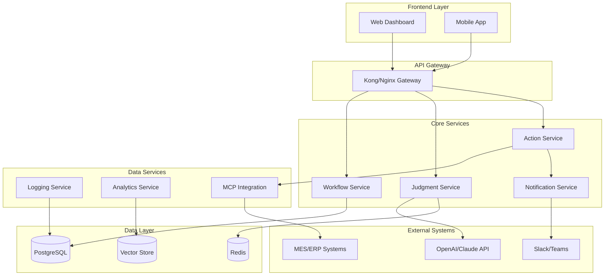

# 시스템 개요 및 아키텍처 정의서

**문서 버전**: v2.0  
**작성일**: 2024.08.05  
**대상**: CTO, 시스템 아키텍트, 백엔드/프론트엔드 개발자  
**목적**: AI 기반 제조 판단 플랫폼의 전체 시스템 구조 정의

## 📋 1. 비즈니스 요구사항 분석

### 1.1 핵심 문제 정의
- **현상**: 제조 현장에서 센서 데이터 기반 의사결정이 수작업으로 이루어짐
- **문제점**: 판단 지연, 일관성 부족, 전문가 의존성, 기록 관리 어려움
- **목표**: AI 기반 자동 판단 시스템으로 신속하고 일관된 의사결정 지원

### 1.2 기능 요구사항
```
F001: 실시간 센서 데이터 기반 판단 (응답시간 < 5초)
F002: 규칙 기반 + AI 기반 하이브리드 판단
F003: 워크플로우 기반 판단 로직 구성
F004: 외부 시스템 연동 (MES, ERP, 알림 시스템)
F005: 판단 결과 시각화 및 대시보드
F006: 판단 이력 관리 및 피드백 수집
F007: 설명 가능한 AI (Explainable AI)
F008: 자연어 기반 대시보드 자동 생성
F009: 실시간 대시보드 업데이트 및 추천
F010: 사용자 피드백 기반 대시보드 개선
```

### 1.3 비기능 요구사항
```
N001: 가용성 99.5% 이상
N002: 동시 처리 1000+ 판단 요청
N003: 데이터 보존 기간 2년 이상
N004: 응답 시간 95% < 5초
N005: 멀티 테넌트 지원
N006: GDPR/개인정보보호법 준수
```

## 🏗 2. 시스템 아키텍처 개요

### 2.1 마이크로서비스 아키텍처


### 2.2 서비스 별 책임 정의

#### 2.2.1 Workflow Service
- **책임**: 판단 워크플로우 생성, 수정, 관리
- **포트**: 8001
- **데이터베이스**: PostgreSQL (workflows 테이블)
- **주요 기능**:
  - 워크플로우 CRUD 작업
  - JSON 스키마 검증
  - 워크플로우 버전 관리
  - 시뮬레이션 실행

#### 2.2.2 Judgment Service
- **책임**: 핵심 판단 로직 실행
- **포트**: 8002
- **데이터베이스**: PostgreSQL + Redis (캐싱)
- **주요 기능**:
  - Rule Engine 실행
  - LLM 기반 판단
  - 컨텍스트 관리
  - 신뢰도 평가

#### 2.2.3 Action Service
- **책임**: 판단 결과에 따른 액션 실행
- **포트**: 8003
- **외부 연동**: MES, SCADA, MCP
- **주요 기능**:
  - 외부 시스템 명령 실행
  - 액션 결과 추적
  - 실패 재시도 로직
  - 액션 로그 관리

#### 2.2.4 Notification Service
- **책임**: 알림 및 커뮤니케이션
- **포트**: 8004
- **외부 연동**: Slack, Teams, Email, SMS
- **주요 기능**:
  - 멀티 채널 알림 발송
  - 알림 템플릿 관리
  - 알림 이력 추적
  - 에스컬레이션 로직

#### 2.2.5 Logging Service
- **책임**: 모든 시스템 로그 수집 및 관리
- **포트**: 8005
- **데이터베이스**: PostgreSQL (로그) + Elasticsearch (검색)
- **주요 기능**:
  - 구조화된 로그 수집
  - 로그 검색 및 분석
  - 감사 추적
  - 메트릭 추출

#### 2.2.6 Dashboard_Auto_Generation_Service:
  port: 8006
  responsibility: "LLM 기반 실시간 대시보드 자동 생성"
  dependencies: 
    - OpenAI/Claude API
    - All other services (데이터 수집용)
  databases: PostgreSQL + Redis

## 🔧 3. 기술 스택 상세 정의

### 3.1 Backend 기술 스택
```yaml
Language: Python 3.11+
Framework: FastAPI 0.104+
Database: PostgreSQL 15+ with pgvector extension
Cache: Redis 7.0+
Message Queue: Celery with Redis broker
Authentication: JWT + OAuth2 with PKCE
API Documentation: OpenAPI 3.0 (Swagger)
Testing: pytest + pytest-asyncio
```

### 3.2 Frontend 기술 스택
```yaml
Framework: Next.js 14 (App Router)
Language: TypeScript 5.0+
UI Components: Tailwind CSS + shadcn/ui
State Management: Zustand
Charts: Recharts + D3.js
Workflow Editor: React Flow
Forms: React Hook Form + Zod validation
Testing: Jest + React Testing Library
```

### 3.3 Infrastructure 스택
```yaml
Containerization: Docker + Docker Compose
Orchestration: Kubernetes (production)
Service Mesh: Istio (optional)
Monitoring: Prometheus + Grafana
Logging: ELK Stack (Elasticsearch, Logstash, Kibana)
Tracing: Jaeger
CI/CD: GitHub Actions + ArgoCD
```

### 3.4 AI_Services:
  LLM_Integration: OpenAI GPT-4, Anthropic Claude
  Component_Generation: AST Parser, Code Generation
  Natural_Language_Processing: Tokenization, Intent Analysis

## 📊 4. 데이터 아키텍처

### 4.1 데이터베이스 설계 원칙
- **단일 진실 원천**: PostgreSQL을 메인 데이터베이스로 사용
- **성능 최적화**: Redis를 L1 캐시로 활용
- **벡터 검색**: pgvector로 임베딩 데이터 관리
- **이벤트 소싱**: 중요한 상태 변화는 이벤트로 기록

### 4.2 핵심 테이블 구조
```sql
-- 워크플로우 정의
CREATE TABLE workflows (
    id UUID PRIMARY KEY DEFAULT gen_random_uuid(),
    name VARCHAR(255) NOT NULL,
    description TEXT,
    definition JSONB NOT NULL,
    version INTEGER DEFAULT 1,
    status VARCHAR(20) DEFAULT 'active',
    created_by UUID NOT NULL,
    created_at TIMESTAMP DEFAULT NOW(),
    updated_at TIMESTAMP DEFAULT NOW()
);

-- 판단 실행 이력
CREATE TABLE judgment_executions (
    id UUID PRIMARY KEY DEFAULT gen_random_uuid(),
    workflow_id UUID REFERENCES workflows(id),
    input_data JSONB NOT NULL,
    rule_result JSONB,
    llm_result JSONB,
    final_result JSONB NOT NULL,
    confidence_score DECIMAL(3,2),
    execution_time_ms INTEGER,
    status VARCHAR(20) NOT NULL,
    error_message TEXT,
    created_at TIMESTAMP DEFAULT NOW()
);

-- 액션 실행 이력
CREATE TABLE action_executions (
    id UUID PRIMARY KEY DEFAULT gen_random_uuid(),
    judgment_id UUID REFERENCES judgment_executions(id),
    action_type VARCHAR(50) NOT NULL,
    target_system VARCHAR(100),
    command JSONB NOT NULL,
    result JSONB,
    status VARCHAR(20) NOT NULL,
    retry_count INTEGER DEFAULT 0,
    executed_at TIMESTAMP DEFAULT NOW()
);
```

## 🔐 5. 보안 아키텍처

### 5.1 인증 및 권한 관리
```python
# JWT 토큰 구조
{
    "sub": "user-uuid",
    "tenant_id": "company-uuid", 
    "roles": ["admin", "operator"],
    "permissions": ["workflow:read", "judgment:execute"],
    "exp": 1700000000
}
```

### 5.2 API 보안
- **Rate Limiting**: 사용자당 1000 req/hour
- **CORS**: 허용된 도메인만 접근
- **Input Validation**: Pydantic 모델로 모든 입력 검증
- **SQL Injection 방지**: ORM 사용 및 파라미터화된 쿼리

### 5.3 데이터 보안
- **암호화**: 민감 데이터는 AES-256으로 암호화
- **마스킹**: 로그에서 개인정보 자동 마스킹
- **접근 제어**: RBAC (Role-Based Access Control)
- **감사 로그**: 모든 중요 작업 기록

## 📈 6. 성능 및 확장성

### 6.1 성능 목표
- **판단 실행**: 평균 2초, 95% < 5초
- **워크플로우 로딩**: < 500ms
- **대시보드 로딩**: < 2초
- **동시 사용자**: 1000명

### 6.2 확장성 전략
- **수평 확장**: 각 마이크로서비스 독립적 스케일링
- **데이터베이스**: 읽기 복제본 활용
- **캐싱**: Redis Cluster로 캐시 분산
- **CDN**: 정적 리소스 글로벌 배포

### 6.3 모니터링 메트릭
```python
# 핵심 비즈니스 메트릭
judgment_executions_total = Counter('judgment_executions_total')
judgment_execution_duration = Histogram('judgment_execution_duration_seconds')
judgment_success_rate = Gauge('judgment_success_rate')
workflow_active_count = Gauge('workflow_active_count')

# 시스템 메트릭  
cpu_usage = Gauge('cpu_usage_percent')
memory_usage = Gauge('memory_usage_bytes')
database_connections = Gauge('database_connections_active')
```

## 🚀 7. 배포 전략

### 7.1 개발 환경
```yaml
# docker-compose.dev.yml
version: '3.8'
services:
  postgres:
    image: pgvector/pgvector:pg15
    environment:
      POSTGRES_DB: judgment_dev
      POSTGRES_USER: dev_user
      POSTGRES_PASSWORD: dev_pass
    
  redis:
    image: redis:7-alpine
    
  workflow-service:
    build: ./services/workflow
    ports: ["8001:8001"]
    depends_on: [postgres, redis]
```

### 7.2 프로덕션 배포
```yaml
# kubernetes deployment
apiVersion: apps/v1
kind: Deployment
metadata:
  name: judgment-service
spec:
  replicas: 3
  selector:
    matchLabels:
      app: judgment-service
  template:
    spec:
      containers:
      - name: judgment-service
        image: judgment-service:v1.0.0
        ports:
        - containerPort: 8002
        env:
        - name: DATABASE_URL
          valueFrom:
            secretKeyRef:
              name: db-secret
              key: url
```

## 📋 8. 개발 로드맵

### Phase 1: 기반 구조 (4주)
- [ ] 마이크로서비스 기본 구조 구축
- [ ] 데이터베이스 스키마 구현
- [ ] 인증/권한 시스템 구현
- [ ] API Gateway 설정

### Phase 2: 핵심 기능 (6주)  
- [ ] Workflow Service 구현
- [ ] Judgment Service (Rule Engine)
- [ ] 기본 UI 구현
- [ ] MCP 연동 기반 구조

### Phase 3: AI 통합 (4주)
- [ ] LLM 통합 (OpenAI API)
- [ ] Vector 데이터베이스 구축
- [ ] 설명 가능한 AI 기능

### Phase 4: 고도화 (6주)
- [ ] 고급 시각화 기능
- [ ] 실시간 모니터링
- [ ] 성능 최적화
- [ ] 보안 강화

## 🔄 9. 다음 문서 연결점

이 아키텍처 정의서를 기반으로 다음 문서들이 작성됩니다:

1. **판단 코어 엔진 상세 설계서**: Judgment Service의 내부 구현
2. **데이터베이스 스키마 및 API 설계서**: 상세 데이터 모델과 API 명세  
3. **워크플로우 편집기 구현 명세서**: React Flow 기반 UI 구현
4. **외부 시스템 연동 가이드**: MCP 및 산업제어시스템 연동
5. **모니터링 및 운영 가이드**: 운영 단계 가이드

각 문서는 이 아키텍처 정의를 기반으로 작성되며, 일관된 기술 스택과 설계 원칙을 따릅니다.