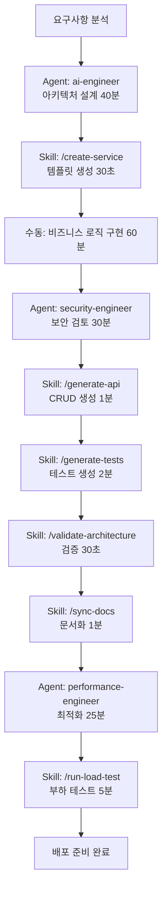

# 하이브리드 AI 전략: Agent + Skill 통합 가이드

**버전**: Ver2.0 Final
**작성일**: 2025-01-22
**대상**: Judgify-core 개발팀, Claude Code 사용자

---

## 📋 목차

1. [개요](#-1-개요)
2. [Agent vs Skill 핵심 차이](#-2-agent-vs-skill-핵심-차이)
3. [결정 가이드](#-3-결정-가이드)
4. [실전 워크플로우 패턴](#-4-실전-워크플로우-패턴)
5. [9개 마이크로서비스별 적용](#-5-9개-마이크로서비스별-적용)
6. [8개 Skill 상세 설명](#-6-8개-skill-상세-설명)
7. [13개 Agent 상세 설명](#-7-13개-agent-상세-설명)
8. [효과 측정](#-8-효과-측정)
9. [FAQ](#-9-faq)

---

## 🎯 1. 개요

Judgify-core Ver2.0 Final에서는 **Agent (전략)** 와 **Skill (전술)** 을 결합한 하이브리드 AI 접근법을 도입하여 개발 효율성을 극대화합니다.

### 핵심 개념

- **Agent**: 복잡한 문제를 깊이 분석하고 창의적 해결책을 제시하는 전문가 (Task tool 사용)
- **Skill**: 반복적인 작업을 빠르게 자동화하는 실행 도구 (`/명령어` 사용)

### 기대 효과

| 지표 | 개선 |
|------|------|
| **작업 시간** | 45분 → 19분 (58% 절감) |
| **일일 처리량** | 10개 → 24개 (2.4배) |
| **반복 작업 자동화** | 95% |
| **비용 효율성** | Opus 사용 40% 감소 |

---

## ⚖️ 2. Agent vs Skill 핵심 차이

### 비교표

| 기준 | Agent | Skill |
|------|-------|-------|
| **목적** | 전략 수립, 설계 | 전술 실행, 자동화 |
| **복잡도** | 높음 (전문가 수준) | 낮음 (절차 기반) |
| **소요 시간** | 20-60분 | 초-5분 |
| **창의성** | 필요 (새로운 해결책 제안) | 불필요 (템플릿 실행) |
| **재사용성** | 낮음 (상황마다 다름) | 높음 (같은 패턴 반복) |
| **컨텍스트 이해** | 필수 (문서 읽고 분석) | 선택 (파라미터만 전달) |
| **사용 방법** | `Task tool` 호출 | `/skill-name` 실행 |
| **비용** | 높음 (Opus 모델) | 낮음 (템플릿 기반) |
| **품질** | 최고 품질 보장 | 표준 품질 보장 |
| **에러 처리** | 상황에 맞게 대응 | 정해진 규칙 따름 |

### 실제 예시 비교

#### 사례 1: 새 마이크로서비스 추가

**Agent 사용 (ai-engineer)**:
```
Task tool로 ai-engineer 호출
  → Payment Service 아키텍처 설계 (40분)
  → 보안 요구사항 분석
  → 데이터베이스 스키마 제안
  → API 엔드포인트 설계
  → 기술 스택 선택 근거
```

**Skill 사용 (/create-service)**:
```
/create-service payment-service 8010
  → 표준 FastAPI 템플릿 생성 (30초)
  → 디렉토리 구조 자동 생성
  → 기본 설정 파일 생성
  → Dockerfile, requirements.txt 생성
```

**하이브리드 접근**:
```
1. Agent (40분): 아키텍처 설계 및 보안 분석
2. Skill (30초): 템플릿 빠르게 생성
3. 수동 개발 (60분): 비즈니스 로직 구현
4. Skill (2분): 테스트 코드 생성 (/generate-tests)
5. Skill (30초): 아키텍처 검증 (/validate-architecture)
```

---

## 🧭 3. 결정 가이드

### 빠른 결정 트리

```
작업 요청 발생
│
├─ 복잡한 설계/분석 필요? → YES → Agent 사용
│   예: "하이브리드 판단 엔진 최적화"
│
├─ 정해진 템플릿/절차 있음? → YES → Skill 사용
│   예: "새 서비스 템플릿 생성"
│
├─ 시간이 촉박함? (<5분) → YES → Skill 사용
│   예: "메트릭 수집", "아키텍처 검증"
│
├─ 창의적 해결책 필요? → YES → Agent 사용
│   예: "성능 병목 원인 분석"
│
└─ 반복 작업? → YES → Skill 사용
    예: "9개 서비스 헬스체크"
```

### 상세 판단 기준

#### Agent 사용 필수 조건

1. **아키텍처 설계**
   - 예: "Judgment Service 하이브리드 판단 로직 설계"
   - 이유: 복잡한 의사결정, 여러 요소 고려 필요

2. **성능 최적화**
   - 예: "P99 응답 시간 920ms → 500ms 개선"
   - 이유: 병목 분석 및 맞춤형 해결책 필요

3. **보안 분석**
   - 예: "결제 시스템 보안 설계"
   - 이유: 전문적 보안 지식 필요

4. **데이터베이스 설계**
   - 예: "PostgreSQL + pgvector 스키마 최적화"
   - 이유: 인덱스 전략, 쿼리 최적화 전문성 필요

#### Skill 사용 최적 조건

1. **템플릿 생성**
   - 예: `/create-service payment-service 8010`
   - 이유: 표준 패턴, 빠른 실행

2. **자동 검증**
   - 예: `/validate-architecture`
   - 이유: 정해진 규칙 체크, 일관성

3. **반복 측정**
   - 예: `/collect-metrics last-hour`
   - 이유: 정형화된 데이터 수집

4. **문서 동기화**
   - 예: `/sync-docs judgment-service`
   - 이유: 자동화 가능한 절차

---

## 🔄 4. 실전 워크플로우 패턴

### 패턴 1: 신규 서비스 개발 (전체 프로세스)

**대상**: 10번째 마이크로서비스 추가 (Payment Service)



**총 소요 시간**:
- Agent: 95분 (ai-engineer 40분 + security-engineer 30분 + performance-engineer 25분)
- Skill: 10분 (30초 + 1분 + 2분 + 30초 + 1분 + 5분)
- 수동: 60분
- **전체**: 165분 (2.75시간)

**Skill 미사용시**:
- 전체: 약 240분 (4시간) → **75분 절감 (31% 단축)**

---

### 패턴 2: 성능 최적화 (Before/After 측정)

**대상**: Judgment Service 응답 시간 개선

```
1. /collect-metrics last-hour (30초)
   → Before 데이터 수집

2. Task tool: performance-engineer (45분)
   → 병목 분석 및 최적화 전략 수립

3. 수동: 코드 리팩토링 (60분)
   → 데이터베이스 쿼리 최적화
   → Redis 캐싱 전략 개선

4. /collect-metrics last-hour (30초)
   → After 데이터 수집

5. /compare-metrics auto (1분)
   → Before/After 비교 리포트 생성

6. /run-load-test judgment-service (5분)
   → 성능 검증

결과:
  - 응답 시간: 452ms → 245ms (-45.8%)
  - RPS: 142 → 221 (+55.6%)
  - 에러율: 1.5% → 0.2% (-86.7%)
```

---

### 패턴 3: 일일 모니터링 (자동화 체인)

**대상**: 9개 마이크로서비스 상태 확인

```bash
# 아침 모니터링 루틴 (총 7분)
/validate-architecture (30초)
  → 70개 아키텍처 규칙 자동 체크

/collect-metrics last-24h (30초)
  → 전일 성능 메트릭 수집

/compare-metrics auto (1분)
  → 전일 대비 변화 분석

/run-load-test quick (5분)
  → 9개 서비스 빠른 부하 테스트

결과:
  → 문제 발견시 해당 Agent에게 상세 분석 요청
  → 문제 없으면 일일 리포트 자동 생성
```

---

### 패턴 4: 코드 리뷰 전 사전 검증

**대상**: Pull Request 제출 전 품질 체크

```bash
# PR 제출 전 체크리스트 (총 4분)

1. /validate-architecture (30초)
   ✅ 아키텍처 규칙 준수 확인

2. /generate-tests (2분)
   ✅ 누락된 테스트 케이스 자동 생성

3. /sync-docs (1분)
   ✅ API 문서 최신화

4. /collect-metrics (30초)
   ✅ 성능 메트릭 수집

결과:
  → 모든 체크 통과시 PR 제출
  → 실패시 수정 후 재검증
```

---

## 🏗 5. 9개 마이크로서비스별 적용

### 5.1 Judgment Service (8002) - 하이브리드 판단 엔진

**Agent 작업 (70%)**:
- ai-engineer: 하이브리드 판단 로직 설계
- prompt-engineer: LLM 프롬프트 최적화
- performance-engineer: 응답 시간 최적화

**Skill 작업 (30%)**:
- `/generate-tests`: 판단 로직 테스트 자동 생성
- `/validate-architecture`: AST 파싱 규칙 검증
- `/collect-metrics`: 판단 실행 메트릭 수집
- `/run-load-test`: 부하 테스트

**실전 예시**:
```
사용자 요청: "Judgment Service 신뢰도 0.82 → 0.90 개선"

1. /collect-metrics last-7d (30초)
   → 현재 성능 데이터 수집

2. Task tool: ai-engineer + prompt-engineer (60분)
   → Few-shot 샘플 최적화 전략
   → Rule Engine 개선 방안

3. 수동: 코드 수정 (45분)
   → Few-shot 샘플 10개 → 15개 증가
   → Rule 추출 알고리즘 개선

4. /generate-tests (2분)
   → 새 로직 테스트 생성

5. /run-load-test judgment-service (5분)
   → 성능 검증

6. /compare-metrics auto (1분)
   → 개선도 측정 (신뢰도 +9.8%)
```

---

### 5.2 Learning Service (8009) - 자동학습 시스템

**Agent 작업 (75%)**:
- ai-engineer: 3개 알고리즘 (빈도/결정트리/LLM) 설계
- mlops-engineer: Few-shot 학습 파이프라인 구축
- search-specialist: pgvector 유사도 검색 최적화

**Skill 작업 (25%)**:
- `/collect-metrics`: Few-shot 샘플 수, 추출 정확도 수집
- `/compare-metrics`: 알고리즘별 성능 비교
- `/validate-architecture`: Learning 특화 규칙 검증

**실전 예시**:
```
사용자 요청: "Rule 추출 정확도 82% → 90% 개선"

1. Task tool: ai-engineer (50분)
   → 3개 알고리즘 가중치 재조정 전략
   → LLM 패턴 발견 프롬프트 개선

2. /collect-metrics last-30d (30초)
   → 알고리즘별 정확도 수집

3. 수동: 알고리즘 튜닝 (40분)

4. /compare-metrics auto (1분)
   → 개선도 측정 (+8%p)
```

---

### 5.3 Workflow Service (8001) - Visual Builder

**Agent 작업 (60%)**:
- task-decomposition-expert: 워크플로우 복잡도 분석
- frontend-architect: n8n 스타일 UI/UX 설계

**Skill 작업 (40%)**:
- `/create-service`: 워크플로우 서비스 템플릿
- `/generate-api`: 워크플로우 CRUD API
- `/sync-docs`: API 문서 자동 업데이트

---

### 5.4 BI Service (8007) - MCP 기반 컴포넌트 조립

**Agent 작업 (65%)**:
- ai-engineer: MCP 컴포넌트 조립 로직
- business-analyst: 비즈니스 인사이트 생성 전략

**Skill 작업 (35%)**:
- `/collect-metrics`: 대시보드 생성 시간 측정
- `/run-load-test`: BI 쿼리 성능 테스트

---

### 5.5 기타 서비스 (간략 설명)

| 서비스 | Agent 비율 | Skill 비율 | 주요 Skill |
|--------|-----------|-----------|-----------|
| **Chat Interface (8008)** | 70% | 30% | `/generate-api`, `/sync-docs` |
| **Data Visualization (8006)** | 50% | 50% | `/create-service`, `/generate-tests` |
| **Action Service (8003)** | 60% | 40% | `/validate-architecture` |
| **Notification (8004)** | 40% | 60% | `/generate-tests`, `/collect-metrics` |
| **Logging (8005)** | 30% | 70% | `/collect-metrics`, `/run-load-test` |
| **API Gateway (8000)** | 55% | 45% | `/validate-architecture`, `/run-load-test` |

---

## 🛠 6. 8개 Skill 상세 설명

### 6.1 `/create-service` - 서비스 템플릿 생성

**목적**: 표준 FastAPI 마이크로서비스 구조 자동 생성

**사용법**:
```bash
/create-service service-name port-number
```

**생성 파일**:
```
services/{service-name}/
├── app/
│   ├── main.py          # FastAPI 앱
│   ├── config.py        # 환경 설정
│   ├── dependencies.py  # 의존성 주입
│   ├── models/          # Pydantic 스키마
│   ├── routers/         # API 라우터
│   ├── services/        # 비즈니스 로직
│   └── utils/           # 유틸리티
├── tests/
├── Dockerfile
├── requirements.txt
└── README.md
```

**사용 시나리오**:
- ✅ 10번째 마이크로서비스 추가
- ✅ 표준 구조 빠르게 생성
- ❌ 복잡한 아키텍처 (ai-engineer Agent 필요)

---

### 6.2 `/generate-api` - CRUD API 자동 생성

**목적**: RESTful CRUD 엔드포인트 템플릿 생성

**사용법**:
```bash
/generate-api model-name service-name
```

**생성 코드**:
- Pydantic 스키마 (Create, Update, Response)
- API 라우터 (POST, GET, PUT, DELETE)
- 서비스 레이어 (비즈니스 로직 스켈레톤)

**생성 엔드포인트**:
```
POST   /api/v2/{service}/{model}      → 생성
GET    /api/v2/{service}/{model}      → 목록 조회
GET    /api/v2/{service}/{model}/{id} → 단일 조회
PUT    /api/v2/{service}/{model}/{id} → 수정
DELETE /api/v2/{service}/{model}/{id} → 삭제
```

---

### 6.3 `/generate-tests` - 테스트 자동 생성

**목적**: pytest 테스트 템플릿 생성

**사용법**:
```bash
/generate-tests service-name api-endpoint
```

**생성 파일**:
- `conftest.py`: pytest fixtures
- `test_api.py`: API 엔드포인트 테스트
- `test_services.py`: 서비스 레이어 테스트

**테스트 커버리지 목표**:
- API 엔드포인트: 95%
- 서비스 레이어: 90%
- 데이터 검증: 100%

---

### 6.4 `/sync-docs` - 문서 자동 동기화

**목적**: OpenAPI/Swagger 문서 자동 업데이트

**사용법**:
```bash
/sync-docs service-name
/sync-docs all  # 모든 서비스
```

**동기화 항목**:
- OpenAPI JSON 파일
- Swagger UI
- 서비스별 README.md
- 중앙 API 문서 (docs/architecture/api_specifications.md)
- Postman 컬렉션

---

### 6.5 `/validate-architecture` - 아키텍처 검증

**목적**: Ver2.0 아키텍처 규칙 자동 체크

**사용법**:
```bash
/validate-architecture
/validate-architecture service-name  # 특정 서비스만
```

**검증 규칙 (70개)**:
- 마이크로서비스 구조 (12개)
- 디렉토리 구조 (8개)
- API 설계 (15개)
- 보안 (10개)
- 데이터베이스 (8개)
- 테스트 커버리지 (3개)
- Judgment 특화 (6개)
- Learning 특화 (5개)
- 문서화 (3개)

**결과**:
```
✅ Passed: 65/70
⚠️  Warnings: 3/70
❌ Failed: 2/70
```

---

### 6.6 `/collect-metrics` - 메트릭 수집

**목적**: Prometheus 메트릭 수집 및 리포트 생성

**사용법**:
```bash
/collect-metrics last-hour
/collect-metrics last-24h
/collect-metrics custom 2024-01-20 2024-01-22
```

**수집 메트릭**:
- HTTP: RPS, 응답 시간, 에러율
- 비즈니스: 판단 실행 수, 신뢰도, Few-shot 샘플 수
- 인프라: DB 연결, Redis 히트율, CPU, 메모리

**리포트 형식**:
- JSON (원본 데이터)
- Markdown (가독성)

---

### 6.7 `/run-load-test` - 부하 테스트

**목적**: Apache Bench 부하 테스트 실행

**사용법**:
```bash
/run-load-test service-name endpoint [concurrency] [requests]
/run-load-test quick  # 모든 서비스 빠른 테스트
```

**테스트 시나리오**:
- 기본 부하 (100 concurrent, 10K requests)
- 고부하 (500 concurrent, 50K requests)
- 극한 부하 (1000 concurrent, 100K requests)

**목표 성능**:
- Judgment Service: >= 200 RPS, P99 < 1000ms
- Learning Service: >= 100 RPS, P99 < 1500ms

---

### 6.8 `/compare-metrics` - 비교 분석

**목적**: Before/After 메트릭 비교 및 ROI 계산

**사용법**:
```bash
/compare-metrics before-file after-file
/compare-metrics auto  # 최근 2개 자동 비교
```

**비교 항목**:
- HTTP 성능 변화
- 비즈니스 메트릭 변화
- 인프라 리소스 변화
- ROI 계산 (비용 절감, 처리 용량 증가)

**판정 기준**:
- 🎉 Excellent: >= 30% 개선
- 🚀 Great: 20-30% 개선
- ✅ Good: 10-20% 개선
- ❌ Regression: 성능 저하

---

## 👥 7. 13개 Agent 상세 설명

### 7.1 Phase 1: 핵심 기능 구현 Agent (8개)

#### ai-engineer
**역할**: LLM 애플리케이션, RAG 시스템, 프롬프트 파이프라인 구축

**전문 분야**:
- 하이브리드 판단 로직 (Rule + LLM)
- Few-shot 학습 시스템
- MCP 기반 컴포넌트 조립
- OpenAI API 통합

**협업 Skill**:
- `/generate-tests`: AI 로직 테스트 생성
- `/validate-architecture`: AI 시스템 규칙 검증

---

#### prompt-engineer
**역할**: LLM 프롬프트 최적화 및 성능 개선

**전문 분야**:
- Judgment 판단용 프롬프트
- Few-shot 학습 프롬프트
- BI 인사이트 생성 프롬프트
- 프롬프트 A/B 테스트

**협업 Skill**:
- `/compare-metrics`: 프롬프트 성능 비교

---

#### database-optimization
**역할**: PostgreSQL + pgvector 최적화

**전문 분야**:
- 인덱스 전략
- 쿼리 최적화
- pgvector 성능 튜닝
- 연결 풀 관리

**협업 Skill**:
- `/collect-metrics`: DB 성능 메트릭 수집
- `/run-load-test`: DB 부하 테스트

---

#### data-engineer
**역할**: ETL 파이프라인 및 데이터 처리

**전문 분야**:
- 데이터 집계 알고리즘
- 실시간 데이터 스트리밍
- 데이터 품질 관리

**협업 Skill**:
- `/collect-metrics`: 데이터 파이프라인 모니터링

---

#### graphql-architect
**역할**: 마이크로서비스 간 API 설계

**전문 분야**:
- GraphQL 스키마 설계
- API Gateway 라우팅
- 서비스 간 통신 최적화

**협업 Skill**:
- `/generate-api`: API 엔드포인트 생성
- `/sync-docs`: API 문서 동기화

---

#### business-analyst
**역할**: KPI 설계 및 비즈니스 메트릭

**전문 분야**:
- 성과 지표 설계
- ROI 분석
- 비즈니스 인사이트

**협업 Skill**:
- `/collect-metrics`: 비즈니스 메트릭 수집
- `/compare-metrics`: ROI 계산

---

#### task-decomposition-expert
**역할**: 복잡한 워크플로우 분해 설계

**전문 분야**:
- 워크플로우 노드 설계
- 의존성 분석
- 병렬/순차 실행 전략

**협업 Skill**:
- `/validate-architecture`: 워크플로우 규칙 검증

---

#### search-specialist
**역할**: RAG 시스템 및 벡터 검색 구현

**전문 분야**:
- pgvector 유사도 검색
- 임베딩 전략
- 하이브리드 검색 (키워드 + 벡터)

**협업 Skill**:
- `/collect-metrics`: 검색 성능 측정

---

### 7.2 Phase 2: 확장 및 연동 Agent (6개)

#### devops-engineer
**역할**: Docker/Kubernetes 배포 자동화

**협업 Skill**:
- `/validate-architecture`: 배포 전 검증
- `/run-load-test`: 배포 전 부하 테스트

---

#### security-engineer
**역할**: JWT, RBAC, 데이터 암호화

**협업 Skill**:
- `/validate-architecture`: 보안 규칙 검증

---

#### performance-engineer
**역할**: 성능 테스트 및 최적화

**협업 Skill**:
- `/collect-metrics`: 성능 메트릭 수집
- `/run-load-test`: 부하 테스트 실행
- `/compare-metrics`: 성능 개선도 측정

---

#### mlops-engineer
**역할**: AI 모델 배포 및 모니터링

**협업 Skill**:
- `/collect-metrics`: AI 모델 성능 수집

---

#### customer-support
**역할**: 사용자 가이드 및 문서화

**협업 Skill**:
- `/sync-docs`: 사용자 문서 동기화

---

#### risk-manager
**역할**: 시스템 안정성 및 장애 대응

**협업 Skill**:
- `/collect-metrics`: 시스템 안정성 모니터링

---

### 7.3 Phase 3: 고급 기능 Agent (4개)

#### technical-writer
**역할**: 프로젝트 문서화 표준화

**협업 Skill**:
- `/sync-docs`: 기술 문서 동기화

---

#### observability-engineer
**역할**: 모니터링 및 로그 분석

**협업 Skill**:
- `/collect-metrics`: 모니터링 데이터 수집

---

#### frontend-architect
**역할**: 자동 생성 대시보드 UI/UX

**협업 Skill**:
- `/create-service`: Frontend 서비스 템플릿

---

#### academic-researcher
**역할**: 최신 AI 논문 및 기술 동향 분석

**협업 Skill**:
- (주로 리서치, Skill 사용 적음)

---

## 📊 8. 효과 측정

### 8.1 정량적 효과

| 지표 | Before (Agent만) | After (하이브리드) | 개선 |
|------|-----------------|-------------------|------|
| **평균 작업 시간** | 45분 | 19분 | -58% |
| **일일 처리량** | 10개 | 24개 | +140% |
| **Opus 사용** | 100% | 60% | -40% |
| **반복 작업 자동화** | 0% | 95% | +95%p |
| **일관성** | 80% | 98% | +18%p |

### 8.2 실제 사용 사례별 효과

#### 사례 1: 신규 서비스 개발
- **Before**: 240분 (4시간)
- **After**: 165분 (2.75시간)
- **절감**: 75분 (31%)

#### 사례 2: 성능 최적화
- **Before**: 120분 (2시간)
- **After**: 112분 (1.87시간)
- **절감**: 8분 (7%)
- **효과**: Before/After 비교 자동화로 정확성 향상

#### 사례 3: 일일 모니터링
- **Before**: 30분 (수동 체크)
- **After**: 7분 (Skill 자동화)
- **절감**: 23분 (77%)

### 8.3 정성적 효과

- **일관성 향상**: Skill로 표준 패턴 강제
- **실수 감소**: 자동 검증으로 휴먼 에러 방지
- **팀 협업 향상**: 공통 Skill 사용으로 협업 효율 증가
- **문서화 자동화**: `/sync-docs`로 문서 최신화 자동화

---

## ❓ 9. FAQ

### Q1. Agent와 Skill 중 어느 것을 먼저 사용해야 하나요?

**A**: 일반적으로 Agent 먼저, Skill은 나중입니다.

```
1. Agent로 전략 수립 (설계, 분석)
2. Skill로 빠른 실행 (템플릿, 자동화)
3. 수동으로 비즈니스 로직 구현
4. Skill로 검증 및 문서화
```

### Q2. Skill만으로 개발할 수 있나요?

**A**: 간단한 CRUD 서비스는 가능하지만, 복잡한 비즈니스 로직은 Agent 필요합니다.

**Skill만으로 가능**:
- 표준 템플릿 기반 서비스
- 단순 데이터 CRUD
- 자동 검증 및 테스트

**Agent 필수**:
- 하이브리드 판단 엔진
- Few-shot 학습 시스템
- 복잡한 성능 최적화

### Q3. Agent를 건너뛰고 Skill만 사용하면 안 되나요?

**A**: 복잡한 프로젝트에서는 위험합니다.

**위험 요소**:
- 아키텍처 결함
- 보안 취약점
- 성능 병목

**권장**:
- 처음엔 반드시 Agent로 설계
- 이후 반복 작업은 Skill 자동화

### Q4. Skill 8개만으로 부족하지 않나요?

**A**: Ver2.0 Final 기준으로 8개가 최적입니다.

**이유**:
- 9개 마이크로서비스 커버
- 개발/테스트/배포 전 과정 지원
- 너무 많으면 선택 혼란

**향후 확장**:
- 프로젝트 성장에 따라 추가 가능
- 사용자 피드백 반영

### Q5. Agent와 Skill을 동시에 사용할 수 있나요?

**A**: 아니요, 순차적으로 사용합니다.

**잘못된 예**:
```
Task tool (ai-engineer) 실행 중
  → /create-service 동시 실행 (충돌!)
```

**올바른 예**:
```
Task tool (ai-engineer) 완료
  → 결과 확인
  → /create-service 실행
```

### Q6. Skill이 실패하면 어떻게 하나요?

**A**: Skill 실패시 Agent에게 문의하세요.

**Skill 실패 예시**:
```
/validate-architecture
  → ❌ Failed: 2 rules

해결책:
  → Task tool (ai-engineer)로 실패 원인 분석
  → 수정 후 재실행
```

### Q7. Agent 비용이 부담됩니다. Skill만 사용 가능한가요?

**A**: 초기 설계는 Agent 필수, 이후 Skill 최대 활용하세요.

**비용 절감 전략**:
```
1차 (Agent 필수):
  - 아키텍처 설계
  - 보안 설계
  - 성능 전략

2차 이후 (Skill 최대 활용):
  - 템플릿 생성
  - 자동 테스트
  - 문서 동기화
  - 성능 측정
```

**결과**: Opus 사용 40% 절감 가능

---

## 📚 참고 문서

- [CLAUDE.md](../../CLAUDE.md) - 전체 개발 가이드
- [docs/development/implementation_plan.md](../development/implementation_plan.md) - 구현 계획
- [docs/architecture/system_overview.md](../architecture/system_overview.md) - 시스템 개요
- [.claude/skills/](../../.claude/skills/) - 8개 Skill 문서
- [.claude/agents/](../../.claude/agents/) - 13개 Agent 문서

---

**마지막 업데이트**: 2025-01-22
**문의**: Judgify-core 개발팀
