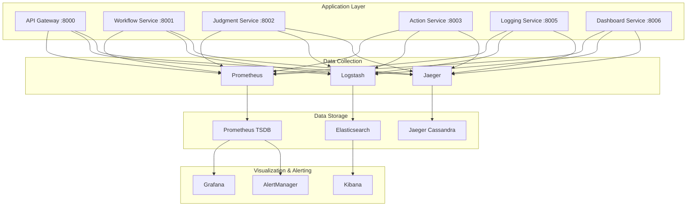
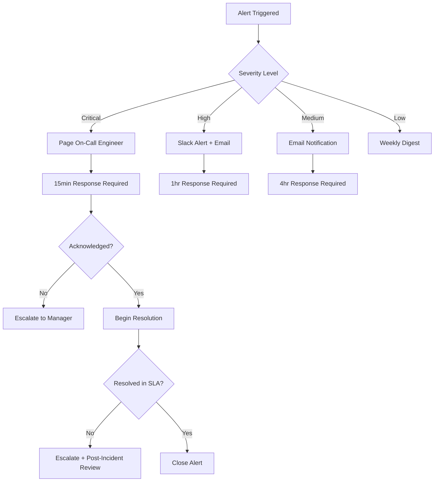

# Judgify-core Ver2.0 Monitoring and Logging Guide

**Version**: 2.0  
**Created**: 2024-08-10  
**Target Audience**: DevOps Engineers, SRE, Platform Engineers, Developers  
**Purpose**: Comprehensive observability strategy for Judgify-core microservices platform

## Table of Contents

1. [Overview](#1-overview)
2. [Three Pillars of Observability](#2-three-pillars-of-observability)
3. [Service-Specific Monitoring](#3-service-specific-monitoring)
4. [Alert Rules and Escalation](#4-alert-rules-and-escalation)
5. [Performance Benchmarking](#5-performance-benchmarking)
6. [Troubleshooting Runbooks](#6-troubleshooting-runbooks)
7. [Implementation Guide](#7-implementation-guide)

---

## 1. Overview

### 1.1 Monitoring Stack Architecture



### 1.2 Key Monitoring Principles

- **Proactive Monitoring**: Detect issues before they impact users
- **Business Impact Focus**: Monitor what matters to business outcomes
- **Service Level Objectives (SLOs)**: Define and track meaningful SLIs
- **Context-Rich Alerting**: Alerts with actionable information
- **Security-First**: Monitor for security threats and compliance

---

## 2. Three Pillars of Observability

### 2.1 Metrics (Prometheus + Grafana)

#### Core System Metrics
```yaml
system_metrics:
  cpu_usage:
    metric: "node_cpu_seconds_total"
    alert_threshold: "> 80%"
    description: "CPU utilization per node"
  
  memory_usage:
    metric: "node_memory_MemAvailable_bytes"
    alert_threshold: "< 20%"
    description: "Available memory per node"
  
  disk_usage:
    metric: "node_filesystem_avail_bytes"
    alert_threshold: "< 15%"
    description: "Available disk space"
```

#### Application Metrics
```yaml
application_metrics:
  http_requests:
    metric: "http_requests_total"
    labels: ["method", "endpoint", "status_code"]
    description: "Total HTTP requests"
  
  request_duration:
    metric: "http_request_duration_seconds"
    buckets: [0.1, 0.5, 1.0, 2.5, 5.0, 10.0]
    description: "HTTP request duration histogram"
  
  database_connections:
    metric: "database_connections_active"
    description: "Active database connections"
```

#### Business Metrics (Judgify-Specific)
```yaml
business_metrics:
  judgment_executions:
    metric: "judgment_executions_total"
    labels: ["method", "result", "workflow_id"]
    description: "Total judgment executions"
  
  judgment_confidence:
    metric: "judgment_confidence_score"
    labels: ["workflow_id", "method"]
    description: "Average confidence score of judgments"
  
  dashboard_generations:
    metric: "dashboard_generations_total"
    labels: ["user_id", "success"]
    description: "Auto-generated dashboards"
  
  workflow_executions:
    metric: "workflow_executions_total"
    labels: ["workflow_id", "status"]
    description: "Workflow execution counts"
```

### 2.2 Logs (ELK Stack)

#### Log Levels and Categories
```json
{
  "log_levels": {
    "ERROR": "System errors, exceptions, failures",
    "WARN": "Warning conditions, degraded performance",
    "INFO": "General information, business events",
    "DEBUG": "Detailed debugging information"
  },
  "log_categories": {
    "business": "Judgment executions, workflow events",
    "security": "Authentication, authorization, security events",
    "performance": "Response times, resource usage",
    "integration": "External system interactions",
    "system": "Infrastructure and platform events"
  }
}
```

#### Structured Logging Format
```json
{
  "timestamp": "2024-08-10T10:30:45.123Z",
  "level": "INFO",
  "service": "judgment-service",
  "request_id": "req_abc123",
  "user_id": "user_456",
  "tenant_id": "tenant_789",
  "event_type": "judgment_executed",
  "workflow_id": "wf_001",
  "execution_id": "exec_123",
  "method": "hybrid",
  "result": true,
  "confidence": 0.87,
  "execution_time_ms": 450,
  "rule_result": {
    "success": false,
    "confidence": 0.3,
    "error": "insufficient_data"
  },
  "llm_result": {
    "success": true,
    "confidence": 0.87,
    "model": "gpt-4",
    "tokens_used": 150
  },
  "message": "Hybrid judgment completed successfully"
}
```

### 2.3 Traces (Jaeger)

#### Distributed Tracing Strategy
```yaml
tracing_configuration:
  sampling_rate: 0.1  # 10% of requests
  service_mapping:
    api-gateway: "gateway"
    workflow-service: "workflow"
    judgment-service: "judgment"
    action-service: "action"
    dashboard-service: "dashboard"
  
  span_tags:
    - "user.id"
    - "tenant.id"
    - "workflow.id"
    - "judgment.method"
    - "http.status_code"
```

---

## 3. Service-Specific Monitoring

### 3.1 API Gateway (Port 8000)

#### Key Metrics
- **Request Rate**: Total requests per second
- **Response Time**: p50, p95, p99 latencies
- **Error Rate**: 4xx, 5xx responses
- **Authentication Success Rate**: JWT validation success
- **Rate Limiting**: Throttled requests

#### Health Checks
```python
@app.get("/health")
async def gateway_health():
    checks = {
        "status": "healthy",
        "timestamp": datetime.utcnow().isoformat(),
        "version": "2.0.0",
        "dependencies": {
            "redis": await check_redis_connection(),
            "postgres": await check_postgres_connection(),
            "downstream_services": await check_downstream_services()
        }
    }
    return checks
```

#### Alert Rules
```yaml
gateway_alerts:
  - name: "HighErrorRate"
    condition: "rate(http_requests_total{code=~'5..'}[5m]) > 0.1"
    severity: "critical"
    description: "Gateway error rate > 10%"
  
  - name: "HighLatency"
    condition: "histogram_quantile(0.95, http_request_duration_seconds) > 5"
    severity: "warning"
    description: "95th percentile latency > 5s"
```

### 3.2 Judgment Service (Port 8002) - Core Business Service

#### Key Metrics
- **Judgment Execution Rate**: Judgments per minute
- **Method Distribution**: Rule vs LLM vs Hybrid usage
- **Confidence Score Distribution**: Quality of judgments
- **Execution Time**: Performance by method
- **Success/Failure Rate**: Reliability metrics

#### Custom Metrics Implementation
```python
from prometheus_client import Counter, Histogram, Gauge, Enum

# Business metrics
judgment_executions_total = Counter(
    'judgment_executions_total',
    'Total number of judgment executions',
    ['method', 'result', 'workflow_id']
)

judgment_execution_duration = Histogram(
    'judgment_execution_duration_seconds',
    'Time spent executing judgments',
    ['method'],
    buckets=[0.1, 0.5, 1.0, 2.5, 5.0, 10.0, 30.0]
)

judgment_confidence_score = Gauge(
    'judgment_confidence_score',
    'Average confidence score of judgments',
    ['workflow_id', 'method']
)

llm_token_usage = Counter(
    'llm_token_usage_total',
    'Total LLM tokens consumed',
    ['model', 'workflow_id']
)

rule_engine_cache_hits = Counter(
    'rule_engine_cache_hits_total',
    'Rule engine cache hits',
    ['workflow_id']
)
```

#### Health Checks
```python
@app.get("/health")
async def judgment_health():
    checks = {
        "status": "healthy",
        "components": {
            "rule_engine": await check_ast_engine(),
            "llm_engine": await check_openai_connection(),
            "vector_db": await check_pgvector_connection(),
            "cache": await check_redis_connection()
        },
        "metrics": {
            "last_execution": await get_last_execution_time(),
            "active_workflows": await count_active_workflows(),
            "queue_size": await get_judgment_queue_size()
        }
    }
    return checks
```

### 3.3 Dashboard Service (Port 8006) - Auto-Generation Service

#### Key Metrics
- **Dashboard Generation Rate**: Dashboards created per hour
- **Generation Success Rate**: Successful auto-generations
- **Generation Time**: Time to create dashboard
- **User Satisfaction**: Feedback scores
- **Component Usage**: Most used chart types

#### Custom Metrics
```python
dashboard_generations_total = Counter(
    'dashboard_generations_total',
    'Total dashboard generations',
    ['user_id', 'success', 'chart_types']
)

dashboard_generation_duration = Histogram(
    'dashboard_generation_duration_seconds',
    'Time to generate dashboard',
    buckets=[1.0, 5.0, 10.0, 30.0, 60.0, 120.0]
)

active_websocket_connections = Gauge(
    'dashboard_websocket_connections_active',
    'Active WebSocket connections for real-time updates'
)

user_satisfaction_score = Gauge(
    'dashboard_user_satisfaction_score',
    'User satisfaction with generated dashboards',
    ['user_id']
)
```

### 3.4 Workflow Service (Port 8001)

#### Key Metrics
- **Workflow Creation Rate**: New workflows per day
- **Workflow Execution Rate**: Executions per workflow
- **Workflow Success Rate**: Successful completions
- **Step Execution Time**: Performance by step type

### 3.5 Action Service (Port 8003)

#### Key Metrics
- **External Integration Health**: Connectivity to external systems
- **Action Execution Rate**: Actions triggered per hour
- **Action Success Rate**: Successful external calls
- **Queue Depth**: Pending actions in Celery queues

### 3.6 Logging Service (Port 8005)

#### Key Metrics
- **Log Ingestion Rate**: Logs processed per second
- **Log Storage Growth**: Elasticsearch index growth
- **Search Query Performance**: Kibana query response times
- **Log Processing Latency**: End-to-end log processing time

---

## 4. Alert Rules and Escalation

### 4.1 Alert Severity Levels

| Level | Response Time | Escalation | Example |
|-------|---------------|------------|---------|
| **Critical** | Immediate | Page on-call engineer | Service down, data loss |
| **High** | 15 minutes | Slack + Email | High error rate, performance degraded |
| **Medium** | 1 hour | Email notification | Resource usage high |
| **Low** | 4 hours | Weekly digest | Minor performance issues |

### 4.2 Business-Critical Alerts

#### Judgment Service Alerts
```yaml
judgment_alerts:
  - name: "JudgmentServiceDown"
    condition: "up{job='judgment-service'} == 0"
    severity: "critical"
    description: "Judgment service is not responding"
    runbook: "https://wiki.company.com/runbooks/judgment-service-down"
  
  - name: "HighJudgmentFailureRate"
    condition: "rate(judgment_executions_total{result='failed'}[5m]) > 0.05"
    severity: "high"
    description: "Judgment failure rate > 5%"
  
  - name: "LowConfidenceJudgments"
    condition: "avg(judgment_confidence_score) < 0.7"
    severity: "medium"
    description: "Average judgment confidence below threshold"
  
  - name: "LLMTokenExhaustion"
    condition: "increase(llm_token_usage_total[1h]) > 100000"
    severity: "high"
    description: "High LLM token consumption"
```

#### System-Level Alerts
```yaml
system_alerts:
  - name: "HighCPUUsage"
    condition: "100 - (avg(rate(node_cpu_seconds_total{mode='idle'}[5m])) * 100) > 80"
    severity: "high"
    description: "CPU usage > 80%"
  
  - name: "LowMemoryAvailable"
    condition: "(node_memory_MemAvailable_bytes / node_memory_MemTotal_bytes) * 100 < 10"
    severity: "critical"
    description: "Available memory < 10%"
  
  - name: "DiskSpaceLow"
    condition: "(node_filesystem_avail_bytes / node_filesystem_size_bytes) * 100 < 15"
    severity: "high"
    description: "Disk space < 15%"
```

### 4.3 Escalation Procedures



---

## 5. Performance Benchmarking and SLOs

### 5.1 Service Level Objectives (SLOs)

| Service | Availability | Latency (p95) | Error Rate | Throughput |
|---------|-------------|---------------|------------|------------|
| **API Gateway** | 99.9% | < 100ms | < 0.1% | 1000 RPS |
| **Judgment Service** | 99.5% | < 5s | < 1% | 100 judgments/min |
| **Workflow Service** | 99.5% | < 2s | < 0.5% | 500 RPS |
| **Dashboard Service** | 99.0% | < 30s | < 2% | 10 generations/min |
| **Action Service** | 99.0% | < 10s | < 1% | 200 actions/min |

### 5.2 Performance Benchmarks

#### Judgment Service Benchmarks
```yaml
judgment_benchmarks:
  rule_engine_execution:
    target: "< 100ms"
    measurement: "avg(judgment_execution_duration_seconds{method='rule'})"
  
  llm_execution:
    target: "< 3s"
    measurement: "avg(judgment_execution_duration_seconds{method='llm'})"
  
  hybrid_execution:
    target: "< 5s"
    measurement: "avg(judgment_execution_duration_seconds{method='hybrid'})"
  
  confidence_threshold:
    target: "> 0.8"
    measurement: "avg(judgment_confidence_score)"
```

#### Dashboard Service Benchmarks
```yaml
dashboard_benchmarks:
  generation_time:
    target: "< 30s"
    measurement: "avg(dashboard_generation_duration_seconds)"
  
  user_satisfaction:
    target: "> 4.0/5"
    measurement: "avg(dashboard_user_satisfaction_score)"
  
  real_time_updates:
    target: "< 1s"
    measurement: "avg(websocket_message_latency_seconds)"
```

---

## 6. Troubleshooting Runbooks

### 6.1 Judgment Service Issues

#### Runbook: High Judgment Failure Rate

**Symptoms**: 
- Alert: `HighJudgmentFailureRate` triggered
- Increased error logs in judgment service
- User reports of failed judgments

**Investigation Steps**:
1. **Check Service Health**:
   ```bash
   curl http://judgment-service:8002/health
   kubectl get pods -l app=judgment-service
   ```

2. **Examine Recent Failures**:
   ```bash
   # Check Kibana for recent errors
   curl -X GET "elasticsearch:9200/logs-judgment-*/_search" -H 'Content-Type: application/json' -d'
   {
     "query": {
       "bool": {
         "must": [
           {"term": {"level": "ERROR"}},
           {"range": {"timestamp": {"gte": "now-1h"}}}
         ]
       }
     },
     "sort": [{"timestamp": "desc"}]
   }'
   ```

3. **Check Dependencies**:
   ```bash
   # PostgreSQL connection
   kubectl exec -it postgres-pod -- psql -c "SELECT 1"
   
   # Redis connection
   kubectl exec -it redis-pod -- redis-cli ping
   
   # OpenAI API status
   curl -H "Authorization: Bearer $OPENAI_API_KEY" https://api.openai.com/v1/models
   ```

**Resolution Steps**:
1. If database issues: Scale up database resources or check for locks
2. If LLM issues: Check API key validity and rate limits
3. If resource issues: Scale judgment service replicas
4. If code issues: Roll back to previous version

**Prevention**:
- Implement circuit breakers for external dependencies
- Add more comprehensive input validation
- Increase monitoring coverage for edge cases

#### Runbook: Low Confidence Judgments

**Symptoms**:
- Alert: `LowConfidenceJudgments` triggered
- Business stakeholders report unreliable judgments
- Increased manual overrides

**Investigation Steps**:
1. **Analyze Confidence Distribution**:
   ```promql
   histogram_quantile(0.5, judgment_confidence_score)
   histogram_quantile(0.95, judgment_confidence_score)
   ```

2. **Check Rule Engine Performance**:
   ```promql
   rate(judgment_executions_total{method="rule", result="failed"}[1h])
   ```

3. **Examine Recent Workflow Changes**:
   ```bash
   # Check workflow modification logs
   curl -X GET "elasticsearch:9200/logs-workflow-*/_search" -H 'Content-Type: application/json' -d'
   {
     "query": {
       "bool": {
         "must": [
           {"term": {"event_type": "workflow_updated"}},
           {"range": {"timestamp": {"gte": "now-24h"}}}
         ]
       }
     }
   }'
   ```

**Resolution Steps**:
1. Review recent workflow rule changes
2. Retrain or update LLM prompts if needed
3. Adjust confidence thresholds if appropriate
4. Gather more training data for edge cases

### 6.2 Dashboard Service Issues

#### Runbook: Dashboard Generation Failures

**Symptoms**:
- Users unable to generate dashboards
- High error rate in dashboard service
- Timeouts in dashboard generation

**Investigation Steps**:
1. **Check Service Status**:
   ```bash
   kubectl get pods -l app=dashboard-service
   kubectl logs -l app=dashboard-service --tail=100
   ```

2. **Examine Generation Logs**:
   ```bash
   # Check for generation errors
   curl -X GET "elasticsearch:9200/logs-dashboard-*/_search" -H 'Content-Type: application/json' -d'
   {
     "query": {
       "bool": {
         "must": [
           {"term": {"event_type": "dashboard_generation_failed"}},
           {"range": {"timestamp": {"gte": "now-2h"}}}
         ]
       }
     }
   }'
   ```

3. **Check LLM Integration**:
   ```bash
   # Test LLM connectivity
   curl -X POST "http://dashboard-service:8006/api/v2/test-llm" \
        -H "Content-Type: application/json" \
        -d '{"prompt": "test"}'
   ```

**Resolution Steps**:
1. Restart dashboard service if hanging
2. Check LLM API quotas and rate limits
3. Validate React component templates
4. Scale service if resource constrained

### 6.3 System-Wide Issues

#### Runbook: High Memory Usage

**Investigation Steps**:
1. **Identify Memory-Consuming Services**:
   ```promql
   topk(5, container_memory_usage_bytes{pod=~"judgify-.*"})
   ```

2. **Check for Memory Leaks**:
   ```bash
   # Monitor memory growth over time
   kubectl top pods --sort-by=memory
   ```

3. **Examine Application Logs**:
   ```bash
   # Look for out-of-memory errors
   kubectl logs -l app=judgment-service | grep -i "memory\|oom"
   ```

**Resolution Steps**:
1. Scale up memory-constrained services
2. Restart services showing memory leaks
3. Implement memory usage alerts
4. Review code for memory optimization opportunities

---

## 7. Implementation Guide

### 7.1 Quick Start Checklist

- [ ] Deploy Prometheus monitoring stack
- [ ] Configure Grafana dashboards
- [ ] Set up ELK stack for logging
- [ ] Implement custom metrics in services
- [ ] Configure alert rules and notification channels
- [ ] Set up Jaeger for distributed tracing
- [ ] Create runbooks for common issues
- [ ] Test alert escalation procedures

### 7.2 Deployment Order

1. **Infrastructure Monitoring** (Day 1)
   - Prometheus + AlertManager
   - Node Exporter
   - Basic system alerts

2. **Application Monitoring** (Day 2)
   - Service metrics endpoints
   - Grafana dashboards
   - Health checks

3. **Log Management** (Day 3)
   - ELK stack deployment
   - Structured logging implementation
   - Log-based alerts

4. **Distributed Tracing** (Day 4)
   - Jaeger deployment
   - Service instrumentation
   - Trace analysis

5. **Business Metrics** (Day 5)
   - Custom business metrics
   - Business dashboards
   - SLO monitoring

### 7.3 Monitoring Maturity Levels

| Level | Description | Implementation |
|-------|-------------|-----------------|
| **Level 1** | Basic monitoring | System metrics, uptime checks |
| **Level 2** | Application monitoring | Custom metrics, dashboards |
| **Level 3** | Business monitoring | SLOs, business metrics |
| **Level 4** | Predictive monitoring | ML-based anomaly detection |
| **Level 5** | Self-healing | Automated remediation |

---

## Conclusion

This monitoring guide provides a comprehensive observability strategy for Judgify-core Ver2.0. The implementation should be done incrementally, starting with basic infrastructure monitoring and progressively adding more sophisticated capabilities.

Key success factors:
- Start simple and iterate
- Focus on actionable metrics
- Ensure alerts are meaningful and actionable
- Maintain runbooks and documentation
- Regular review and improvement of monitoring strategy

**Next Steps**: Implement the monitoring components in the order specified, starting with the Prometheus monitoring stack creation.