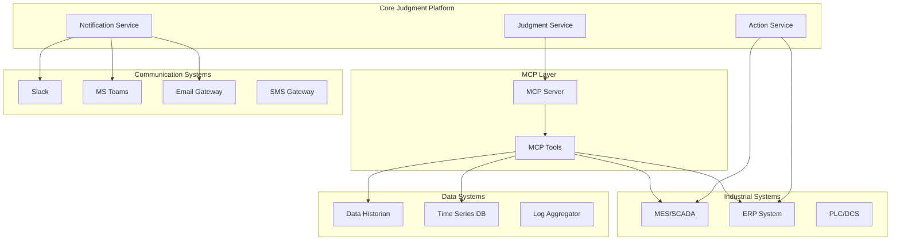

# 외부 시스템 연동 가이드

**문서 버전**: v2.0  
**작성일**: 2024.08.05  
**대상**: 시스템 통합 엔지니어, DevOps 엔지니어, 백엔드 개발자  
**목적**: MCP, MES/ERP, 알림 시스템 등 외부 시스템과의 연동 구현 가이드

## 📋 1. 연동 시스템 개요

### 1.1 연동 대상 시스템
```typescript
interface ExternalSystems {
    // AI 컨텍스트 제공
    mcp: {
        purpose: 'AI 모델에 실시간 컨텍스트 데이터 제공';
        protocol: 'Model Context Protocol (MCP)';
        dataFlow: 'bidirectional';
    };
    
    // 제조 실행 시스템
    mes: {
        purpose: '생산 데이터 수집 및 제어 명령 실행';
        protocols: ['OPC-UA', 'REST API', 'MQTT'];
        vendors: ['Siemens', 'Rockwell', 'Schneider', 'Custom'];
    };
    
    // 기업 자원 관리
    erp: {
        purpose: '생산 계획, 자재 정보, 품질 데이터 연동';
        systems: ['SAP', 'Oracle', 'Microsoft Dynamics'];
        integration: 'REST API';
    };
    
    // 알림 및 커뮤니케이션
    notifications: {
        channels: ['Slack', 'Microsoft Teams', 'Email', 'SMS'];
        purpose: '실시간 알림 및 승인 워크플로우';
    };
    
    // 시각화 및 대시보드
    visualization: {
        systems: ['Grafana', 'Power BI', 'Tableau'];
        purpose: '판단 결과 및 트렌드 시각화';
    };
}
```

### 1.2 연동 아키텍처


## 🔌 2. MCP (Model Context Protocol) 연동

### 2.1 MCP 서버 구현
```python
# MCP 서버 구현 (Python)
from mcp import Server, Tool
from mcp.types import TextContent, ImageContent
import asyncio
import aiohttp
import json
from typing import Dict, Any, List, Optional

class ManufacturingMCPServer:
    def __init__(self, config: Dict[str, Any]):
        self.server = Server("manufacturing-context")
        self.config = config
        self.mes_connector = MESConnector(config.get('mes_config'))
        self.erp_connector = ERPConnector(config.get('erp_config'))
        
        # MCP 도구 등록
        self._register_tools()
    
    def _register_tools(self):
        """MCP 도구들을 서버에 등록"""
        
        @self.server.tool()
        async def get_machine_status(machine_id: str) -> List[TextContent]:
            """특정 기계의 현재 상태 조회"""
            try:
                status = await self.mes_connector.get_machine_status(machine_id)
                
                return [TextContent(
                    type="text",
                    text=json.dumps({
                        "machine_id": machine_id,
                        "status": status.get("status", "unknown"),
                        "temperature": status.get("temperature"),
                        "pressure": status.get("pressure"),
                        "vibration": status.get("vibration"),
                        "last_updated": status.get("timestamp"),
                        "alarms": status.get("active_alarms", [])
                    }, indent=2)
                )]
                
            except Exception as e:
                return [TextContent(
                    type="text",
                    text=f"Error retrieving machine status: {str(e)}"
                )]
        
        @self.server.tool()
        async def query_production_data(
            timeframe: str = "1h",
            machine_ids: Optional[List[str]] = None,
            metrics: Optional[List[str]] = None
        ) -> List[TextContent]:
            """생산 데이터 쿼리"""
            try:
                query_params = {
                    "timeframe": timeframe,
                    "machine_ids": machine_ids or [],
                    "metrics": metrics or ["output", "efficiency", "quality"]
                }
                
                data = await self.mes_connector.query_production_data(query_params)
                
                return [TextContent(
                    type="text",
                    text=json.dumps({
                        "query": query_params,
                        "results": data.get("results", []),
                        "summary": data.get("summary", {}),
                        "timestamp": data.get("timestamp")
                    }, indent=2)
                )]
                
            except Exception as e:
                return [TextContent(
                    type="text",
                    text=f"Error querying production data: {str(e)}"
                )]
        
        @self.server.tool()
        async def get_quality_standards(
            product_type: str,
            version: Optional[str] = None
        ) -> List[TextContent]:
            """품질 기준 조회"""
            try:
                standards = await self.erp_connector.get_quality_standards(
                    product_type, version
                )
                
                return [TextContent(
                    type="text",
                    text=json.dumps({
                        "product_type": product_type,
                        "version": version or "latest",
                        "standards": standards.get("standards", {}),
                        "thresholds": standards.get("thresholds", {}),
                        "test_procedures": standards.get("procedures", [])
                    }, indent=2)
                )]
                
            except Exception as e:
                return [TextContent(
                    type="text",
                    text=f"Error retrieving quality standards: {str(e)}"
                )]
        
        @self.server.tool()
        async def search_maintenance_history(
            machine_id: str,
            days_back: int = 30,
            issue_type: Optional[str] = None
        ) -> List[TextContent]:
            """유지보수 이력 검색"""
            try:
                history = await self.mes_connector.search_maintenance_history(
                    machine_id, days_back, issue_type
                )
                
                return [TextContent(
                    type="text",
                    text=json.dumps({
                        "machine_id": machine_id,
                        "search_period": f"{days_back} days",
                        "issue_type": issue_type,
                        "maintenance_records": history.get("records", []),
                        "patterns": history.get("patterns", {}),
                        "recommendations": history.get("recommendations", [])
                    }, indent=2)
                )]
                
            except Exception as e:
                return [TextContent(
                    type="text",
                    text=f"Error searching maintenance history: {str(e)}"
                )]
        
        @self.server.tool()
        async def execute_control_command(
            machine_id: str,
            command: str,
            parameters: Optional[Dict[str, Any]] = None,
            safety_check: bool = True
        ) -> List[TextContent]:
            """제어 명령 실행"""
            try:
                if safety_check:
                    # 안전성 검사
                    safety_result = await self._perform_safety_check(
                        machine_id, command, parameters
                    )
                    if not safety_result.get("safe", False):
                        return [TextContent(
                            type="text",
                            text=json.dumps({
                                "status": "rejected",
                                "reason": safety_result.get("reason"),
                                "required_permissions": safety_result.get("required_permissions", [])
                            })
                        )]
                
                # 명령 실행
                result = await self.mes_connector.execute_command(
                    machine_id, command, parameters or {}
                )
                
                return [TextContent(
                    type="text",
                    text=json.dumps({
                        "machine_id": machine_id,
                        "command": command,
                        "parameters": parameters,
                        "execution_id": result.get("execution_id"),
                        "status": result.get("status"),
                        "result": result.get("result"),
                        "timestamp": result.get("timestamp")
                    }, indent=2)
                )]
                
            except Exception as e:
                return [TextContent(
                    type="text",
                    text=f"Error executing control command: {str(e)}"
                )]
    
    async def _perform_safety_check(
        self, 
        machine_id: str, 
        command: str, 
        parameters: Optional[Dict[str, Any]]
    ) -> Dict[str, Any]:
        """안전성 검사 수행"""
        
        # 위험한 명령어 체크
        dangerous_commands = ["emergency_stop", "force_override", "bypass_safety"]
        if command in dangerous_commands:
            return {
                "safe": False,
                "reason": f"Command '{command}' requires supervisor approval",
                "required_permissions": ["supervisor", "safety_officer"]
            }
        
        # 기계 상태 확인
        machine_status = await self.mes_connector.get_machine_status(machine_id)
        if machine_status.get("status") == "error":
            return {
                "safe": False,
                "reason": "Machine is in error state",
                "required_permissions": ["maintenance"]
            }
        
        # 매개변수 범위 검사
        if parameters:
            validation_result = await self._validate_parameters(
                machine_id, command, parameters
            )
            if not validation_result.get("valid", True):
                return {
                    "safe": False,
                    "reason": validation_result.get("reason"),
                    "required_permissions": ["engineer"]
                }
        
        return {"safe": True}
    
    async def start(self, host: str = "localhost", port: int = 3001):
        """MCP 서버 시작"""
        await self.server.start(host, port)

# MCP 서버 시작 스크립트
async def main():
    config = {
        "mes_config": {
            "host": "mes.company.com",
            "port": 8080,
            "api_key": "mes_api_key",
            "timeout": 30
        },
        "erp_config": {
            "host": "erp.company.com",
            "port": 8443,
            "api_key": "erp_api_key",
            "timeout": 60
        }
    }
    
    server = ManufacturingMCPServer(config)
    await server.start()

if __name__ == "__main__":
    asyncio.run(main())
@mcp_server.tool()
async def get_dashboard_data_sources() -> List[TextContent]:
    """대시보드 생성 가능한 데이터 소스 목록 조회"""
    data_sources = {
        "production_metrics": {
            "tables": ["judgment_executions", "action_executions"],
            "real_time": True,
            "aggregations": ["count", "avg", "sum"]
        },
        "machine_data": {
            "source": "mes_connector",
            "metrics": ["temperature", "vibration", "pressure"],
            "real_time": True
        },
        "quality_data": {
            "source": "erp_connector", 
            "metrics": ["defect_rate", "inspection_results"],
            "real_time": False
        }
    }
    
    return [TextContent(
        type="text",
        text=json.dumps(data_sources, indent=2)
    )]

@mcp_server.tool()
async def get_sample_data_for_visualization(
    data_source: str,
    limit: int = 100
) -> List[TextContent]:
    """시각화를 위한 샘플 데이터 조회"""
    # 구현 로직
    pass
```

### 2.2 MCP 클라이언트 연동
```typescript
// 판단 서비스에서 MCP 클라이언트 사용
import { MCPClient } from '@anthropic/mcp-client';

interface MCPConfig {
    serverUrl: string;
    timeout: number;
    retryAttempts: number;
}

class JudgmentMCPClient {
    private client: MCPClient;
    private config: MCPConfig;
    
    constructor(config: MCPConfig) {
        this.config = config;
        this.client = new MCPClient({
            serverUrl: config.serverUrl,
            timeout: config.timeout
        });
    }
    
    async gatherContext(
        workflowId: string, 
        inputData: Record<string, any>
    ): Promise<Record<string, any>> {
        const context: Record<string, any> = {};
        
        try {
            // 기계 상태 정보 수집
            if (inputData.machine_id) {
                const machineStatus = await this.client.callTool(
                    'get_machine_status',
                    { machine_id: inputData.machine_id }
                );
                context.machine_status = JSON.parse(machineStatus.content[0].text);
            }
            
            // 생산 데이터 수집
            const productionData = await this.client.callTool(
                'query_production_data',
                {
                    timeframe: '1h',
                    machine_ids: inputData.machine_id ? [inputData.machine_id] : [],
                    metrics: ['output', 'efficiency', 'quality']
                }
            );
            context.production_data = JSON.parse(productionData.content[0].text);
            
            // 품질 기준 수집
            if (inputData.product_type) {
                const qualityStandards = await this.client.callTool(
                    'get_quality_standards',
                    { product_type: inputData.product_type }
                );
                context.quality_standards = JSON.parse(qualityStandards.content[0].text);
            }
            
            // 유지보수 이력 수집
            if (inputData.machine_id) {
                const maintenanceHistory = await this.client.callTool(
                    'search_maintenance_history',
                    {
                        machine_id: inputData.machine_id,
                        days_back: 7,
                        issue_type: inputData.issue_type
                    }
                );
                context.maintenance_history = JSON.parse(maintenanceHistory.content[0].text);
            }
            
            return context;
            
        } catch (error) {
            console.error('Failed to gather context via MCP:', error);
            return {}; // 빈 컨텍스트 반환
        }
    }
    
    async executeControlCommand(
        machineId: string,
        command: string,
        parameters: Record<string, any> = {}
    ): Promise<any> {
        try {
            const result = await this.client.callTool(
                'execute_control_command',
                {
                    machine_id: machineId,
                    command: command,
                    parameters: parameters,
                    safety_check: true
                }
            );
            
            return JSON.parse(result.content[0].text);
            
        } catch (error) {
            console.error('Failed to execute control command:', error);
            throw error;
        }
    }
}
```

## 🏭 3. MES/SCADA 시스템 연동

### 3.1 OPC-UA 연동 구현
```python
# OPC-UA 클라이언트 구현
from asyncua import Client, ua
import asyncio
import logging
from typing import Dict, Any, List, Optional
from datetime import datetime, timedelta

class OPCUAConnector:
    def __init__(self, config: Dict[str, Any]):
        self.config = config
        self.client = None
        self.connected = False
        self.subscription = None
        self.monitored_items = {}
        
        # 로깅 설정
        logging.basicConfig(level=logging.INFO)
        self.logger = logging.getLogger(__name__)
    
    async def connect(self):
        """OPC-UA 서버에 연결"""
        try:
            self.client = Client(self.config['endpoint'])
            
            # 보안 설정
            if self.config.get('security_policy'):
                await self.client.set_security_string(
                    f"{self.config['security_policy']},Sign,{self.config['certificate_path']},{self.config['private_key_path']}"
                )
            
            # 인증 설정
            if self.config.get('username'):
                self.client.set_user(self.config['username'])
                self.client.set_password(self.config['password'])
            
            await self.client.connect()
            self.connected = True
            
            self.logger.info(f"Connected to OPC-UA server: {self.config['endpoint']}")
            
            # 서버 정보 로깅
            server_info = await self.client.get_server_node().read_browse_name()
            self.logger.info(f"Server name: {server_info}")
            
        except Exception as e:
            self.logger.error(f"Failed to connect to OPC-UA server: {e}")
            raise
    
    async def disconnect(self):
        """OPC-UA 서버 연결 해제"""
        if self.client and self.connected:
            try:
                if self.subscription:
                    await self.subscription.delete()
                await self.client.disconnect()
                self.connected = False
                self.logger.info("Disconnected from OPC-UA server")
            except Exception as e:
                self.logger.error(f"Error during disconnect: {e}")
    
    async def read_variable(self, node_id: str) -> Any:
        """단일 변수 읽기"""
        if not self.connected:
            await self.connect()
        
        try:
            node = self.client.get_node(node_id)
            value = await node.read_value()
            
            # 데이터 타입에 따른 변환
            if isinstance(value, ua.DataValue):
                return value.Value.Value
            
            return value
            
        except Exception as e:
            self.logger.error(f"Failed to read variable {node_id}: {e}")
            raise
    
    async def read_multiple_variables(self, node_ids: List[str]) -> Dict[str, Any]:
        """여러 변수 일괄 읽기"""
        if not self.connected:
            await self.connect()
        
        try:
            nodes = [self.client.get_node(node_id) for node_id in node_ids]
            values = await self.client.read_values(nodes)
            
            result = {}
            for node_id, value in zip(node_ids, values):
                if isinstance(value, ua.DataValue):
                    result[node_id] = {
                        'value': value.Value.Value,
                        'status': value.StatusCode.name,
                        'timestamp': value.SourceTimestamp,
                        'quality': 'Good' if value.StatusCode.is_good() else 'Bad'
                    }
                else:
                    result[node_id] = {
                        'value': value,
                        'status': 'Good',
                        'timestamp': datetime.utcnow(),
                        'quality': 'Good'
                    }
            
            return result
            
        except Exception as e:
            self.logger.error(f"Failed to read multiple variables: {e}")
            raise
    
    async def write_variable(self, node_id: str, value: Any) -> bool:
        """변수 쓰기"""
        if not self.connected:
            await self.connect()
        
        try:
            node = self.client.get_node(node_id)
            
            # 데이터 타입 확인
            data_type = await node.read_data_type_as_variant_type()
            
            # 값 변환 및 쓰기
            variant = ua.Variant(value, data_type)
            await node.write_value(variant)
            
            self.logger.info(f"Successfully wrote {value} to {node_id}")
            return True
            
        except Exception as e:
            self.logger.error(f"Failed to write variable {node_id}: {e}")
            return False
    
    async def call_method(
        self, 
        object_node_id: str, 
        method_node_id: str, 
        *args
    ) -> Any:
        """메서드 호출"""
        if not self.connected:
            await self.connect()
        
        try:
            object_node = self.client.get_node(object_node_id)
            method_node = self.client.get_node(method_node_id)
            
            result = await object_node.call_method(method_node, *args)
            
            self.logger.info(f"Method {method_node_id} called successfully")
            return result
            
        except Exception as e:
            self.logger.error(f"Failed to call method {method_node_id}: {e}")
            raise
    
    async def setup_subscription(
        self, 
        monitored_variables: Dict[str, str],
        callback_handler: callable
    ):
        """데이터 변경 구독 설정"""
        if not self.connected:
            await self.connect()
        
        try:
            # 구독 생성
            self.subscription = await self.client.create_subscription(
                period=self.config.get('subscription_period', 1000),  # 1초
                handler=OPCUASubscriptionHandler(callback_handler)
            )
            
            # 모니터링 항목 추가
            for variable_name, node_id in monitored_variables.items():
                node = self.client.get_node(node_id)
                handle = await self.subscription.subscribe_data_change(node)
                self.monitored_items[variable_name] = {
                    'node_id': node_id,
                    'handle': handle
                }
            
            self.logger.info(f"Subscription setup complete for {len(monitored_variables)} variables")
            
        except Exception as e:
            self.logger.error(f"Failed to setup subscription: {e}")
            raise

class OPCUASubscriptionHandler:
    def __init__(self, callback_handler: callable):
        self.callback_handler = callback_handler
        self.logger = logging.getLogger(__name__)
    
    def datachange_notification(self, node, val, data):
        """데이터 변경 알림 처리"""
        try:
            change_data = {
                'node_id': str(node),
                'value': val,
                'timestamp': data.monitored_item.Value.SourceTimestamp,
                'status': data.monitored_item.Value.StatusCode.name
            }
            
            # 콜백 함수 호출
            asyncio.create_task(self.callback_handler(change_data))
            
        except Exception as e:
            self.logger.error(f"Error in datachange notification: {e}")

# MES 시스템 연동을 위한 어댑터
class MESAdapter:
    def __init__(self, config: Dict[str, Any]):
        self.config = config
        self.opc_connector = OPCUAConnector(config.get('opc_config', {}))
        self.rest_client = aiohttp.ClientSession()
        
        # 노드 ID 매핑
        self.node_mappings = config.get('node_mappings', {})
    
    async def get_machine_status(self, machine_id: str) -> Dict[str, Any]:
        """기계 상태 조회"""
        try:
            # 해당 기계의 노드 ID 목록 가져오기
            machine_nodes = self.node_mappings.get(machine_id, {})
            
            if not machine_nodes:
                raise ValueError(f"No node mappings found for machine {machine_id}")
            
            # OPC-UA에서 데이터 읽기
            node_ids = list(machine_nodes.values())
            opc_data = await self.opc_connector.read_multiple_variables(node_ids)
            
            # 데이터 변환
            status = {}
            for field_name, node_id in machine_nodes.items():
                if node_id in opc_data:
                    status[field_name] = opc_data[node_id]['value']
            
            # 추가 정보 보강
            status.update({
                'machine_id': machine_id,
                'timestamp': datetime.utcnow().isoformat(),
                'data_quality': all(
                    data['quality'] == 'Good' 
                    for data in opc_data.values()
                )
            })
            
            return status
            
        except Exception as e:
            self.logger.error(f"Failed to get machine status for {machine_id}: {e}")
            raise
    
    async def execute_command(
        self, 
        machine_id: str, 
        command: str, 
        parameters: Dict[str, Any]
    ) -> Dict[str, Any]:
        """제어 명령 실행"""
        try:
            command_config = self.config.get('commands', {}).get(command)
            if not command_config:
                raise ValueError(f"Unknown command: {command}")
            
            execution_id = f"cmd_{machine_id}_{int(datetime.now().timestamp())}"
            
            if command_config['type'] == 'opc_method':
                # OPC-UA 메서드 호출
                result = await self.opc_connector.call_method(
                    command_config['object_node'],
                    command_config['method_node'],
                    *parameters.values()
                )
                
            elif command_config['type'] == 'opc_write':
                # OPC-UA 변수 쓰기
                success = await self.opc_connector.write_variable(
                    command_config['node_id'],
                    parameters.get('value', command_config.get('default_value'))
                )
                result = {'success': success}
                
            elif command_config['type'] == 'rest_api':
                # REST API 호출
                result = await self._call_rest_api(
                    command_config['endpoint'],
                    command_config['method'],
                    parameters
                )
            
            else:
                raise ValueError(f"Unsupported command type: {command_config['type']}")
            
            return {
                'execution_id': execution_id,
                'machine_id': machine_id,
                'command': command,
                'parameters': parameters,
                'result': result,
                'status': 'success',
                'timestamp': datetime.utcnow().isoformat()
            }
            
        except Exception as e:
            return {
                'execution_id': execution_id,
                'machine_id': machine_id,
                'command': command,
                'parameters': parameters,
                'result': None,
                'status': 'failed',
                'error': str(e),
                'timestamp': datetime.utcnow().isoformat()
            }
    
    async def _call_rest_api(
        self, 
        endpoint: str, 
        method: str, 
        parameters: Dict[str, Any]
    ) -> Dict[str, Any]:
        """REST API 호출"""
        url = f"{self.config['rest_base_url']}{endpoint}"
        headers = {
            'Authorization': f"Bearer {self.config['api_token']}",
            'Content-Type': 'application/json'
        }
        
        async with self.rest_client.request(
            method=method.upper(),
            url=url,
            json=parameters,
            headers=headers,
            timeout=aiohttp.ClientTimeout(total=30)
        ) as response:
            if response.status == 200:
                return await response.json()
            else:
                raise Exception(f"REST API call failed: {response.status}")
```

## 📧 4. 알림 시스템 연동

### 4.1 멀티 채널 알림 서비스
```typescript
// 알림 서비스 구현
interface NotificationChannel {
    type: 'slack' | 'teams' | 'email' | 'sms' | 'webhook';
    config: Record<string, any>;
    enabled: boolean;
    priority: number;
}

interface NotificationMessage {
    title: string;
    content: string;
    severity: 'info' | 'warning' | 'error' | 'critical';
    data?: Record<string, any>;
    attachments?: Array<{
        name: string;
        content: string;
        type: string;
    }>;
}

class NotificationService {
    private channels: Map<string, NotificationChannel> = new Map();
    private rateLimiter: Map<string, number> = new Map();
    
    constructor(private config: NotificationConfig) {
        this.initializeChannels();
    }
    
    private initializeChannels() {
        // Slack 채널
        if (this.config.slack?.enabled) {
            this.channels.set('slack', {
                type: 'slack',
                config: this.config.slack,
                enabled: true,
                priority: 1
            });
        }
        
        // Microsoft Teams 채널
        if (this.config.teams?.enabled) {
            this.channels.set('teams', {
                type: 'teams',
                config: this.config.teams,
                enabled: true,
                priority: 2
            });
        }
        
        // 이메일 채널
        if (this.config.email?.enabled) {
            this.channels.set('email', {
                type: 'email',
                config: this.config.email,
                enabled: true,
                priority: 3
            });
        }
        
        // SMS 채널
        if (this.config.sms?.enabled) {
            this.channels.set('sms', {
                type: 'sms',
                config: this.config.sms,
                enabled: true,
                priority: 4
            });
        }
    }
    
    async sendNotification(
        channels: string[],
        message: NotificationMessage,
        options: {
            urgent?: boolean;
            retryCount?: number;
            rateLimitKey?: string;
        } = {}
    ): Promise<NotificationResult[]> {
        const results: NotificationResult[] = [];
        
        // 속도 제한 확인
        if (options.rateLimitKey && !this.checkRateLimit(options.rateLimitKey)) {
            throw new Error('Rate limit exceeded');
        }
        
        // 우선순위순으로 채널 정렬
        const sortedChannels = channels
            .map(name => ({ name, channel: this.channels.get(name) }))
            .filter(({ channel }) => channel?.enabled)
            .sort((a, b) => (a.channel?.priority || 999) - (b.channel?.priority || 999));
        
        // 병렬로 알림 전송
        const sendPromises = sortedChannels.map(({ name, channel }) =>
            this.sendToChannel(name, channel!, message, options)
        );
        
        const channelResults = await Promise.allSettled(sendPromises);
        
        channelResults.forEach((result, index) => {
            const channelName = sortedChannels[index].name;
            
            if (result.status === 'fulfilled') {
                results.push({
                    channel: channelName,
                    success: true,
                    messageId: result.value.messageId,
                    timestamp: new Date()
                });
            } else {
                results.push({
                    channel: channelName,
                    success: false,
                    error: result.reason.message,
                    timestamp: new Date()
                });
            }
        });
        
        return results;
    }
    
    private async sendToChannel(
        channelName: string,
        channel: NotificationChannel,
        message: NotificationMessage,
        options: any
    ): Promise<{ messageId: string }> {
        switch (channel.type) {
            case 'slack':
                return await this.sendSlackMessage(channel.config, message);
            
            case 'teams':
                return await this.sendTeamsMessage(channel.config, message);
            
            case 'email':
                return await this.sendEmailMessage(channel.config, message);
            
            case 'sms':
                return await this.sendSMSMessage(channel.config, message);
            
            case 'webhook':
                return await this.sendWebhookMessage(channel.config, message);
            
            default:
                throw new Error(`Unsupported channel type: ${channel.type}`);
        }
    }
    
    private async sendSlackMessage(
        config: any,
        message: NotificationMessage
    ): Promise<{ messageId: string }> {
        const { WebClient } = require('@slack/web-api');
        const slack = new WebClient(config.botToken);
        
        // 심각도에 따른 색상 설정
        const colorMap = {
            info: '#36a64f',
            warning: '#ff9500',
            error: '#ff0000',
            critical: '#8b0000'
        };
        
        const blocks = [
            {
                type: 'header',
                text: {
                    type: 'plain_text',
                    text: message.title
                }
            },
            {
                type: 'section',
                text: {
                    type: 'mrkdwn',
                    text: message.content
                }
            }
        ];
        
        // 데이터가 있으면 필드 추가
        if (message.data) {
            const fields = Object.entries(message.data).map(([key, value]) => ({
                type: 'mrkdwn',
                text: `*${key}:* ${value}`
            }));
            
            if (fields.length > 0) {
                blocks.push({
                    type: 'section',
                    fields: fields.slice(0, 10) // 최대 10개 필드
                });
            }
        }
        
        // 액션 버튼 추가 (중요한 알림의 경우)
        if (message.severity === 'critical' || message.severity === 'error') {
            blocks.push({
                type: 'actions',
                elements: [
                    {
                        type: 'button',
                        text: {
                            type: 'plain_text',
                            text: '확인'
                        },
                        style: 'primary',
                        action_id: 'acknowledge',
                        value: JSON.stringify({ 
                            type: 'acknowledge',
                            timestamp: new Date().toISOString()
                        })
                    },
                    {
                        type: 'button',
                        text: {
                            type: 'plain_text',
                            text: '상세 보기'
                        },
                        action_id: 'view_details',
                        url: `${config.dashboardUrl}/alerts/${message.data?.alertId || ''}`
                    }
                ]
            });
        }
        
        const result = await slack.chat.postMessage({
            channel: config.channel,
            blocks: blocks,
            attachments: [{
                color: colorMap[message.severity],
                fallback: message.content
            }]
        });
        
        return { messageId: result.ts as string };
    }
    
    private async sendEmailMessage(
        config: any,
        message: NotificationMessage
    ): Promise<{ messageId: string }> {
        const nodemailer = require('nodemailer');
        
        const transporter = nodemailer.createTransporter({
            host: config.smtpHost,
            port: config.smtpPort,
            secure: config.smtpSecure,
            auth: {
                user: config.username,
                pass: config.password
            }
        });
        
        // HTML 템플릿 생성
        const htmlContent = this.generateEmailHTML(message);
        
        const mailOptions = {
            from: config.fromAddress,
            to: config.recipients.join(', '),
            subject: `[${message.severity.toUpperCase()}] ${message.title}`,
            text: message.content,
            html: htmlContent,
            attachments: message.attachments?.map(att => ({
                filename: att.name,
                content: att.content,
                contentType: att.type
            }))
        };
        
        const result = await transporter.sendMail(mailOptions);
        return { messageId: result.messageId };
    }
    
    private generateEmailHTML(message: NotificationMessage): string {
        const severityColors = {
            info: '#17a2b8',
            warning: '#ffc107',
            error: '#dc3545',
            critical: '#8b0000'
        };
        
        const color = severityColors[message.severity];
        
        return `
            <!DOCTYPE html>
            <html>
            <head>
                <meta charset="utf-8">
                <title>${message.title}</title>
                <style>
                    body { font-family: Arial, sans-serif; margin: 0; padding: 20px; }
                    .container { max-width: 600px; margin: 0 auto; }
                    .header { background-color: ${color}; color: white; padding: 20px; border-radius: 5px 5px 0 0; }
                    .content { background-color: #f8f9fa; padding: 20px; border-radius: 0 0 5px 5px; }
                    .data-table { width: 100%; border-collapse: collapse; margin-top: 20px; }
                    .data-table th, .data-table td { border: 1px solid #dee2e6; padding: 12px; text-align: left; }
                    .data-table th { background-color: #e9ecef; }
                    .severity-badge { display: inline-block; padding: 4px 8px; border-radius: 4px; background-color: ${color}; color: white; font-size: 12px; font-weight: bold; }
                </style>
            </head>
            <body>
                <div class="container">
                    <div class="header">
                        <h1>${message.title}</h1>
                        <span class="severity-badge">${message.severity.toUpperCase()}</span>
                    </div>
                    <div class="content">
                        <p>${message.content.replace(/\n/g, '<br>')}</p>
                        
                        ${message.data ? `
                            <table class="data-table">
                                <thead>
                                    <tr>
                                        <th>항목</th>
                                        <th>값</th>
                                    </tr>
                                </thead>
                                <tbody>
                                    ${Object.entries(message.data).map(([key, value]) => `
                                        <tr>
                                            <td><strong>${key}</strong></td>
                                            <td>${value}</td>
                                        </tr>
                                    `).join('')}
                                </tbody>
                            </table>
                        ` : ''}
                        
                        <p style="margin-top: 30px; color: #6c757d; font-size: 12px;">
                            발송 시간: ${new Date().toLocaleString('ko-KR')}
                        </p>
                    </div>
                </div>
            </body>
            </html>
        `;
    }
    
    private checkRateLimit(key: string): boolean {
        const now = Date.now();
        const lastSent = this.rateLimiter.get(key) || 0;
        const minInterval = this.config.rateLimitInterval || 60000; // 1분
        
        if (now - lastSent < minInterval) {
            return false;
        }
        
        this.rateLimiter.set(key, now);
        return true;
    }
}

// 알림 템플릿 시스템
class NotificationTemplateEngine {
    private templates: Map<string, NotificationTemplate> = new Map();
    
    constructor() {
        this.loadDefaultTemplates();
    }
    
    private loadDefaultTemplates() {
        // 기계 과열 알림 템플릿
        this.templates.set('machine_overheat', {
            title: '🔥 기계 과열 경고',
            contentTemplate: `
기계 {{machine_id}}에서 과열이 감지되었습니다.

📊 **현재 상태:**
• 온도: {{temperature}}°C (기준: {{threshold}}°C)
• 진동: {{vibration}}
• 상태: {{status}}

⚠️ **권장 조치:**
• 즉시 기계 점검 필요
• 운영 담당자 호출
• 안전 절차 준수

🕒 감지 시간: {{timestamp}}
            `,
            severity: 'critical',
            channels: ['slack', 'email', 'sms'],
            escalation: {
                enabled: true,
                delay: 300000, // 5분
                channels: ['sms', 'teams']
            }
        });
        
        // 품질 이상 알림 템플릿
        this.templates.set('quality_issue', {
            title: '⚠️ 품질 기준 미달',
            contentTemplate: `
제품 {{product_id}}에서 품질 기준 미달이 발견되었습니다.

📋 **검사 결과:**
• 검사 항목: {{inspection_item}}
• 측정값: {{measured_value}}
• 기준값: {{standard_value}}
• 편차: {{deviation}}

🔍 **세부 정보:**
• 배치: {{batch_id}}
• 검사자: {{inspector}}
• 검사 시간: {{inspection_time}}

📞 **담당자:** {{responsible_person}}
            `,
            severity: 'warning',
            channels: ['slack', 'email'],
            escalation: {
                enabled: false
            }
        });
        
        // 시스템 점검 알림 템플릿
        this.templates.set('system_maintenance', {
            title: '🔧 정기 점검 안내',
            contentTemplate: `
시스템 정기 점검이 예정되어 있습니다.

📅 **점검 일정:**
• 시작: {{start_time}}
• 종료: {{end_time}}
• 대상: {{target_systems}}

⚡ **영향 범위:**
{{affected_areas}}

📝 **준비 사항:**
{{preparation_items}}

문의사항이 있으시면 시스템 관리팀으로 연락해 주세요.
            `,
            severity: 'info',
            channels: ['slack', 'email'],
            escalation: {
                enabled: false
            }
        });
    }
    
    renderTemplate(
        templateId: string,
        data: Record<string, any>
    ): NotificationMessage {
        const template = this.templates.get(templateId);
        if (!template) {
            throw new Error(`Template not found: ${templateId}`);
        }
        
        // 템플릿 변수 치환
        let content = template.contentTemplate;
        for (const [key, value] of Object.entries(data)) {
            const regex = new RegExp(`{{${key}}}`, 'g');
            content = content.replace(regex, String(value));
        }
        
        return {
            title: template.title,
            content: content.trim(),
            severity: template.severity,
            data: data
        };
    }
    
    getTemplate(templateId: string): NotificationTemplate | undefined {
        return this.templates.get(templateId);
    }
    
    addTemplate(templateId: string, template: NotificationTemplate) {
        this.templates.set(templateId, template);
    }
}

interface NotificationTemplate {
    title: string;
    contentTemplate: string;
    severity: 'info' | 'warning' | 'error' | 'critical';
    channels: string[];
    escalation: {
        enabled: boolean;
        delay?: number;
        channels?: string[];
    };
}

interface NotificationResult {
    channel: string;
    success: boolean;
    messageId?: string;
    error?: string;
    timestamp: Date;
}
```

## 📊 5. ERP 시스템 연동

### 5.1 SAP 연동 구현
```python
# SAP RFC 연동
import pyrfc
from typing import Dict, Any, List, Optional
import logging
from datetime import datetime, timedelta

class SAPConnector:
    def __init__(self, config: Dict[str, Any]):
        self.config = config
        self.connection = None
        self.logger = logging.getLogger(__name__)
    
    def connect(self):
        """SAP 시스템에 연결"""
        try:
            self.connection = pyrfc.Connection(
                ashost=self.config['host'],
                sysnr=self.config['system_number'],
                client=self.config['client'],
                user=self.config['username'],
                passwd=self.config['password'],
                lang=self.config.get('language', 'EN')
            )
            
            self.logger.info("Connected to SAP system")
            
        except Exception as e:
            self.logger.error(f"Failed to connect to SAP: {e}")
            raise
    
    def disconnect(self):
        """SAP 연결 해제"""
        if self.connection:
            self.connection.close()
            self.logger.info("Disconnected from SAP system")
    
    def get_material_master(self, material_number: str) -> Dict[str, Any]:
        """자재 마스터 정보 조회"""
        if not self.connection:
            self.connect()
        
        try:
            # BAPI_MATERIAL_GET_DETAIL 호출
            result = self.connection.call(
                'BAPI_MATERIAL_GET_DETAIL',
                MATERIAL=material_number,
                PLANT=self.config.get('default_plant', ''),
                VALUATIONAREA=self.config.get('default_plant', '')
            )
            
            material_data = {
                'material_number': material_number,
                'description': result.get('MATERIAL_GENERAL_DATA', {}).get('MATL_DESC', ''),
                'base_unit': result.get('MATERIAL_GENERAL_DATA', {}).get('BASE_UOM', ''),
                'material_group': result.get('MATERIAL_GENERAL_DATA', {}).get('MATL_GROUP', ''),
                'gross_weight': result.get('MATERIAL_GENERAL_DATA', {}).get('GROSS_WT', 0),
                'net_weight': result.get('MATERIAL_GENERAL_DATA', {}).get('NET_WEIGHT', 0),
                'volume': result.get('MATERIAL_GENERAL_DATA', {}).get('VOLUME', 0)
            }
            
            # 품질 관리 데이터 추가
            qm_data = result.get('MATERIAL_QM_DATA', {})
            if qm_data:
                material_data.update({
                    'inspection_setup': qm_data.get('INSP_SETUP', ''),
                    'quality_score': qm_data.get('QLTY_SCORE', 0),
                    'inspection_interval': qm_data.get('INSP_INTERVAL', 0)
                })
            
            return material_data
            
        except Exception as e:
            self.logger.error(f"Failed to get material master for {material_number}: {e}")
            raise
    
    def get_production_order(self, order_number: str) -> Dict[str, Any]:
        """생산 오더 정보 조회"""
        if not self.connection:
            self.connect()
        
        try:
            # BAPI_PRODORD_GET_DETAIL 호출
            result = self.connection.call(
                'BAPI_PRODORD_GET_DETAIL',
                NUMBER=order_number
            )
            
            order_header = result.get('ORDER_HEADER', {})
            order_data = {
                'order_number': order_number,
                'material': order_header.get('MATERIAL', ''),
                'plant': order_header.get('PLANT', ''),
                'order_type': order_header.get('ORDER_TYPE', ''),
                'status': order_header.get('STATUS', ''),
                'planned_start': order_header.get('PLND_STRT', ''),
                'planned_end': order_header.get('PLND_END', ''),
                'actual_start': order_header.get('ACT_START', ''),
                'actual_end': order_header.get('ACT_END', ''),
                'target_quantity': order_header.get('TARGET_QTY', 0),
                'confirmed_quantity': order_header.get('CONF_QTY', 0),
                'scrap_quantity': order_header.get('SCRAP_QTY', 0)
            }
            
            # 작업 순서 정보 추가
            operations = result.get('ORDER_OPERATIONS', [])
            order_data['operations'] = [
                {
                    'operation_number': op.get('OPERATION', ''),
                    'work_center': op.get('WORKCENTER', ''),
                    'description': op.get('DESCRIPTION', ''),
                    'status': op.get('STATUS', ''),
                    'planned_duration': op.get('DURATION', 0),
                    'actual_duration': op.get('ACT_DURATION', 0)
                }
                for op in operations
            ]
            
            return order_data
            
        except Exception as e:
            self.logger.error(f"Failed to get production order {order_number}: {e}")
            raise
    
    def create_quality_notification(
        self, 
        notification_data: Dict[str, Any]
    ) -> str:
        """품질 통지 생성"""
        if not self.connection:
            self.connect()
        
        try:
            # BAPI_QUALNOT_CREATE 호출
            result = self.connection.call(
                'BAPI_QUALNOT_CREATE',
                NOTIFICATION_DATA={
                    'NOTIF_TYPE': notification_data.get('type', 'Q1'),
                    'MATERIAL': notification_data.get('material', ''),
                    'PLANT': notification_data.get('plant', ''),
                    'VENDOR': notification_data.get('vendor', ''),
                    'SHORT_TEXT': notification_data.get('short_text', ''),
                    'PRIORITY': notification_data.get('priority', '2'),
                    'CATALOG_PROFILE': notification_data.get('catalog_profile', '')
                }
            )
            
            notification_number = result.get('NOTIFICATION', '')
            
            # 장문 텍스트 추가 (필요한 경우)
            if notification_data.get('long_text'):
                self.connection.call(
                    'BAPI_QUALNOT_ADD_TEXT',
                    NOTIFICATION=notification_number,
                    TEXT_LINES=[
                        {'TEXT_LINE': line}
                        for line in notification_data['long_text'].split('\n')
                    ]
                )
            
            # 커밋
            self.connection.call('BAPI_TRANSACTION_COMMIT', WAIT='X')
            
            self.logger.info(f"Quality notification created: {notification_number}")
            return notification_number
            
        except Exception as e:
            self.logger.error(f"Failed to create quality notification: {e}")
            raise
    
    def get_stock_levels(
        self, 
        materials: List[str], 
        plant: Optional[str] = None
    ) -> List[Dict[str, Any]]:
        """재고 수준 조회"""
        if not self.connection:
            self.connect()
        
        try:
            stock_data = []
            
            for material in materials:
                # BAPI_MATERIAL_STOCK_REQ_LIST 호출
                result = self.connection.call(
                    'BAPI_MATERIAL_STOCK_REQ_LIST',
                    MATERIAL=material,
                    PLANT=plant or self.config.get('default_plant', '')
                )
                
                stocks = result.get('STOCK_LIST', [])
                for stock in stocks:
                    stock_data.append({
                        'material': material,
                        'plant': stock.get('PLANT', ''),
                        'storage_location': stock.get('STGE_LOC', ''),
                        'unrestricted_stock': float(stock.get('UNRES_STOCK', 0)),
                        'quality_inspection': float(stock.get('QUAL_INSP', 0)),
                        'blocked_stock': float(stock.get('BLOCKED', 0)),
                        'unit': stock.get('UNIT', ''),
                        'last_updated': stock.get('LAST_CHG_DATE', '')
                    })
            
            return stock_data
            
        except Exception as e:
            self.logger.error(f"Failed to get stock levels: {e}")
            raise

# ERP 어댑터 클래스
class ERPAdapter:
    def __init__(self, config: Dict[str, Any]):
        self.config = config
        self.erp_type = config.get('type', 'sap')
        
        if self.erp_type == 'sap':
            self.connector = SAPConnector(config.get('sap_config', {}))
        else:
            raise ValueError(f"Unsupported ERP type: {self.erp_type}")
    
    async def get_production_context(
        self, 
        order_number: Optional[str] = None,
        material_number: Optional[str] = None
    ) -> Dict[str, Any]:
        """생산 컨텍스트 정보 조회"""
        context = {}
        
        try:
            if order_number:
                order_data = self.connector.get_production_order(order_number)
                context['production_order'] = order_data
                
                # 오더에서 자재 정보 추출
                if not material_number and order_data.get('material'):
                    material_number = order_data['material']
            
            if material_number:
                material_data = self.connector.get_material_master(material_number)
                context['material'] = material_data
                
                # 재고 정보 조회
                stock_data = self.connector.get_stock_levels([material_number])
                context['stock'] = stock_data
            
            return context
            
        except Exception as e:
            self.logger.error(f"Failed to get production context: {e}")
            return {}
    
    async def create_quality_issue(
        self, 
        issue_data: Dict[str, Any]
    ) -> str:
        """품질 이슈 생성"""
        try:
            notification_data = {
                'type': 'Q1',  # 품질 통지
                'material': issue_data.get('material_number'),
                'plant': issue_data.get('plant'),
                'short_text': issue_data.get('title', 'Quality Issue Detected'),
                'priority': self._map_severity_to_priority(issue_data.get('severity', 'warning')),
                'long_text': issue_data.get('description', '')
            }
            
            notification_number = self.connector.create_quality_notification(notification_data)
            return notification_number
            
        except Exception as e:
            self.logger.error(f"Failed to create quality issue: {e}")
            raise
    
    def _map_severity_to_priority(self, severity: str) -> str:
        """심각도를 SAP 우선순위로 매핑"""
        priority_map = {
            'critical': '1',  # 매우 높음
            'error': '2',     # 높음
            'warning': '3',   # 보통
            'info': '4'       # 낮음
        }
        return priority_map.get(severity, '3')
```

## 🔄 6. 실시간 데이터 동기화

### 6.1 WebSocket 기반 실시간 업데이트
```typescript
// WebSocket 서비스 구현
class RealTimeDataService {
    private ws: WebSocket | null = null;
    private reconnectAttempts = 0;
    private maxReconnectAttempts = 5;
    private reconnectDelay = 1000;
    private subscribers: Map<string, Set<(data: any) => void>> = new Map();
    
    constructor(private config: { wsUrl: string; authToken: string }) {}
    
    connect(): Promise<void> {
        return new Promise((resolve, reject) => {
            try {
                this.ws = new WebSocket(
                    `${this.config.wsUrl}?token=${this.config.authToken}`
                );
                
                this.ws.onopen = () => {
                    console.log('WebSocket connected');
                    this.reconnectAttempts = 0;
                    resolve();
                };
                
                this.ws.onmessage = (event) => {
                    try {
                        const message = JSON.parse(event.data);
                        this.handleMessage(message);
                    } catch (error) {
                        console.error('Failed to parse WebSocket message:', error);
                    }
                };
                
                this.ws.onclose = (event) => {
                    console.log('WebSocket disconnected:', event.code, event.reason);
                    this.handleReconnect();
                };
                
                this.ws.onerror = (error) => {
                    console.error('WebSocket error:', error);
                    reject(error);
                };
                
            } catch (error) {
                reject(error);
            }
        });
    }
    
    private handleMessage(message: any) {
        const { type, channel, data } = message;
        
        if (type === 'data_update') {
            const channelSubscribers = this.subscribers.get(channel);
            if (channelSubscribers) {
                channelSubscribers.forEach(callback => {
                    try {
                        callback(data);
                    } catch (error) {
                        console.error('Error in subscriber callback:', error);
                    }
                });
            }
        }
    }
    
    subscribe(channel: string, callback: (data: any) => void) {
        if (!this.subscribers.has(channel)) {
            this.subscribers.set(channel, new Set());
            
            // 서버에 구독 요청
            this.sendMessage({
                type: 'subscribe',
                channel: channel
            });
        }
        
        this.subscribers.get(channel)!.add(callback);
        
        // 구독 해제 함수 반환
        return () => {
            const channelSubscribers = this.subscribers.get(channel);
            if (channelSubscribers) {
                channelSubscribers.delete(callback);
                
                if (channelSubscribers.size === 0) {
                    this.subscribers.delete(channel);
                    
                    // 서버에 구독 해제 요청
                    this.sendMessage({
                        type: 'unsubscribe',
                        channel: channel
                    });
                }
            }
        };
    }
    
    private sendMessage(message: any) {
        if (this.ws && this.ws.readyState === WebSocket.OPEN) {
            this.ws.send(JSON.stringify(message));
        }
    }
    
    private async handleReconnect() {
        if (this.reconnectAttempts < this.maxReconnectAttempts) {
            this.reconnectAttempts++;
            
            console.log(`Attempting to reconnect (${this.reconnectAttempts}/${this.maxReconnectAttempts})...`);
            
            await new Promise(resolve => 
                setTimeout(resolve, this.reconnectDelay * this.reconnectAttempts)
            );
            
            try {
                await this.connect();
                
                // 기존 구독 복원
                this.subscribers.forEach((_, channel) => {
                    this.sendMessage({
                        type: 'subscribe',
                        channel: channel
                    });
                });
                
            } catch (error) {
                console.error('Reconnection failed:', error);
                this.handleReconnect();
            }
        } else {
            console.error('Max reconnection attempts reached');
        }
    }
    
    disconnect() {
        if (this.ws) {
            this.ws.close();
            this.ws = null;
        }
        this.subscribers.clear();
    }
}

// React Hook for real-time data
const useRealTimeData = (channel: string) => {
    const [data, setData] = useState<any>(null);
    const [connected, setConnected] = useState(false);
    const [error, setError] = useState<string | null>(null);
    
    useEffect(() => {
        const service = new RealTimeDataService({
            wsUrl: process.env.NEXT_PUBLIC_WS_URL!,
            authToken: getAuthToken()
        });
        
        service.connect()
            .then(() => {
                setConnected(true);
                setError(null);
                
                const unsubscribe = service.subscribe(channel, (newData) => {
                    setData(newData);
                });
                
                return () => {
                    unsubscribe();
                    service.disconnect();
                };
            })
            .catch((err) => {
                setError(err.message);
                setConnected(false);
            });
        
    }, [channel]);
    
    return { data, connected, error };
};
# WebSocket 기반 실시간 데이터 서비스
class RealTimeDashboardService:
    def __init__(self):
        self.active_subscriptions = {}
        
    async def subscribe_dashboard_data(
        self, 
        dashboard_id: str, 
        websocket: WebSocket
    ):
        """대시보드 실시간 데이터 구독"""
        dashboard = await get_dashboard(dashboard_id)
        
        # 각 컴포넌트별 데이터 소스 구독
        for component in dashboard.components:
            await self.subscribe_component_data(
                component, websocket
            )
    
    async def subscribe_component_data(
        self, 
        component: dict, 
        websocket: WebSocket
    ):
        """개별 컴포넌트 데이터 구독"""
        data_source = component['data_source']
        refresh_interval = component.get('refresh_interval', 30)
        
        while True:
            try:
                # 데이터 조회
                data = await self.fetch_component_data(component)
                
                # WebSocket으로 전송
                await websocket.send_json({
                    'component_id': component['id'],
                    'data': data,
                    'timestamp': time.time()
                })
                
                await asyncio.sleep(refresh_interval)
                
            except Exception as e:
                logger.error(f"Component data streaming error: {e}")
                break
```

