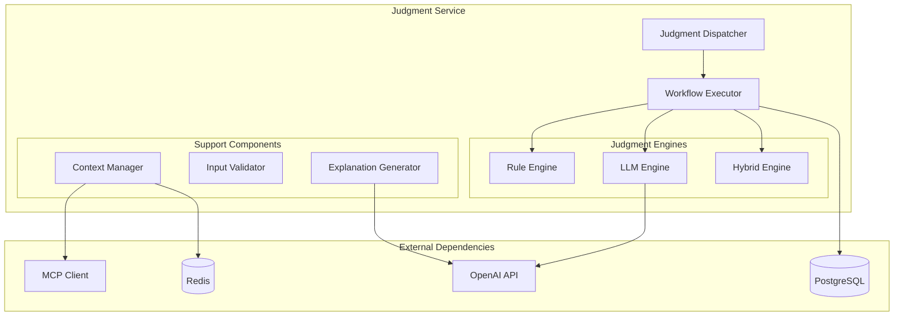

# 판단 코어 엔진 상세 설계서

**문서 버전**: v2.0
**작성일**: 2024.08.05
**최종 업데이트**: 2025-10-30 (Few-shot 학습 통합 완료)
**완료율**: 80% ✅ (Few-shot 통합 완료, API 문서화 진행 중)
**대상**: 백엔드 개발자, AI 엔지니어, 시스템 아키텍트
**목적**: Judgment Service의 내부 구현 및 핵심 판단 로직 정의

## 🆕 Ver2.0 Final 주요 변경사항 (2025-10-30)
- ✅ **Few-shot 학습 통합**: Learning Service와 연동하여 유사 사례 15개 자동 검색
- ✅ **하이브리드 판단 개선**: Rule Engine → LLM + Few-shot 순차 실행
- ✅ **신뢰도 향상**: Few-shot 샘플 개수에 따른 동적 신뢰도 보정
- ✅ **테스트 커버리지**: 3개 핵심 테스트 추가 (총 28개 통과)

## 📋 1. 개요 및 설계 원칙

### 1.1 핵심 책임
- **워크플로우 해석**: JSON 기반 워크플로우를 실행 가능한 로직으로 변환
- **하이브리드 판단**: Rule 기반과 LLM 기반 판단의 조합
- **컨텍스트 관리**: MCP를 통한 외부 데이터 수집 및 활용
- **신뢰도 평가**: 판단 결과의 신뢰도 산출
- **설명 생성**: 판단 근거와 설명 제공

### 1.2 설계 원칙
```python
# SOLID 원칙 적용
# S: 각 클래스는 단일 책임
# O: 새로운 판단 방식 확장 가능
# L: 판단 인터페이스 일관성
# I: 필요한 인터페이스만 구현
# D: 의존성 역전으로 테스트 용이성 확보
```

## 🏗 2. 아키텍처 구조

### 2.1 컴포넌트 다이어그램


### 2.2 핵심 클래스 구조
```python
from abc import ABC, abstractmethod
from typing import Any, Dict, List, Optional
from pydantic import BaseModel
from enum import Enum


class JudgmentMethod(str, Enum):
    RULE = "rule"
    LLM = "llm"
    HYBRID = "hybrid"


class JudgmentInput(BaseModel):
    workflow_id: str
    input_data: Dict[str, Any]
    context: Optional[Dict[str, Any]] = None
    method: Optional[JudgmentMethod] = None


class JudgmentResult(BaseModel):
    result: Any
    confidence: float
    method_used: JudgmentMethod
    execution_time_ms: int
    explanation: Optional[str] = None
    error: Optional[str] = None


class JudgmentEngine(ABC):
    """판단 엔진 추상 클래스"""
    
    @abstractmethod
    async def judge(self, input_data: JudgmentInput) -> JudgmentResult:
        pass
    
    @abstractmethod
    def validate_input(self, input_data: JudgmentInput) -> bool:
        pass
class DashboardGenerationEngine:
    """대시보드 자동 생성 엔진"""
    
    def __init__(self, llm_client, data_analyzer):
        self.llm_client = llm_client
        self.data_analyzer = data_analyzer
        self.component_generator = ComponentGenerator()
        
    async def generate_dashboard(self, request: str, context: dict):
        # 구현 로직
        pass
```

## 🔧 3. Rule Engine 상세 구현

### 3.1 안전한 Rule DSL 파서
```python
import ast
import operator
from typing import Any, Dict, Set


class SafeRuleEngine(JudgmentEngine):
    """AST 기반 안전한 Rule 실행 엔진"""
    
    # 허용된 연산자 정의
    ALLOWED_OPERATORS = {
        ast.Gt: operator.gt,
        ast.Lt: operator.lt,
        ast.GtE: operator.ge,
        ast.LtE: operator.le,
        ast.Eq: operator.eq,
        ast.NotEq: operator.ne,
        ast.And: operator.and_,
        ast.Or: operator.or_,
        ast.Not: operator.not_,
        ast.In: lambda x, y: x in y,
        ast.NotIn: lambda x, y: x not in y,
    }
    
    # 허용된 함수
    ALLOWED_FUNCTIONS = {
        'abs': abs,
        'min': min,
        'max': max,
        'len': len,
        'round': round,
    }
    
    def __init__(self):
        self.variables: Dict[str, Any] = {}
    
    async def judge(self, input_data: JudgmentInput) -> JudgmentResult:
        start_time = time.time()
        
        try:
            # 워크플로우에서 규칙 추출
            workflow = await self.get_workflow(input_data.workflow_id)
            rule_expression = workflow.get('rule_expression')
            
            if not rule_expression:
                raise ValueError("Rule expression not found in workflow")
            
            # 변수 바인딩
            self.variables = input_data.input_data.copy()
            if input_data.context:
                self.variables.update(input_data.context)
            
            # 규칙 실행
            result = self._evaluate_expression(rule_expression)
            
            execution_time = int((time.time() - start_time) * 1000)
            
            return JudgmentResult(
                result=result,
                confidence=1.0,  # Rule 기반은 항상 확신
                method_used=JudgmentMethod.RULE,
                execution_time_ms=execution_time,
                explanation=f"Rule '{rule_expression}' evaluated to {result}"
            )
            
        except Exception as e:
            execution_time = int((time.time() - start_time) * 1000)
            return JudgmentResult(
                result=None,
                confidence=0.0,
                method_used=JudgmentMethod.RULE,
                execution_time_ms=execution_time,
                error=str(e)
            )
    
    def _evaluate_expression(self, expression: str) -> Any:
        """AST를 사용한 안전한 표현식 평가"""
        try:
            tree = ast.parse(expression, mode='eval')
            return self._evaluate_node(tree.body)
        except SyntaxError as e:
            raise ValueError(f"Invalid syntax in rule expression: {e}")
    
    def _evaluate_node(self, node: ast.AST) -> Any:
        """AST 노드 재귀적 평가"""
        if isinstance(node, ast.Constant):
            return node.value
        
        elif isinstance(node, ast.Name):
            if node.id in self.variables:
                return self.variables[node.id]
            else:
                raise NameError(f"Variable '{node.id}' is not defined")
        
        elif isinstance(node, ast.BinOp):
            left = self._evaluate_node(node.left)
            right = self._evaluate_node(node.right)
            op_func = self.ALLOWED_OPERATORS.get(type(node.op))
            
            if op_func:
                return op_func(left, right)
            else:
                raise ValueError(f"Operator {type(node.op)} not allowed")
        
        elif isinstance(node, ast.Compare):
            left = self._evaluate_node(node.left)
            
            for op, comparator in zip(node.ops, node.comparators):
                right = self._evaluate_node(comparator)
                op_func = self.ALLOWED_OPERATORS.get(type(op))
                
                if not op_func:
                    raise ValueError(f"Comparison {type(op)} not allowed")
                
                if not op_func(left, right):
                    return False
                left = right
            
            return True
        
        elif isinstance(node, ast.BoolOp):
            op_func = self.ALLOWED_OPERATORS.get(type(node.op))
            if not op_func:
                raise ValueError(f"Boolean operator {type(node.op)} not allowed")
            
            values = [self._evaluate_node(value) for value in node.values]
            
            if isinstance(node.op, ast.And):
                return all(values)
            elif isinstance(node.op, ast.Or):
                return any(values)
        
        elif isinstance(node, ast.UnaryOp):
            operand = self._evaluate_node(node.operand)
            op_func = self.ALLOWED_OPERATORS.get(type(node.op))
            
            if op_func:
                return op_func(operand)
            else:
                raise ValueError(f"Unary operator {type(node.op)} not allowed")
        
        elif isinstance(node, ast.Call):
            func_name = node.func.id if isinstance(node.func, ast.Name) else None
            
            if func_name in self.ALLOWED_FUNCTIONS:
                args = [self._evaluate_node(arg) for arg in node.args]
                return self.ALLOWED_FUNCTIONS[func_name](*args)
            else:
                raise ValueError(f"Function '{func_name}' not allowed")
        
        elif isinstance(node, ast.List):
            return [self._evaluate_node(item) for item in node.elts]
        
        else:
            raise ValueError(f"Node type {type(node)} not supported")
    
    def validate_input(self, input_data: JudgmentInput) -> bool:
        """입력 데이터 검증"""
        required_fields = self._extract_variables_from_workflow(
            input_data.workflow_id
        )
        
        for field in required_fields:
            if field not in input_data.input_data:
                return False
        
        return True
    
    def _extract_variables_from_workflow(self, workflow_id: str) -> Set[str]:
        """워크플로우에서 필요한 변수 추출"""
        # 실제 구현에서는 워크플로우 정의를 파싱하여 변수 추출
        return set()
```

### 3.2 Rule DSL 예시
```python
# 지원하는 Rule 표현식 예시
RULE_EXAMPLES = {
    "simple_comparison": "temperature > 85",
    "multiple_conditions": "temperature > 85 and vibration > 40",
    "range_check": "temperature >= 80 and temperature <= 100",
    "list_membership": "status in ['ERROR', 'WARNING']",
    "function_usage": "abs(pressure - target_pressure) > threshold",
    "complex_logic": "(temperature > 85 or pressure > 100) and status != 'MAINTENANCE'"
}
```

## 🤖 4. LLM Engine 상세 구현

### 4.1 LLM 판단 엔진
```python
import openai
import json
from typing import Dict, Any
import asyncio


class LLMJudgmentEngine(JudgmentEngine):
    """OpenAI API 기반 LLM 판단 엔진"""
    
    def __init__(self, api_key: str, model: str = "gpt-4"):
        self.client = openai.AsyncOpenAI(api_key=api_key)
        self.model = model
        self.max_retries = 3
        self.timeout = 30
    
    async def judge(self, input_data: JudgmentInput) -> JudgmentResult:
        start_time = time.time()
        
        try:
            # 워크플로우에서 판단 기준 추출
            workflow = await self.get_workflow(input_data.workflow_id)
            judgment_criteria = workflow.get('llm_criteria', '')
            
            # 프롬프트 생성
            prompt = await self._build_judgment_prompt(
                input_data.input_data,
                input_data.context or {},
                judgment_criteria
            )
            
            # LLM 호출
            response = await self._call_llm_with_retry(prompt)
            
            # 응답 파싱
            parsed_result = self._parse_llm_response(response)
            
            execution_time = int((time.time() - start_time) * 1000)
            
            return JudgmentResult(
                result=parsed_result['result'],
                confidence=parsed_result.get('confidence', 0.5),
                method_used=JudgmentMethod.LLM,
                execution_time_ms=execution_time,
                explanation=parsed_result.get('explanation', '')
            )
            
        except Exception as e:
            execution_time = int((time.time() - start_time) * 1000)
            return JudgmentResult(
                result=None,
                confidence=0.0,
                method_used=JudgmentMethod.LLM,
                execution_time_ms=execution_time,
                error=str(e)
            )
    
    async def _build_judgment_prompt(
        self, 
        input_data: Dict[str, Any],
        context: Dict[str, Any],
        criteria: str
    ) -> str:
        """판단용 프롬프트 생성"""
        
        prompt_template = """
당신은 제조업 현장의 전문가입니다. 주어진 데이터를 분석하여 적절한 판단을 내려주세요.

## 입력 데이터
{input_data_formatted}

## 추가 컨텍스트
{context_formatted}

## 판단 기준
{criteria}

## 응답 형식
반드시 다음 JSON 형식으로 응답해주세요:
{{
    "result": true/false 또는 구체적인 값,
    "confidence": 0.0~1.0 사이의 신뢰도,
    "explanation": "판단 근거에 대한 상세한 설명"
}}

판단을 내려주세요:
        """.strip()
        
        input_data_formatted = json.dumps(input_data, indent=2, ensure_ascii=False)
        context_formatted = json.dumps(context, indent=2, ensure_ascii=False)
        
        return prompt_template.format(
            input_data_formatted=input_data_formatted,
            context_formatted=context_formatted,
            criteria=criteria
        )
    
    async def _call_llm_with_retry(self, prompt: str) -> str:
        """재시도 로직이 포함된 LLM 호출"""
        
        for attempt in range(self.max_retries):
            try:
                response = await asyncio.wait_for(
                    self.client.chat.completions.create(
                        model=self.model,
                        messages=[
                            {
                                "role": "system", 
                                "content": "당신은 제조업 현장 전문가입니다. 정확하고 신뢰할 수 있는 판단을 내려주세요."
                            },
                            {"role": "user", "content": prompt}
                        ],
                        temperature=0.1,
                        max_tokens=500
                    ),
                    timeout=self.timeout
                )
                
                return response.choices[0].message.content
                
            except asyncio.TimeoutError:
                if attempt == self.max_retries - 1:
                    raise TimeoutError("LLM response timeout")
                await asyncio.sleep(2 ** attempt)  # 지수 백오프
                
            except Exception as e:
                if attempt == self.max_retries - 1:
                    raise e
                await asyncio.sleep(1)
    
    def _parse_llm_response(self, response: str) -> Dict[str, Any]:
        """LLM 응답 파싱 및 검증"""
        try:
            # JSON 응답 파싱 시도
            if response.strip().startswith('{'):
                parsed = json.loads(response)
                
                # 필수 필드 검증
                if 'result' not in parsed:
                    raise ValueError("Missing 'result' field in LLM response")
                
                # 신뢰도 검증
                confidence = parsed.get('confidence', 0.5)
                if not 0 <= confidence <= 1:
                    parsed['confidence'] = 0.5
                
                return parsed
            
            else:
                # JSON이 아닌 경우 휴리스틱 파싱
                return self._heuristic_parse(response)
                
        except json.JSONDecodeError:
            return self._heuristic_parse(response)
    
    def _heuristic_parse(self, response: str) -> Dict[str, Any]:
        """JSON이 아닌 응답에 대한 휴리스틱 파싱"""
        
        # 긍정/부정 키워드 검색
        positive_keywords = ['yes', 'true', '필요', '해야', '권장']
        negative_keywords = ['no', 'false', '불필요', '않아도', '권장하지']
        
        response_lower = response.lower()
        
        positive_score = sum(1 for keyword in positive_keywords if keyword in response_lower)
        negative_score = sum(1 for keyword in negative_keywords if keyword in response_lower)
        
        if positive_score > negative_score:
            result = True
            confidence = min(0.9, 0.5 + positive_score * 0.1)
        elif negative_score > positive_score:
            result = False
            confidence = min(0.9, 0.5 + negative_score * 0.1)
        else:
            result = None
            confidence = 0.3
        
        return {
            'result': result,
            'confidence': confidence,
            'explanation': response[:200] + '...' if len(response) > 200 else response
        }
    
    def validate_input(self, input_data: JudgmentInput) -> bool:
        """LLM 입력 검증"""
        # 기본적인 데이터 존재 여부만 확인
        return bool(input_data.input_data)
```

## 🔄 5. Hybrid Engine 구현

### 5.1 하이브리드 판단 로직
```python
class HybridJudgmentEngine(JudgmentEngine):
    """Rule과 LLM을 조합한 하이브리드 판단 엔진"""
    
    def __init__(self, rule_engine: SafeRuleEngine, llm_engine: LLMJudgmentEngine):
        self.rule_engine = rule_engine
        self.llm_engine = llm_engine
    
    async def judge(self, input_data: JudgmentInput) -> JudgmentResult:
        start_time = time.time()
        
        try:
            workflow = await self.get_workflow(input_data.workflow_id)
            strategy = workflow.get('hybrid_strategy', 'rule_first')
            
            if strategy == 'rule_first':
                return await self._rule_first_strategy(input_data)
            elif strategy == 'llm_first':
                return await self._llm_first_strategy(input_data)
            elif strategy == 'parallel':
                return await self._parallel_strategy(input_data)
            elif strategy == 'consensus':
                return await self._consensus_strategy(input_data)
            else:
                raise ValueError(f"Unknown hybrid strategy: {strategy}")
                
        except Exception as e:
            execution_time = int((time.time() - start_time) * 1000)
            return JudgmentResult(
                result=None,
                confidence=0.0,
                method_used=JudgmentMethod.HYBRID,
                execution_time_ms=execution_time,
                error=str(e)
            )
    
    async def _rule_first_strategy(self, input_data: JudgmentInput) -> JudgmentResult:
        """Rule 우선 전략: Rule 실패시에만 LLM 사용"""
        
        # Rule 시도
        rule_result = await self.rule_engine.judge(input_data)
        
        if rule_result.error is None:
            # Rule 성공
            rule_result.method_used = JudgmentMethod.HYBRID
            rule_result.explanation = f"Rule-based: {rule_result.explanation}"
            return rule_result
        
        # Rule 실패시 LLM 사용
        llm_input = input_data.model_copy()
        llm_input.context = llm_input.context or {}
        llm_input.context['rule_error'] = rule_result.error
        
        llm_result = await self.llm_engine.judge(llm_input)
        llm_result.method_used = JudgmentMethod.HYBRID
        llm_result.explanation = f"LLM-based (Rule failed): {llm_result.explanation}"
        
        return llm_result
    
    async def _consensus_strategy(self, input_data: JudgmentInput) -> JudgmentResult:
        """합의 전략: Rule과 LLM 결과를 종합하여 최종 판단"""
        
        # 병렬 실행
        rule_task = asyncio.create_task(self.rule_engine.judge(input_data))
        llm_task = asyncio.create_task(self.llm_engine.judge(input_data))
        
        rule_result, llm_result = await asyncio.gather(rule_task, llm_task)
        
        # 결과 분석
        if rule_result.error and llm_result.error:
            # 둘 다 실패
            return JudgmentResult(
                result=None,
                confidence=0.0,
                method_used=JudgmentMethod.HYBRID,
                execution_time_ms=rule_result.execution_time_ms + llm_result.execution_time_ms,
                error="Both rule and LLM engines failed"
            )
        
        elif rule_result.error:
            # Rule 실패, LLM 성공
            llm_result.method_used = JudgmentMethod.HYBRID
            return llm_result
        
        elif llm_result.error:
            # LLM 실패, Rule 성공
            rule_result.method_used = JudgmentMethod.HYBRID
            return rule_result
        
        else:
            # 둘 다 성공 - 합의 알고리즘 적용
            return self._merge_results(rule_result, llm_result)
    
    def _merge_results(self, rule_result: JudgmentResult, llm_result: JudgmentResult) -> JudgmentResult:
        """Rule과 LLM 결과 병합"""
        
        # 결과가 동일한 경우
        if rule_result.result == llm_result.result:
            combined_confidence = (rule_result.confidence + llm_result.confidence) / 2
            combined_confidence = min(combined_confidence * 1.2, 1.0)  # 합의 보너스
            
            return JudgmentResult(
                result=rule_result.result,
                confidence=combined_confidence,
                method_used=JudgmentMethod.HYBRID,
                execution_time_ms=rule_result.execution_time_ms + llm_result.execution_time_ms,
                explanation=f"Consensus: Rule({rule_result.result}) + LLM({llm_result.result})"
            )
        
        # 결과가 다른 경우 - 신뢰도 기반 선택
        else:
            if rule_result.confidence > llm_result.confidence:
                chosen_result = rule_result
                explanation = f"Rule-preferred: Rule({rule_result.confidence:.2f}) > LLM({llm_result.confidence:.2f})"
            else:
                chosen_result = llm_result
                explanation = f"LLM-preferred: LLM({llm_result.confidence:.2f}) > Rule({rule_result.confidence:.2f})"
            
            chosen_result.method_used = JudgmentMethod.HYBRID
            chosen_result.explanation = explanation
            chosen_result.execution_time_ms = rule_result.execution_time_ms + llm_result.execution_time_ms
            
            return chosen_result
    
    def validate_input(self, input_data: JudgmentInput) -> bool:
        """하이브리드 입력 검증"""
        return (self.rule_engine.validate_input(input_data) or 
                self.llm_engine.validate_input(input_data))
```

## 📊 6. Context Manager 구현

### 6.1 MCP 기반 컨텍스트 수집
```python
from typing import Dict, Any, List
import aiohttp


class MCPContextManager:
    """MCP(Model Context Protocol)를 통한 컨텍스트 데이터 수집"""
    
    def __init__(self, mcp_servers: List[Dict[str, str]]):
        self.mcp_servers = mcp_servers
        self.cache_ttl = 300  # 5분 캐시
    
    async def gather_context(self, workflow_id: str, input_data: Dict[str, Any]) -> Dict[str, Any]:
        """워크플로우와 입력 데이터를 기반으로 필요한 컨텍스트 수집"""
        
        workflow = await self.get_workflow(workflow_id)
        required_context = workflow.get('required_context', [])
        
        context = {}
        
        for context_req in required_context:
            context_type = context_req.get('type')
            
            if context_type == 'machine_status':
                machine_id = input_data.get('machine_id')
                if machine_id:
                    context['machine_status'] = await self._get_machine_status(machine_id)
            
            elif context_type == 'historical_data':
                context['historical_data'] = await self._get_historical_data(
                    context_req.get('timeframe', '1h'),
                    input_data
                )
            
            elif context_type == 'policy_documents':
                context['policies'] = await self._get_relevant_policies(
                    context_req.get('category', 'safety')
                )
        
        return context
    
    async def _get_machine_status(self, machine_id: str) -> Dict[str, Any]:
        """MCP를 통한 기계 상태 조회"""
        
        mcp_request = {
            "method": "tools/call",
            "params": {
                "name": "get_machine_status",
                "arguments": {"machine_id": machine_id}
            }
        }
        
        try:
            async with aiohttp.ClientSession() as session:
                for server in self.mcp_servers:
                    try:
                        async with session.post(
                            f"{server['url']}/mcp",
                            json=mcp_request,
                            headers={"Authorization": f"Bearer {server['token']}"}
                        ) as response:
                            if response.status == 200:
                                result = await response.json()
                                return result.get('content', {})
                    except Exception:
                        continue
            
            return {"status": "unknown", "error": "No MCP server available"}
            
        except Exception as e:
            return {"status": "error", "message": str(e)}
    
    async def _get_historical_data(self, timeframe: str, input_data: Dict[str, Any]) -> List[Dict[str, Any]]:
        """과거 데이터 조회"""
        
        # 캐시 확인
        cache_key = f"historical:{timeframe}:{hash(str(input_data))}"
        cached_data = await self._get_from_cache(cache_key)
        
        if cached_data:
            return cached_data
        
        # MCP를 통한 데이터 조회
        mcp_request = {
            "method": "tools/call",
            "params": {
                "name": "query_historical_data",
                "arguments": {
                    "timeframe": timeframe,
                    "filters": input_data
                }
            }
        }
        
        async def gather_dashboard_context(self, user_request: str):
        """대시보드 생성을 위한 컨텍스트 수집"""
        context = {}
        
        # 사용 가능한 데이터 스키마 수집
        context['available_schemas'] = await self.get_data_schemas()
        
        # 최근 데이터 샘플 수집
        context['sample_data'] = await self.get_sample_data()
        
        # 사용자 히스토리 분석
        context['user_preferences'] = await self.analyze_user_history()
        
        return context
        # 실제 구현은 위와 동일한 패턴
        # ...
        
        return []
```

## 🔍 7. 설명 생성기 (Explainer)

### 7.1 판단 설명 생성
```python
class JudgmentExplainer:
    """판단 결과에 대한 설명 생성"""
    
    def __init__(self, llm_client: openai.AsyncOpenAI):
        self.llm_client = llm_client
    
    async def generate_explanation(
        self, 
        judgment_result: JudgmentResult,
        input_data: JudgmentInput,
        context: Dict[str, Any]
    ) -> str:
        """상세한 판단 설명 생성"""
        
        if judgment_result.method_used == JudgmentMethod.RULE:
            return self._explain_rule_result(judgment_result, input_data)
        
        elif judgment_result.method_used == JudgmentMethod.LLM:
            return await self._enhance_llm_explanation(judgment_result, input_data, context)
        
        else:  # HYBRID
            return await self._explain_hybrid_result(judgment_result, input_data, context)
    
    def _explain_rule_result(self, result: JudgmentResult, input_data: JudgmentInput) -> str:
        """Rule 기반 판단 설명"""
        
        explanation = f"""
## 규칙 기반 판단 결과

**판단 결과**: {result.result}
**신뢰도**: {result.confidence:.2f}
**실행 시간**: {result.execution_time_ms}ms

### 적용된 규칙
{result.explanation}

### 입력 데이터
{json.dumps(input_data.input_data, indent=2, ensure_ascii=False)}

### 판단 과정
규칙 엔진이 정의된 조건식을 평가하여 명확한 결과를 도출했습니다.
규칙 기반 판단은 일관성이 높고 예측 가능한 결과를 제공합니다.
        """.strip()
        
        return explanation
    
    async def _enhance_llm_explanation(
        self, 
        result: JudgmentResult, 
        input_data: JudgmentInput,
        context: Dict[str, Any]
    ) -> str:
        """LLM 설명 향상"""
        
        prompt = f"""
다음 AI 판단 결과에 대해 더 상세하고 이해하기 쉬운 설명을 제공해주세요.

## 판단 결과
- 결과: {result.result}
- 신뢰도: {result.confidence:.2f}
- 기존 설명: {result.explanation}

## 입력 데이터
{json.dumps(input_data.input_data, indent=2, ensure_ascii=False)}

## 추가 컨텍스트
{json.dumps(context, indent=2, ensure_ascii=False)}

다음 형식으로 설명을 제공해주세요:
1. 판단 요약
2. 핵심 근거
3. 고려된 요인들
4. 신뢰도 평가 이유
5. 권장 조치 (해당하는 경우)
        """
        
        try:
            response = await self.llm_client.chat.completions.create(
                model="gpt-4",
                messages=[
                    {"role": "system", "content": "당신은 제조업 전문가입니다. 판단 결과를 명확하고 이해하기 쉽게 설명해주세요."},
                    {"role": "user", "content": prompt}
                ],
                temperature=0.3,
                max_tokens=800
            )
            
            return response.choices[0].message.content
            
        except Exception as e:
            return f"설명 생성 중 오류 발생: {str(e)}\n\n원본 설명: {result.explanation}"
```

## 🧪 8. 테스트 전략

### 8.1 유닛 테스트
```python
import pytest
from unittest.mock import Mock, AsyncMock


class TestSafeRuleEngine:
    
    @pytest.fixture
    def rule_engine(self):
        return SafeRuleEngine()
    
    @pytest.mark.asyncio
    async def test_simple_comparison(self, rule_engine):
        """간단한 비교 연산 테스트"""
        
        rule_engine.variables = {"temperature": 90}
        result = rule_engine._evaluate_expression("temperature > 85")
        
        assert result is True
    
    @pytest.mark.asyncio
    async def test_complex_logic(self, rule_engine):
        """복합 논리 연산 테스트"""
        
        rule_engine.variables = {
            "temperature": 90,
            "pressure": 95,
            "status": "RUNNING"
        }
        
        result = rule_engine._evaluate_expression(
            "(temperature > 85 or pressure > 100) and status != 'MAINTENANCE'"
        )
        
        assert result is True
    
    @pytest.mark.asyncio
    async def test_security_injection(self, rule_engine):
        """보안 취약점 테스트"""
        
        with pytest.raises(ValueError):
            rule_engine._evaluate_expression("__import__('os').system('rm -rf /')")
        
        with pytest.raises(ValueError):
            rule_engine._evaluate_expression("exec('print(1)')")


class TestLLMJudgmentEngine:
    
    @pytest.fixture
    def llm_engine(self):
        mock_client = AsyncMock()
        engine = LLMJudgmentEngine("test-key")
        engine.client = mock_client
        return engine
    
    @pytest.mark.asyncio
    async def test_successful_judgment(self, llm_engine):
        """LLM 판단 성공 케이스"""
        
        # Mock LLM 응답
        mock_response = Mock()
        mock_response.choices = [Mock()]
        mock_response.choices[0].message.content = '{"result": true, "confidence": 0.85, "explanation": "Temperature exceeds threshold"}'
        
        llm_engine.client.chat.completions.create.return_value = mock_response
        
        input_data = JudgmentInput(
            workflow_id="test-workflow",
            input_data={"temperature": 90}
        )
        
        result = await llm_engine.judge(input_data)
        
        assert result.result is True
        assert result.confidence == 0.85
        assert result.method_used == JudgmentMethod.LLM
        assert result.error is None
```

## 📈 9. 성능 최적화

### 9.1 캐싱 전략
```python
class CachedJudgmentService:
    """캐싱이 적용된 판단 서비스"""
    
    def __init__(self, redis_client, judgment_engine):
        self.redis = redis_client
        self.engine = judgment_engine
        self.cache_ttl = 300  # 5분
    
    async def judge_with_cache(self, input_data: JudgmentInput) -> JudgmentResult:
        """캐시를 고려한 판단 실행"""
        
        # 캐시 키 생성
        cache_key = self._generate_cache_key(input_data)
        
        # 캐시 확인
        cached_result = await self.redis.get(cache_key)
        if cached_result:
            return JudgmentResult.parse_raw(cached_result)
        
        # 실제 판단 실행
        result = await self.engine.judge(input_data)
        
        # 성공한 결과만 캐시
        if result.error is None:
            await self.redis.setex(
                cache_key, 
                self.cache_ttl, 
                result.json()
            )
        
        return result
    
    def _generate_cache_key(self, input_data: JudgmentInput) -> str:
        """캐시 키 생성"""
        
        # 입력 데이터의 해시값으로 키 생성
        data_hash = hash(str(sorted(input_data.input_data.items())))
        return f"judgment:{input_data.workflow_id}:{data_hash}"
```

이 설계서는 실제 구현 가능한 수준의 상세한 기술 명세를 제공합니다. 다음 문서인 "데이터베이스 스키마 및 API 설계서"를 작성할까요?